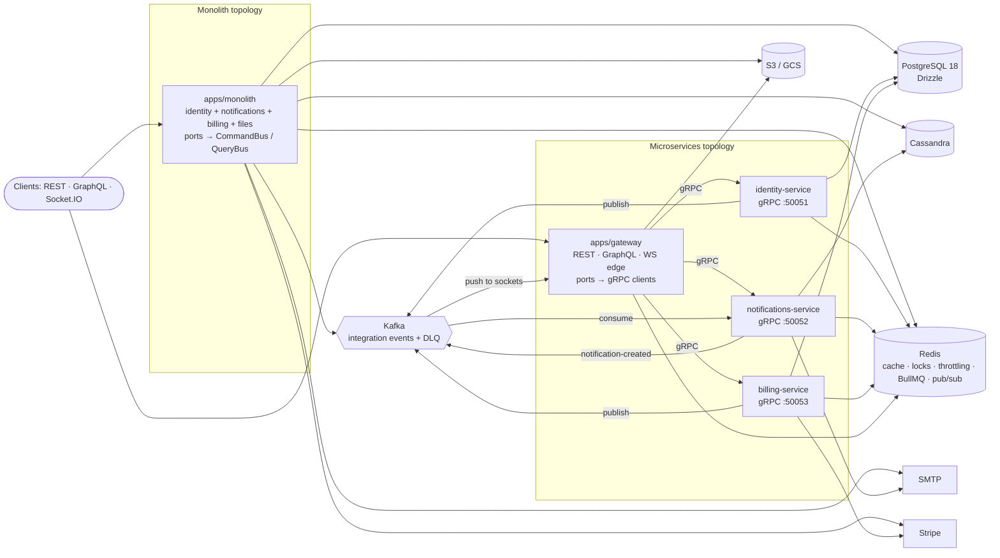
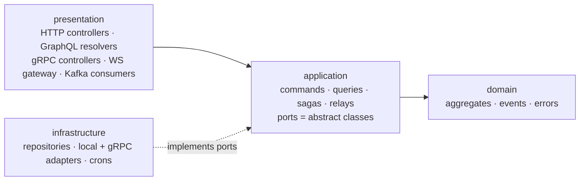

# nestjs-boilerplate

NestJS 12 (ESM, Fastify) monorepo boilerplate: one codebase, deployed as a modular monolith or as microservices.

## Why this boilerplate

A production-grade starting point for a NestJS 12 backend on Node 24 LTS, TypeScript 6 and Fastify. The domain code
(identity, notifications, billing, files) is written once as hexagonal + CQRS libraries and runs either in a single
process (`apps/monolith`) or split behind an API gateway (`apps/gateway`) into gRPC services (`identity-service`,
`notifications-service`, `billing-service`) that share integration events over Kafka. The stack covers REST, GraphQL
(Apollo, with subscriptions), Socket.IO and gRPC; PostgreSQL 18 with Drizzle, Cassandra, Redis and Kafka; JWT + RBAC;
pino logs, Prometheus metrics and OpenTelemetry traces; mail through a BullMQ queue; cron jobs; S3 / GCS file storage;
and Stripe payments. All of it is wired, tested (Vitest, unit + e2e + integration) and containerised (one Dockerfile,
one compose file with profiles). Copy it, delete the domains you don't need, and add your own.

## Feature matrix

Every requested capability, where it lives and where to see it in use. Paths are relative to the repository root.

| Feature                                                     | Lives in                                                                                                                                                                                                                                                                                                                                                                                                               | Example / how to see it                                                                                                                                                 |
| ----------------------------------------------------------- | ---------------------------------------------------------------------------------------------------------------------------------------------------------------------------------------------------------------------------------------------------------------------------------------------------------------------------------------------------------------------------------------------------------------------- | ----------------------------------------------------------------------------------------------------------------------------------------------------------------------- |
| NestJS 12 (ESM) on Node 24 LTS + Fastify                    | root `package.json` (`type: module`, `engines.node >=24 <25`, `catalog` `@nestjs/*` 12.x), `libs/bootstrap/src/http/create-http-app.ts` (`FastifyAdapter`)                                                                                                                                                                                                                                                             | every `apps/*/src/main.ts`; `.nvmrc`                                                                                                                                    |
| TypeScript (6.0.3, strict, ESM)                             | `tsconfig.base.json`, `tsconfig.json` (one root `tsc`), `.swcrc` (SWC build)                                                                                                                                                                                                                                                                                                                                           | `bun run typecheck`; every `libs/*/src` and `apps/*/src`                                                                                                                |
| Strict NestJS architecture (hexagonal + modules per domain) | `libs/<domain>/src/{domain,application,infrastructure,presentation}`; `XCoreModule`, `XGrpcModule`, `XApiModule.forLocal()/.forRemote()`                                                                                                                                                                                                                                                                               | `libs/identity/src` (aggregate `domain/user.aggregate.ts`, ports `application/ports`, adapters `infrastructure/adapters`); [docs/ARCHITECTURE.md](docs/ARCHITECTURE.md) |
| Latest packages, with justified pins                        | root `package.json` `catalog` (one version per dependency) + `overrides`                                                                                                                                                                                                                                                                                                                                               | [Version policy](#version-policy-and-deliberate-pins) below                                                                                                             |
| Bun as package manager                                      | `package.json` (`packageManager: bun@1.4.2`), `bunfig.toml` (`linker = "hoisted"`, `[run] bun = false`), `bun.lock`                                                                                                                                                                                                                                                                                                    | `bun run setup`; Node 24 is the runtime of every app, tool and test                                                                                                     |
| Performance, throughput, latency, concurrency               | `libs/bootstrap/src/cluster/run-clustered.ts` (`CLUSTER_WORKERS`), `libs/redis/src/redis.factory.ts` (auto-pipelining), `libs/redis/src/cache/app-cache.module.ts` (L1 LRU → L2 Redis), `libs/database/src/drizzle/prepared-statements.ts`, `libs/database/src/pagination/keyset.ts`, `libs/graphql/src/loaders` (DataLoader), `libs/transport/src/grpc/grpc-circuit-breakers.ts`, `Dockerfile` (`UV_THREADPOOL_SIZE`) | `bun run loadtest` (k6, `docker/k6/script.js`); [docs/PERFORMANCE.md](docs/PERFORMANCE.md)                                                                              |
| Docker + Compose                                            | `Dockerfile` (one image per app, `--build-arg APP=<app>`), `docker-compose.yml` (profiles `monolith`, `microservices`, `observability`, `logs`, `tools`, `loadtest`), `docker/`                                                                                                                                                                                                                                        | `bun run docker:infra`, `bun run docker:monolith` (distroless monolith image: 294 MB); [docs/DOCKER.md](docs/DOCKER.md)                                                 |
| Microservices + monolith from one codebase                  | `apps/monolith`, `apps/gateway`, `apps/identity-service`, `apps/notifications-service`, `apps/billing-service`; `libs/<domain>/src/<domain>-api.module.ts`                                                                                                                                                                                                                                                             | `bun run dev` vs `bun run dev:microservices`; [Topology switch](#topology-switch-monolith-or-microservices)                                                             |
| ESLint                                                      | `eslint.config.ts` (typescript-eslint, type-aware, decorator-aware `consistent-type-imports`)                                                                                                                                                                                                                                                                                                                          | `bun run lint`                                                                                                                                                          |
| Prettier                                                    | `.prettierrc.json`, `.prettierignore` (Markdown and YAML only)                                                                                                                                                                                                                                                                                                                                                         | `bun run format`                                                                                                                                                        |
| Biome                                                       | `biome.json` (formatter + linter for TS/JS/JSON, `noUndeclaredDependencies` as error)                                                                                                                                                                                                                                                                                                                                  | `bun run lint`, `bun run check`                                                                                                                                         |
| Commitizen                                                  | `package.json` `config.commitizen` (`@commitlint/cz-commitlint`)                                                                                                                                                                                                                                                                                                                                                       | `bun run commit`                                                                                                                                                        |
| Commitlint                                                  | `commitlint.config.ts` (Conventional Commits, scopes = workspace packages + `deps`, `docker`, `ci`, `docs`…)                                                                                                                                                                                                                                                                                                           | `.husky/commit-msg`                                                                                                                                                     |
| Husky                                                       | `.husky/pre-commit`, `.husky/commit-msg` (installed by the `prepare` script)                                                                                                                                                                                                                                                                                                                                           | runs on every `git commit`                                                                                                                                              |
| lint-staged                                                 | `lint-staged.config.ts` (Biome then ESLint on TS; Biome on JS/JSON; Prettier on MD/YAML)                                                                                                                                                                                                                                                                                                                               | `.husky/pre-commit`                                                                                                                                                     |
| PostgreSQL 18                                               | `libs/database` (postgres.js pool, health, migrator), `libs/database/src/migrations/*.sql`, `docker/postgres`                                                                                                                                                                                                                                                                                                          | identity users/sessions, billing payments: `libs/identity/src/infrastructure/persistence`, `libs/billing/src/infrastructure/persistence`                                |
| GraphQL                                                     | `libs/graphql` (Apollo config, complexity limit, DataLoader registry, Redis pub/sub, scalars)                                                                                                                                                                                                                                                                                                                          | resolvers in `libs/*/src/presentation/graphql`; [GraphQL example](#graphql-and-subscriptions)                                                                           |
| Cassandra 5                                                 | `libs/cassandra` (client, CQL migrator, paging, health)                                                                                                                                                                                                                                                                                                                                                                | notifications inbox: `libs/notifications/src/infrastructure/persistence/cassandra-notifications.repository.ts`                                                          |
| Redis                                                       | `libs/redis` (client factory, cache, throttler storage, distributed locks, BullMQ, Socket.IO adapter)                                                                                                                                                                                                                                                                                                                  | `libs/redis/src/lock/with-lock.decorator.ts`, `libs/redis/src/throttler`                                                                                                |
| Drizzle ORM                                                 | `libs/database/src/drizzle`, `drizzle-kit` (`db:generate`, `db:studio`), `@nestjs-cls/transactional` adapter                                                                                                                                                                                                                                                                                                           | `libs/identity/src/infrastructure/persistence`; `bun run db:generate`                                                                                                   |
| Apollo                                                      | `@nestjs/apollo` + `@apollo/server` in `libs/graphql/src/apollo-config.factory.ts`                                                                                                                                                                                                                                                                                                                                     | Apollo Sandbox at `http://localhost:3000/graphql` (non-production)                                                                                                      |
| Kafka                                                       | `libs/transport/src/kafka` (producer, consumer decorator, retry, dead-letter + replay), `libs/contracts/src/events` (topics, zod envelope)                                                                                                                                                                                                                                                                             | consumers in `libs/notifications/src/presentation/messaging`; relays such as `libs/identity/src/application/event-handlers/user-registered.relay.ts`                    |
| CQRS                                                        | `@nestjs/cqrs`; `application/commands`, `application/queries`, `application/sagas` in each domain                                                                                                                                                                                                                                                                                                                      | `libs/identity/src/application/commands/register-user`, `libs/notifications/src/application/sagas/notifications.sagas.ts`                                               |
| gRPC                                                        | `libs/transport/src/grpc` (server/client options, deadlines, retries, circuit breaker, health, reflection, TLS), `libs/contracts/src/proto` (+ `ts-proto` output in `generated/`)                                                                                                                                                                                                                                      | `libs/*/src/presentation/grpc`; `bun run proto:gen`                                                                                                                     |
| WebSocket (Socket.IO)                                       | `libs/notifications/src/presentation/ws/notifications.gateway.ts`, `libs/redis/src/socket-io` (Redis adapter)                                                                                                                                                                                                                                                                                                          | [Socket.IO example](#socketio)                                                                                                                                          |
| REST                                                        | `libs/*/src/presentation/http/*.controller.ts`, `libs/bootstrap/src/http/create-http-app.ts` (Fastify, URI versioning `/v1`)                                                                                                                                                                                                                                                                                           | [REST example](#rest)                                                                                                                                                   |
| API Gateway                                                 | `apps/gateway` (REST/GraphQL/WS edge, ports wired to gRPC clients with `XApiModule.forRemote()`)                                                                                                                                                                                                                                                                                                                       | `bun run dev:microservices`; [apps/gateway/README.md](apps/gateway/README.md)                                                                                           |
| Logging: pino (+ optional `@nestjs/observe`)                | `nestjs-pino` in `libs/observability`; `libs/observability/src/observe/observe.ts` (on when `OBSERVE_APP_KEY` + `OBSERVE_APP_SECRET` are set)                                                                                                                                                                                                                                                                          | `LOG_LEVEL`; [docs/OBSERVABILITY.md](docs/OBSERVABILITY.md)                                                                                                             |
| Monitoring: Prometheus, Grafana, Jaeger, OpenTelemetry      | `libs/observability/src/metrics` (`/metrics`), `libs/observability/src/otel.ts`, `docker/prometheus/prometheus.yml`, `docker/grafana/dashboards/nestjs-overview.json`                                                                                                                                                                                                                                                  | `bun run docker:observability`: Grafana `http://localhost:3300`, Prometheus `:9090`, Jaeger `:16686`                                                                    |
| JWT passport auth + RBAC                                    | `libs/auth` (`strategies/jwt.strategy.ts`, `guards/`, `rbac/role-permissions.ts`, `@RequirePermissions()`, `@Roles()`, `@Public()`), access-token denylist                                                                                                                                                                                                                                                             | `libs/identity/src/presentation/http/users.controller.ts`; [docs/SECURITY.md](docs/SECURITY.md)                                                                         |
| class-transformer + class-validator                         | DTOs in `libs/*/src/presentation/http/dto`, global class-validator pipe in `libs/common/src/providers/common-enhancers.ts`                                                                                                                                                                                                                                                                                             | `libs/identity/src/presentation/http/dto/register.dto.ts`, `libs/identity/src/presentation/shared/transforms.ts`                                                        |
| zod                                                         | env validation `libs/config/src/env`, Kafka envelope `libs/contracts/src/events/envelope.ts`, gRPC payloads `libs/transport/src/grpc/zod-rpc-validation.pipe.ts`, global Standard Schema pipe (`common-enhancers.ts`)                                                                                                                                                                                                  | `libs/notifications/src/presentation/ws/notifications-ws.schemas.ts`                                                                                                    |
| Middlewares                                                 | `libs/common/src/middlewares` (`correlation-id`, `maintenance-mode`), plus helmet, compression, CORS, cookies in `create-http-app.ts`                                                                                                                                                                                                                                                                                  | `MAINTENANCE_MODE=true`; applied in every `apps/*/src/app.module.ts`                                                                                                    |
| Mailer (BullMQ)                                             | `libs/mailer` (`mail.service.ts` enqueues, `mail.processor.ts` sends, Handlebars `templates/`), queue in `libs/redis/src/queue`                                                                                                                                                                                                                                                                                        | welcome / payment receipt / daily digest mails, caught by Mailpit at `http://localhost:8025`                                                                            |
| Scheduling                                                  | `@nestjs/schedule`; `*.cron.ts` in `libs/*/src/infrastructure/scheduling`, made single-run across replicas by `@WithLock()`                                                                                                                                                                                                                                                                                            | `libs/identity/src/infrastructure/scheduling/purge-expired-sessions.cron.ts`, `libs/notifications/src/infrastructure/scheduling/daily-digest.cron.ts`                   |
| File storage: S3 + GCS                                      | `libs/storage/src/drivers/{s3,gcs}-storage.driver.ts` (`STORAGE_DRIVER=s3\|gcs`), `libs/files` (upload, presigned URLs, access policy)                                                                                                                                                                                                                                                                                 | `POST /v1/files`, `POST /v1/files/presigned-uploads`; RustFS (S3) and fake-gcs in compose                                                                               |
| Stripe                                                      | `libs/payments` (`stripe.service.ts`), `libs/billing` (checkout sessions, signed webhook, idempotent event log)                                                                                                                                                                                                                                                                                                        | `POST /v1/billing/checkout-sessions`, `POST /v1/billing/webhooks/stripe`                                                                                                |
| UUID v7                                                     | `libs/common/src/utils/id.util.ts` (`generateId()`, `isUuidV7()`), Postgres `uuidv7()`                                                                                                                                                                                                                                                                                                                                 | every entity, event envelope and request id                                                                                                                             |
| lodash                                                      | `lodash-es` named imports across the codebase (ESM). CommonJS `lodash` is kept only in `libs/mailer/package.json`, because `@nestjs-modules/mailer`'s Handlebars adapter `require`s it without declaring it                                                                                                                                                                                                            | `libs/bootstrap/src/docs/setup-api-docs.ts` (`omitBy`, `once`)                                                                                                          |
| rimraf                                                      | every package's `clean` script, root `clean`                                                                                                                                                                                                                                                                                                                                                                           | `bun run clean`                                                                                                                                                         |
| Lerna                                                       | `lerna.json` (independent versions, Conventional Commits), Nx 23 task runner and cache (`nx.json`)                                                                                                                                                                                                                                                                                                                     | `bun run build`, `bun run release`; [docs/RELEASING.md](docs/RELEASING.md)                                                                                              |
| Tests                                                       | Vitest 5 (`vitest.config.ts`, one project per package): `*.spec.ts` unit, `apps/*/test/*.e2e-spec.ts` e2e, `*.int-spec.ts` integration (`INTEGRATION=1`; Testcontainers Postgres, live Redis); helpers in `libs/testing`                                                                                                                                                                                               | `bun run test`; 217 test files / 1693 tests at the time of writing; [docs/TESTING.md](docs/TESTING.md)                                                                  |
| API specification page                                      | `libs/bootstrap/src/docs/setup-api-docs.ts`                                                                                                                                                                                                                                                                                                                                                                            | Scalar at `/docs`, OpenAPI at `/openapi.json` and `/openapi.yaml`, Apollo Sandbox at `/graphql`; [docs/API.md](docs/API.md)                                             |

### Version policy and deliberate pins

Every dependency is on its latest stable release as of 2026-09, declared once in the root `package.json` `catalog`.
The exceptions are deliberate:

| Pin                                                | Why                                                                                                                                                                                                                            |
| -------------------------------------------------- | ------------------------------------------------------------------------------------------------------------------------------------------------------------------------------------------------------------------------------ |
| `typescript` 6.0.3                                 | TypeScript 7 (the Go port) has no JS compiler API. typescript-eslint supports `<6.1`, the Nest CLI bundles `~6.0`, and the `@nestjs/swagger` / `@nestjs/graphql` plugins need the API.                                         |
| `@types/node` 24                                   | Matches the Node 24 LTS runtime (`.nvmrc`, `engines`).                                                                                                                                                                         |
| `protobufjs` 7 (via `overrides`)                   | `@grpc/proto-loader` maps `google.protobuf.Timestamp` ↔ `Date` by patching the protobufjs instance it uses; protobufjs 8 silently breaks that mapping.                                                                         |
| `conventional-changelog-conventionalcommits` 9.3.1 | Lerna 10 crashes with 10.x.                                                                                                                                                                                                    |
| `inquirer` 12                                      | Peer dependency of `@commitlint/cz-commitlint`.                                                                                                                                                                                |
| `lodash-es` instead of `lodash`                    | `lodash` is CommonJS, so ESM named imports fail. `lodash-es` gives named, tree-shakeable imports.                                                                                                                              |
| Bun `linker = "hoisted"` (`bunfig.toml`)           | NestJS packages declare each other as cyclic optional peers. The isolated linker produced duplicate `@nestjs/core` copies (broken DI and `instanceof`). Biome's `noUndeclaredDependencies` still enforces per-package hygiene. |

## Prerequisites

| Tool   | Version                                                                                 |
| ------ | --------------------------------------------------------------------------------------- |
| Node   | 24 LTS (`.nvmrc`, `engines: >=24 <25`). Node is the runtime of every app, tool and test |
| Bun    | 1.4.2, used as the **package manager and script runner only** (`bunfig.toml`)           |
| Docker | Docker Desktop / Engine with Compose v2.24+ and BuildKit (budget: 4 CPU / 4 GB)         |

## Quick start

### Monolith (default)

```bash
bun run setup          # bun install + copy every missing .env from its .env.example (never overwrites)
bun run docker:infra   # infra only: Postgres, Redis, Cassandra, Kafka, Mailpit, RustFS (S3), fake-gcs
bun run db:migrate     # apply the Drizzle migrations to Postgres (optional, see below)
bun run dev            # monolith on the host, watch mode -> http://localhost:3000
```

Then open:

| URL                                  | What                                                       |
| ------------------------------------ | ---------------------------------------------------------- |
| `http://localhost:3000/docs`         | Scalar API reference                                       |
| `http://localhost:3000/openapi.json` | OpenAPI document (also `/openapi.yaml`)                    |
| `http://localhost:3000/graphql`      | Apollo Sandbox (GraphQL queries, mutations, subscriptions) |
| `http://localhost:3000/health/ready` | readiness probe (`/health/live` for liveness)              |
| `http://localhost:8025`              | Mailpit: every mail the apps send                          |

Notes:

- `bun run db:migrate` runs `libs/database/src/migrate.ts` against the `DATABASE_URL` of the root `.env`. It is
  optional on a dev machine: every app `.env.example` that owns Postgres tables sets `DATABASE_RUN_MIGRATIONS=true`, so
  the app applies pending migrations at boot under an advisory lock. Use the explicit step in CI or when you set
  `DATABASE_RUN_MIGRATIONS=false`. Cassandra tables have no root script: they are created at boot
  (`CASSANDRA_RUN_MIGRATIONS=true`).
- The per-app settings that must differ between apps (`SERVICE_NAME`, `PORT`, `GRPC_URL`, `KAFKA_GROUP_ID`,
  `DATABASE_RUN_MIGRATIONS`) live **only** in `apps/*/.env`. Every root `dev*` script runs `bun run setup:env` first,
  so those files exist. If you start an app another way, run `bun run setup:env` once.
- The API docs and Apollo Sandbox are on by default outside production (`DOCS_ENABLED`, `GRAPHQL_SANDBOX`).

### Microservices variant

```bash
bun run setup
bun run docker:infra
bun run db:migrate          # optional, as above
bun run dev:microservices   # gateway :3000 + identity :3001/50051, notifications :3002/50052, billing :3003/50053
```

The gateway serves the same REST, GraphQL and Socket.IO API on port 3000 and reaches the services over gRPC
(`IDENTITY_GRPC_URL`, `NOTIFICATIONS_GRPC_URL`, `BILLING_GRPC_URL` in `apps/gateway/.env`). Each service exposes only
`/health/*` and `/metrics` over HTTP.

### Everything in containers

```bash
bun run docker:monolith        # or: bun run docker:microservices  (both publish the API on :3000)
bun run docker:observability   # Grafana http://localhost:3300 · Prometheus :9090 · Jaeger :16686
bun run loadtest               # k6 against whichever topology runs
bun run docker:down            # stop every profile
```

See [docs/DOCKER.md](docs/DOCKER.md) for profiles, images, `watch` mode and the resource budget.

### Try it

#### REST

```bash
# Register (returns an access + refresh token pair)
curl -s http://localhost:3000/v1/auth/register \
  -H 'content-type: application/json' \
  -d '{"email":"ada@example.com","password":"correct horse battery staple","displayName":"Ada Lovelace"}'

# Log in and keep the access token
TOKEN=$(curl -s http://localhost:3000/v1/auth/login \
  -H 'content-type: application/json' \
  -d '{"email":"ada@example.com","password":"correct horse battery staple"}' | node -pe 'JSON.parse(require("fs").readFileSync(0)).accessToken')

curl -s http://localhost:3000/v1/auth/me -H "authorization: Bearer $TOKEN"
curl -s http://localhost:3000/v1/notifications -H "authorization: Bearer $TOKEN"
```

#### GraphQL and subscriptions

```graphql
mutation {
  login(input: { email: "ada@example.com", password: "correct horse battery staple" }) {
    accessToken
    refreshToken
    expiresIn
    user {
      id
      email
      roles
    }
  }
}
```

Subscriptions use graphql-ws on the same `/graphql` path, authenticated once per connection:

```ts
import { createClient } from 'graphql-ws';

const client = createClient({
  url: 'ws://localhost:3000/graphql',
  connectionParams: { authorization: `Bearer ${accessToken}` },
});
client.subscribe(
  { query: 'subscription { notificationCreated { id title } }' },
  { next: console.log, error: console.error, complete: () => undefined },
);
```

#### Socket.IO

```ts
import { io } from 'socket.io-client';

// websocket transport only: the server accepts no long-polling, so the client must not start with it
const socket = io('http://localhost:3000/notifications', {
  transports: ['websocket'],
  auth: { token: accessToken },
});
socket.on('notification.created', (notification) => console.log(notification));
socket.on('exception', (problem) => console.warn(problem)); // e.g. TOKEN_EXPIRED, then reconnect
socket.emit('notifications.markRead', { id: notificationId }, (ack) => console.log(ack)); // { ok: true }
```

Full contracts for every interface (REST, GraphQL, WebSocket, gRPC, Kafka) are in [docs/API.md](docs/API.md).

## Topology switch: monolith or microservices

The domain libraries never know which topology they run in. Their presentation layer (controllers, resolvers, the
WebSocket gateway) depends only on **ports** (abstract classes in `libs/<domain>/src/application/ports`), and the app
picks the adapters:

| Topology      | Entrypoint                                                                                          | Ports wired to                                                                                 | Kafka                                                                                                                                        |
| ------------- | --------------------------------------------------------------------------------------------------- | ---------------------------------------------------------------------------------------------- | -------------------------------------------------------------------------------------------------------------------------------------------- |
| Monolith      | `apps/monolith` imports every `XCoreModule` + `XApiModule.forLocal()`                               | the in-process `CommandBus` / `QueryBus`                                                       | still used for integration events (same contracts)                                                                                           |
| Microservices | `apps/gateway` imports `XApiModule.forRemote()`; each service imports `XCoreModule` + `XGrpcModule` | gRPC clients (deadlines, retries, circuit breaker) to `identity/notifications/billing-service` | identity and billing publish; notifications consumes them and publishes `notification-created`; the gateway consumes that to push to sockets |

Both adapters return the same `@app/contracts` (ts-proto) types, so the REST, GraphQL and WebSocket API is identical in
both topologies. Switching is a deployment choice:

| Run                   | Host (watch mode)                                                         | Containers                                               |
| --------------------- | ------------------------------------------------------------------------- | -------------------------------------------------------- |
| Monolith              | `bun run dev`                                                             | `bun run docker:monolith`                                |
| Microservices         | `bun run dev:microservices`                                               | `bun run docker:microservices`                           |
| One service at a time | `bun run dev:gateway`, `dev:identity`, `dev:notifications`, `dev:billing` | `docker compose --profile microservices up -d <service>` |

Never run both compose profiles at once: each topology's edge app carries the network alias `api` and publishes host
port `3000`. Details in [docs/ARCHITECTURE.md](docs/ARCHITECTURE.md).

## Architecture overview



Inside each domain library the dependencies point inward:



Integration events (`identity.user-registered.v1`, `billing.payment-succeeded.v1`, `notifications.notification-created.v1`,
each with a `.dlq`) travel in a zod-validated envelope defined in `libs/contracts/src/events`.

## Repository layout

```text
.
├── apps/                          # deployable entrypoints (thin: main.ts, app.module.ts, e2e tests)
│   ├── monolith/                  # every domain in one process: REST + GraphQL + Socket.IO + Kafka consumers
│   ├── gateway/                   # microservices edge: REST + GraphQL + Socket.IO → gRPC clients
│   ├── identity-service/          # gRPC AuthService + UsersService (Postgres)
│   ├── notifications-service/     # gRPC NotificationsService + Kafka consumers + mail (Cassandra)
│   └── billing-service/           # gRPC BillingService (Postgres, Stripe)
├── libs/
│   ├── identity/                  # domain: users, sessions, roles          ┐
│   ├── notifications/             # domain: inbox, sagas, WS gateway, digest │ hexagonal + CQRS:
│   ├── billing/                   # domain: Stripe checkout, payments        │ domain / application /
│   ├── files/                     # domain: uploads, presigned URLs          ┘ infrastructure / presentation
│   ├── auth/                      # JWT strategy, guards, RBAC, password hashing (Argon2id)
│   ├── bootstrap/                 # createHttpApp (Fastify), API docs, cluster mode, process handlers
│   ├── cassandra/                 # client, CQL migrator, paging, health
│   ├── common/                    # errors, filters, pipes, interceptors, middlewares, utils (uuid v7)
│   ├── config/                    # zod-validated env → typed config namespaces
│   ├── contracts/                 # .proto + ts-proto types, Kafka topics and event schemas
│   ├── database/                  # Drizzle + postgres.js, migrations, keyset pagination
│   ├── graphql/                   # Apollo config, complexity, DataLoader, pub/sub, scalars
│   ├── mailer/                    # BullMQ mail queue + processor, Handlebars templates
│   ├── observability/             # pino, Prometheus, OpenTelemetry, @nestjs/observe, health
│   ├── payments/                  # Stripe client wrapper
│   ├── redis/                     # Redis client, cache, throttler, locks, queues, Socket.IO adapter
│   ├── storage/                   # S3 + GCS drivers behind one StorageService
│   ├── testing/                   # test app factory, mocks
│   └── transport/                 # gRPC (clients, server, errors, health) + Kafka (producer, consumers, DLQ)
├── docker/                        # service configs: postgres, cassandra, kafka, storage, prometheus, grafana, alloy, k6
├── docs/                          # the guides linked below
├── scripts/                       # setup-env.mjs, check-env-example.mjs, docker/ (image assembly, infra checks)
├── patches/                       # bun patchedDependencies (kafkajs)
├── .github/workflows/ci.yml       # CI: verify, integration, image (per app), compose
├── .husky/                        # pre-commit (lint-staged), commit-msg (commitlint)
├── Dockerfile                     # one multi-stage image per app (--build-arg APP=<app>)
├── docker-compose.yml             # infra + profiles: monolith, microservices, observability, logs, tools, loadtest
├── .env.example                   # every environment variable, with its default
└── package.json                   # workspaces, dependency catalog, root scripts
```

## Ports

Host ports bind `127.0.0.1` only.

| Port                   | Service                                                                   |
| ---------------------- | ------------------------------------------------------------------------- |
| 3000                   | monolith or gateway (REST, GraphQL, Socket.IO, `/docs`)                   |
| 3001 / 3002 / 3003     | identity / notifications / billing service on the host (health + metrics) |
| 50051 / 50052 / 50053  | identity / notifications / billing gRPC                                   |
| 5432, 6379, 9042, 9094 | Postgres, Redis, Cassandra, Kafka (EXTERNAL listener)                     |
| 1025 / 8025            | Mailpit SMTP / UI                                                         |
| 9000 / 9001, 4443      | RustFS S3 / console, fake-gcs                                             |
| 3300, 9090, 16686      | Grafana, Prometheus, Jaeger (`observability` profile)                     |
| 3100, 12345            | Loki, Alloy (`logs` profile)                                              |
| 8080                   | Kafka UI (`tools` profile)                                                |
| 5665                   | k6 live dashboard (`loadtest` profile)                                    |

Every infra port can be moved with a `*_HOST_PORT` variable (compose-only section of `.env.example`), e.g.
`POSTGRES_HOST_PORT=15432 bun run docker:infra`.

## Root scripts

| Script                                                               | What it does                                                                               |
| -------------------------------------------------------------------- | ------------------------------------------------------------------------------------------ |
| `setup`                                                              | `bun install`, then `setup:env`                                                            |
| `setup:env`                                                          | copy every missing `.env` from its `.env.example` (root + `apps/*`), never overwrites      |
| `prepare`                                                            | install the Husky hooks (runs automatically after `bun install`)                           |
| `dev` / `dev:monolith`                                               | monolith on the host in watch mode (TS sources, no build)                                  |
| `dev:microservices`                                                  | gateway + identity + notifications + billing, in parallel (`concurrently`)                 |
| `dev:gateway` / `dev:identity` / `dev:notifications` / `dev:billing` | one app on the host                                                                        |
| `build`                                                              | SWC build of every package (`lerna run build`, Nx-cached, topological)                     |
| `build:affected`                                                     | build only the packages changed since `origin/master`                                      |
| `typecheck`                                                          | one `tsc -p tsconfig.json` over the whole repository                                       |
| `test` / `test:watch`                                                | Vitest unit + e2e (fakes at the network edges)                                             |
| `test:e2e`                                                           | only the `*:e2e` Vitest projects                                                           |
| `test:cov`                                                           | tests with V8 coverage                                                                     |
| `test:int`                                                           | integration tests (`*.int-spec.ts`, `INTEGRATION=1`), needs Docker                         |
| `lint` / `lint:fix`                                                  | Biome + ESLint (check / fix)                                                               |
| `format`                                                             | Biome format + Prettier (Markdown, YAML)                                                   |
| `check`                                                              | the CI quality gate: `biome ci`, ESLint with `--max-warnings=0`, `prettier --check`, `tsc` |
| `commit`                                                             | Conventional Commit prompt (Commitizen + `@commitlint/cz-commitlint`)                      |
| `release`                                                            | `lerna version --conventional-commits` (bump + changelog + tag, no push)                   |
| `clean`                                                              | every package's `clean` (rimraf `dist`, `coverage`) + Nx/ESLint caches                     |
| `graph`                                                              | Nx project graph                                                                           |
| `proto:gen`                                                          | regenerate the ts-proto types in `libs/contracts/src/generated`                            |
| `db:generate`                                                        | generate a Drizzle migration from the schema (`drizzle-kit generate`)                      |
| `db:migrate`                                                         | apply the Drizzle migrations (root `.env` `DATABASE_URL`)                                  |
| `db:studio`                                                          | Drizzle Studio                                                                             |
| `docker:infra`                                                       | `docker compose up -d --wait` (infrastructure only)                                        |
| `docker:monolith` / `docker:microservices`                           | build and start a topology in containers                                                   |
| `docker:observability`                                               | Prometheus, Grafana, Jaeger, exporters                                                     |
| `docker:down`                                                        | stop every profile (`docker compose --profile '*' down`)                                   |
| `loadtest`                                                           | k6 load test against the running topology (report in `docker/k6/reports/`)                 |

Run any of them with `bun run <script>`.

## Documentation

| Guide                                          | Covers                                                          |
| ---------------------------------------------- | --------------------------------------------------------------- |
| [docs/ARCHITECTURE.md](docs/ARCHITECTURE.md)   | topologies, hexagonal + CQRS layout, modules per domain, events |
| [docs/DEVELOPMENT.md](docs/DEVELOPMENT.md)     | setup, dev loop, generators, recipes, troubleshooting           |
| [docs/API.md](docs/API.md)                     | REST, GraphQL, WebSocket, gRPC and Kafka contracts              |
| [docs/CONFIGURATION.md](docs/CONFIGURATION.md) | every environment variable, validated by `@app/config`          |
| [docs/TESTING.md](docs/TESTING.md)             | unit, e2e and integration tests                                 |
| [docs/OBSERVABILITY.md](docs/OBSERVABILITY.md) | logs, metrics, traces, health, dashboards                       |
| [docs/PERFORMANCE.md](docs/PERFORMANCE.md)     | every optimisation and its knob, load testing                   |
| [docs/SECURITY.md](docs/SECURITY.md)           | authentication, RBAC, rate limiting, hardening                  |
| [docs/DOCKER.md](docs/DOCKER.md)               | local infrastructure, compose profiles, images, CI              |
| [docs/RELEASING.md](docs/RELEASING.md)         | Conventional Commits, Lerna versioning, changelogs              |

Package READMEs:

- Apps: [monolith](apps/monolith/README.md), [gateway](apps/gateway/README.md),
  [identity-service](apps/identity-service/README.md), [notifications-service](apps/notifications-service/README.md),
  [billing-service](apps/billing-service/README.md).
- Domain libs: [identity](libs/identity/README.md), [notifications](libs/notifications/README.md),
  [billing](libs/billing/README.md), [files](libs/files/README.md).
- Infrastructure libs: [auth](libs/auth/README.md), [bootstrap](libs/bootstrap/README.md),
  [cassandra](libs/cassandra/README.md), [common](libs/common/README.md), [config](libs/config/README.md),
  [contracts](libs/contracts/README.md), [database](libs/database/README.md), [graphql](libs/graphql/README.md),
  [mailer](libs/mailer/README.md), [observability](libs/observability/README.md), [payments](libs/payments/README.md),
  [redis](libs/redis/README.md), [storage](libs/storage/README.md), [testing](libs/testing/README.md),
  [transport](libs/transport/README.md).

## Operational notes

- **`UV_THREADPOOL_SIZE` must stay ≤ the container's CPU quota.** The libuv pool runs Argon2id hashing, zlib, `fs` and
  `dns.lookup`; the images default it to 4. Measured with the monolith capped at 2 CPUs under k6: 16 threads of
  Argon2id exhausted the CFS quota and the kernel throttled the whole cgroup, event loop included, so p95 latency went
  from 36 ms (4 threads) to 300 ms and beyond. Raise it only together with the CPU limit.
- In containers, scale with replicas (`CLUSTER_WORKERS=1`, `--scale`), not with `node:cluster`; size the heap with
  `NODE_OPTIONS=--max-old-space-size` at about 75 % of the memory limit.
- Production mode rejects the development JWT secrets and turns off `/docs`, introspection and Apollo Sandbox unless
  `DOCS_ENABLED`, `GRAPHQL_INTROSPECTION` or `GRAPHQL_SANDBOX` are set.

## Known follow-ups

Deliberately not done yet:

- **Per-domain `@app/<x>/api` subpath exports**, so the gateway image ships only the presentation layer of each domain
  instead of the whole library.
- **Transactional outbox.** Integration events are published after the database commit today; a crash between the
  commit and the publish loses the event.
- **Separate metrics listener**, so `/metrics` is served on its own port instead of the API port.
- **Real-database integration specs for the billing and notifications repositories**. Today `*.int-spec.ts` covers
  the database lib and the identity users repository (Testcontainers Postgres) and the Redis lib (a live Redis at
  `REDIS_URL`).

## License

[MIT](LICENSE) © 2026 Long Hoang.
