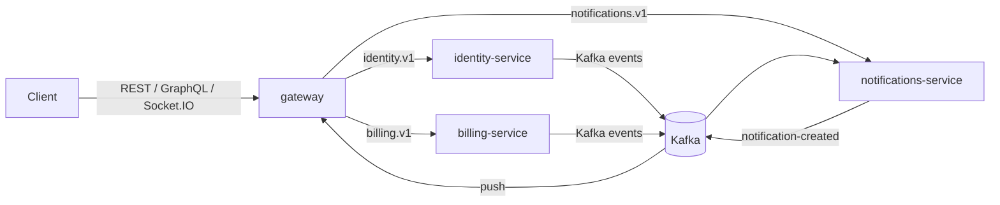
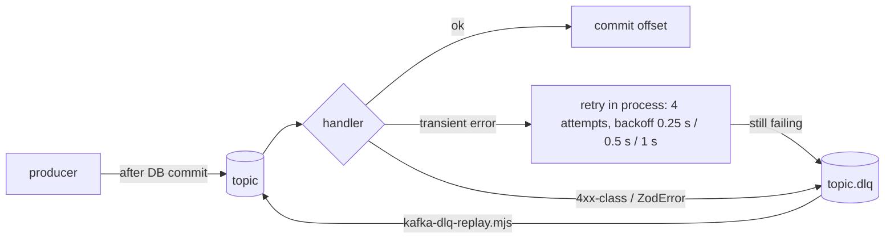

# API reference

This page lists every interface the boilerplate exposes: REST, GraphQL, Socket.IO, gRPC and Kafka. It was written from
the controllers, resolvers, gateways and `.proto` files. If this page and the code disagree, the code is right. The
generated OpenAPI document (`/openapi.json`) is the exact REST contract.

## Surfaces and ports

The public surface is the same in both topologies. The monolith and the gateway mount the same presentation classes.
In the monolith they reach the domain through the CQRS buses (`XApiModule.forLocal()`). In the gateway they reach it
through gRPC clients (`XApiModule.forRemote()`). See [ARCHITECTURE.md](ARCHITECTURE.md).

| Process                 | Listens on                                       | Serves                                                                                                      |
| ----------------------- | ------------------------------------------------ | ----------------------------------------------------------------------------------------------------------- |
| `monolith`              | HTTP `PORT` (default `3000`)                     | REST `/v1/*`, GraphQL + graphql-ws `/graphql`, Socket.IO `/notifications`, `/docs`, `/health/*`, `/metrics` |
| `gateway`               | HTTP `PORT` (default `3000`)                     | Same public surface as the monolith. Domain calls go to the services over gRPC                              |
| `identity-service`      | gRPC `GRPC_URL` (default `0.0.0.0:50051`) + HTTP | `identity.v1.AuthService`, `identity.v1.UsersService`. HTTP serves only `/health/*` and `/metrics`          |
| `notifications-service` | gRPC `GRPC_URL` + HTTP                           | `notifications.v1.NotificationsService`, Kafka consumers. HTTP serves only `/health/*` and `/metrics`       |
| `billing-service`       | gRPC `GRPC_URL` + HTTP                           | `billing.v1.BillingService`. HTTP serves only `/health/*` and `/metrics`                                    |

Docker Compose host ports (all bound to `127.0.0.1`): API `3000` (`API_HOST_PORT`, used by the monolith or the gateway
depending on the profile), identity gRPC `50051`, notifications gRPC `50052`, billing gRPC `50053`. Each service listens
on `50051` inside its container. In local development the gateway finds the services through `IDENTITY_GRPC_URL`
(`localhost:50051`), `NOTIFICATIONS_GRPC_URL` (`localhost:50052`) and `BILLING_GRPC_URL` (`localhost:50053`). See
[DOCKER.md](DOCKER.md) and [CONFIGURATION.md](CONFIGURATION.md).

Conventions that apply to every HTTP response:

- **Versioning**: URI versioning with default version `1`, so domain routes live under `/v1/...`. `/health/*` and
  `/metrics` are version-neutral, so they have no prefix.
- **Request ids**: every response carries `x-request-id` (this hop) and `x-correlation-id` (the whole flow). A valid
  incoming `x-request-id` is adopted. Otherwise the server creates a UUIDv7. The same id appears in logs, in traces and
  in problem documents (`requestId`).
- **Rate limiting** (Redis-backed, shared by all replicas): `THROTTLE_LIMIT` requests per `THROTTLE_TTL_MS` (default
  100 per 60 s). The limit is tracked per user when the request is authenticated and per IP otherwise. Register and
  login use the stricter `THROTTLE_AUTH_LIMIT` / `THROTTLE_AUTH_TTL_MS` (default 10 per 60 s). GraphQL is throttled
  too. Socket.IO messages are throttled per message. gRPC and Kafka traffic is not throttled.
- **Timeouts**: an HTTP or GraphQL handler that runs longer than 30 s fails with 504 `TIMEOUT`. The streaming upload
  opts out with `@Timeout(0)`.
- **Metrics port**: `/metrics` is served on the same port as the public API. Putting it on a separate listener is a
  known follow-up. Until then, protect it with `METRICS_BEARER_TOKEN` or block it at the ingress.
- **Maintenance**: with `MAINTENANCE_MODE=true` every request except `/health*` and `/metrics` gets 503 problem+json
  with `Retry-After`.

## API documentation pages

The monolith and the gateway serve these pages (`setupApiDocs`). They are on by default and off when
`NODE_ENV=production`, unless the variable in the table turns them on.

| Path                | What                                                                                      | Toggle                                       |
| ------------------- | ----------------------------------------------------------------------------------------- | -------------------------------------------- |
| `GET /docs`         | Scalar API reference, rendered from `/openapi.json`. It has its own route-level CSP       | `DOCS_ENABLED`                               |
| `GET /openapi.json` | OpenAPI document, built on the first request and then cached                              | `DOCS_ENABLED`                               |
| `GET /openapi.yaml` | The same document in YAML                                                                 | `DOCS_ENABLED`                               |
| `GET /graphql`      | Apollo Sandbox (embedded landing page). When it is off, a GET without a query returns 400 | `GRAPHQL_SANDBOX`                            |
| Introspection       | Schema introspection on `/graphql`                                                        | `GRAPHQL_INTROSPECTION`                      |
| gRPC reflection     | `grpc.reflection` on each service, for grpcurl, Postman and Kreya                         | `GRPC_REFLECTION` (`true` in docker-compose) |

About the OpenAPI document:

- It declares a bearer (JWT) security scheme.
- Tags come from the controllers.
- Operation ids look like `<Controller>_<method>` (`Auth_register`, `Users_list`, `Billing_createCheckoutSession`). They
  are stable, so generated clients keep the same method names across releases.
- `/health` and `/metrics` are left out of the document.
- zod-validated routes are documented from their schemas (`standardSchema`). Swagger expands query schemas into
  individual parameters.

```bash
curl -s http://localhost:3000/openapi.json | jq '.paths | keys'
```

Set `GRAPHQL_SCHEMA_FILE` to also write the code-first SDL to a file. By default the schema is kept in memory only.

## Authentication and authorization

Every route is authenticated unless it is marked `@Public()`. Clients send the access token as
`Authorization: Bearer <accessToken>`. Three global guards run in order: `JwtAuthGuard`, then `RolesGuard`, then
`PermissionsGuard`. The user id always comes from the token, never from the request body.

| Token   | Lifetime                               | Notes                                                                                                                                                                                    |
| ------- | -------------------------------------- | ---------------------------------------------------------------------------------------------------------------------------------------------------------------------------------------- |
| Access  | `JWT_ACCESS_TTL_SEC` (default 900 s)   | Signed with `JWT_ACCESS_SECRET` and checked for issuer, audience and `typ`. On logout it goes on a Redis denylist (`AUTH_DENYLIST_ENABLED`, default on), so it stops working immediately |
| Refresh | `JWT_REFRESH_TTL_SEC` (default 7 days) | Single use: every refresh returns a new pair and revokes the token you sent. Presenting a token that was already rotated revokes every session of that user (`REFRESH_TOKEN_REUSED`)     |

Roles only group permissions. Endpoints check permissions (`@RequirePermissions` needs all of the listed permissions,
`@RequireAnyPermission` needs at least one). Role changes take effect on the user's next token refresh.

| Permission            | `admin` | `moderator` | `user` |
| --------------------- | :-----: | :---------: | :----: |
| `users:read`          |   yes   |     yes     |        |
| `users:write`         |   yes   |             |        |
| `users:manage-roles`  |   yes   |             |        |
| `notifications:read`  |   yes   |     yes     |  yes   |
| `notifications:write` |   yes   |     yes     |        |
| `billing:checkout`    |   yes   |             |  yes   |
| `billing:read-all`    |   yes   |             |        |
| `files:read`          |   yes   |     yes     |  yes   |
| `files:write`         |   yes   |     yes     |  yes   |
| `files:manage`        |   yes   |             |        |

Some rules depend on ownership rather than on a permission. They are enforced in the handler:

- You can always read your own user record.
- Files: you can only touch keys under `users/<yourId>/`, unless you hold `files:manage`.
- `GET /v1/billing/payments?all=true` requires `billing:read-all`.

See [SECURITY.md](SECURITY.md) for the threat model.

## REST endpoints

All domain routes are prefixed with `/v1`. The "Validation" column says how the input is checked:

- **class-validator**: the global `ValidationPipe` with `whitelist` and `forbidNonWhitelisted`, so unknown fields are
  rejected. Used by the identity DTOs. For example, register expects `displayName`; sending `name` instead returns 400
  `VALIDATION_FAILED` with `errors[]` containing
  `{ "path": "name", "message": "property name should not exist", "code": "whitelistValidation" }`.
- **zod**: Nest's native Standard Schema pipe (`@Body({ schema })`, `@Query({ schema })`). Bodies use `strictObject`, so
  unknown keys are rejected. zod response schemas also strip any field they do not list.
- **guard**: `LoginRequestGuard` validates the body before passport-local runs. Guards run before pipes, so the pipe
  would be too late here.

A bad request returns 400 `VALIDATION_FAILED` with `errors[]`, whichever validator caught it.

| Method   | Path                            | Auth / permission                                       | Validation      | Success | Description                                                                                                                                                                                                                   |
| -------- | ------------------------------- | ------------------------------------------------------- | --------------- | ------- | ----------------------------------------------------------------------------------------------------------------------------------------------------------------------------------------------------------------------------- |
| `POST`   | `/v1/auth/register`             | Public, auth throttle                                   | class-validator | 201     | Create an account and open a session. Returns `AuthTokens`. 409 `EMAIL_TAKEN`                                                                                                                                                 |
| `POST`   | `/v1/auth/login`                | Public, auth throttle                                   | guard           | 200     | Email and password login (passport-local). Returns `AuthTokens`. 401 `INVALID_CREDENTIALS`                                                                                                                                    |
| `POST`   | `/v1/auth/refresh`              | Public                                                  | class-validator | 200     | Rotate the refresh token (`{ refreshToken }`). 401 `INVALID_REFRESH_TOKEN`, `SESSION_EXPIRED` or `REFRESH_TOKEN_REUSED`                                                                                                       |
| `POST`   | `/v1/auth/logout`               | Bearer                                                  | class-validator | 204     | Denylists the access token. Revokes the session of `refreshToken`, or every session when it is omitted. Discard both tokens: refreshing with the logged-out token is reuse (401 `REFRESH_TOKEN_REUSED`, all sessions revoked) |
| `GET`    | `/v1/auth/me`                   | Bearer                                                  | none            | 200     | The authenticated user                                                                                                                                                                                                        |
| `GET`    | `/v1/users`                     | `users:read`                                            | class-validator | 200     | Keyset page of users, newest first. Query: `limit` (1-100, default 20), `cursor`, `search` (3-100 chars)                                                                                                                      |
| `GET`    | `/v1/users/:id`                 | Bearer (yourself) or `users:read`                       | `ParseUUIDPipe` | 200     | One user. `:id` must be a UUIDv7                                                                                                                                                                                              |
| `PATCH`  | `/v1/users/:id/roles`           | `users:manage-roles`                                    | class-validator | 200     | Replace a user's roles. 422 `CANNOT_REVOKE_OWN_ADMIN` or `CANNOT_REMOVE_LAST_ADMIN`                                                                                                                                           |
| `GET`    | `/v1/notifications`             | `notifications:read`                                    | zod             | 200     | My inbox, newest first. Query: `limit` (1-100, default 20), `pageState`                                                                                                                                                       |
| `POST`   | `/v1/notifications/:id/read`    | `notifications:read`                                    | zod             | 204     | Mark one of my notifications read. Idempotent. 404 `NOTIFICATION_NOT_FOUND` outside my inbox                                                                                                                                  |
| `POST`   | `/v1/billing/checkout-sessions` | `billing:checkout`                                      | zod             | 201     | Create a Stripe Checkout Session and a `pending` payment. Body: `priceId`, `quantity` (1-100). Accepts `Idempotency-Key`                                                                                                      |
| `POST`   | `/v1/billing/webhooks/stripe`   | Public, not throttled, verified with `Stripe-Signature` | raw body        | 200     | Stripe webhook. Each event id is applied once; duplicates return `duplicate: true`. 422 on a bad signature                                                                                                                    |
| `GET`    | `/v1/billing/payments`          | Bearer. `all=true` needs `billing:read-all`             | zod             | 200     | My payments (or everyone's with `all=true`), keyset-paginated. Query: `all`, `limit` (1-100, default 20), `cursor`                                                                                                            |
| `POST`   | `/v1/files`                     | `files:write`                                           | multipart       | 201     | Stream one multipart part named `file` to object storage (up to `STORAGE_MAX_UPLOAD_BYTES`, default 25 MiB)                                                                                                                   |
| `POST`   | `/v1/files/presigned-uploads`   | `files:write`                                           | zod             | 201     | Presigned PUT URL. Body: `filename`, `contentType`, `contentLength`. Send the returned `headers` exactly as given                                                                                                             |
| `GET`    | `/v1/files/download-url?key=`   | `files:read` or `files:manage`                          | zod             | 200     | Presigned GET URL that downloads as an attachment. Only your own keys unless you hold `files:manage`                                                                                                                          |
| `DELETE` | `/v1/files?key=`                | `files:write` or `files:manage`                         | zod             | 204     | Delete a file. Idempotent. Only your own keys unless you hold `files:manage`                                                                                                                                                  |
| `GET`    | `/health/live`                  | Public                                                  | none            | 200     | Liveness. Always `ok` while the process is up                                                                                                                                                                                 |
| `GET`    | `/health/ready`                 | Public                                                  | none            | 200/503 | Readiness of the app's own stores: Postgres, Cassandra, Redis (+ Kafka on notifications-service; the gateway checks only Redis). Failure details are hidden in production                                                     |
| `GET`    | `/metrics`                      | Public. Bearer `METRICS_BEARER_TOKEN` when it is set    | none            | 200     | Prometheus metrics. Returns 404 when `METRICS_ENABLED=false` or the token is wrong or missing                                                                                                                                 |

More details for each endpoint group:

- **Uploads**: the allowed content types are PNG, JPEG, GIF, WebP and AVIF images, PDF, JSON, ZIP, plain text, CSV, MP3
  and MP4. Any other type gets 415 `UNSUPPORTED_FILE_TYPE`. A file over the limit gets 413 `FILE_TOO_LARGE`, and
  `errors[0]` states the limit. Each instance runs at most `STORAGE_MAX_CONCURRENT_UPLOADS` (default 4) streamed uploads
  at once. Beyond that, the server answers 503 `UPLOAD_CAPACITY_EXCEEDED` with `Retry-After`. Use presigned uploads for
  large files.
- **Stripe webhook**: the signature is checked over the exact raw bytes of the request, so both apps are created with
  `rawBody: true`. Redirect URLs are never accepted from clients. They come from `STRIPE_SUCCESS_URL` and
  `STRIPE_CANCEL_URL`.

### Quick start with curl

```bash
API=http://localhost:3000

# Register (or log in) and keep the access token
TOKEN=$(curl -s "$API/v1/auth/register" -H 'content-type: application/json' \
  -d '{"email":"ada@example.com","password":"correct horse battery staple","displayName":"Ada Lovelace"}' \
  | jq -r .accessToken)

curl -s "$API/v1/auth/me" -H "authorization: Bearer $TOKEN"
curl -s "$API/v1/notifications?limit=10" -H "authorization: Bearer $TOKEN"

# Start a checkout. Sending the same Idempotency-Key again returns the same session
curl -s "$API/v1/billing/checkout-sessions" -H "authorization: Bearer $TOKEN" \
  -H 'content-type: application/json' -H 'idempotency-key: order-42' \
  -d '{"priceId":"price_123","quantity":1}'

# Upload a file through the API
curl -s "$API/v1/files" -H "authorization: Bearer $TOKEN" -F 'file=@./report.pdf;type=application/pdf'
```

The upload answers 201 `{ key: "users/<userId>/<uuidv7>-<filename>", filename, contentType, size, etag }`.
`GET /v1/files/download-url?key=` returns `{ key, filename, url, expiresAt, size, contentType }`, where `url` is a
presigned GET built from `S3_PUBLIC_ENDPOINT` that downloads as an attachment. `POST /v1/files/presigned-uploads`
returns `{ key, filename, url, method: "PUT", headers: { "content-type" }, expiresAt }`; content type and length are
signed. A key outside your own `users/<id>/` prefix gets 403 `FILE_ACCESS_DENIED` unless you hold `files:manage`.

**Testing the Stripe webhook locally.** Sign the exact payload with the same `STRIPE_WEBHOOK_SECRET` the app (or
billing-service) uses, then send the bytes unchanged (`--data-binary`, not `-d`):

```js
// sign.mjs: node sign.mjs > header.txt (payload.json holds the event)
import { readFileSync } from 'node:fs';
import Stripe from 'stripe';
const payload = readFileSync('payload.json', 'utf8');
console.log(
  new Stripe('sk_test_placeholder').webhooks.generateTestHeaderString({
    payload,
    secret: process.env.STRIPE_WEBHOOK_SECRET,
  }),
);
```

```bash
curl -s "$API/v1/billing/webhooks/stripe" -H 'content-type: application/json' \
  -H "stripe-signature: $(cat header.txt)" --data-binary @payload.json
# 200 {"received":true,"eventId":"evt_…","eventType":"checkout.session.completed","duplicate":false}
# the same event again → "duplicate":true; a bad signature → 422 INVALID_WEBHOOK_SIGNATURE
```

A `checkout.session.completed` event with `payment_status: "paid"` marks the matching payment (by
`client_reference_id` or `metadata.paymentId`, then the session id) `succeeded`, stores `amount_total`, `currency` and
`payment_intent`, and publishes `billing.payment-succeeded.v1`: the user then gets a `payment_receipt` notification and
a "Your receipt ($19.99)" mail.

The `AuthTokens` response looks like this:

```json
{
  "accessToken": "eyJ...",
  "refreshToken": "eyJ...",
  "expiresIn": 900,
  "tokenType": "Bearer",
  "user": {
    "id": "01994f6c-1c3a-7b4e-9f00-5d1e2a3b4c5d",
    "email": "ada@example.com",
    "displayName": "Ada Lovelace",
    "roles": ["user"],
    "createdAt": "2026-09-30T10:00:00.000Z",
    "updatedAt": "2026-09-30T10:00:00.000Z"
  }
}
```

## Error format

All transports share one error vocabulary. Domain code throws `DomainException` subclasses from `@app/common`, each with
a stable `code` and an HTTP status. Each transport turns that exception into its own error format:

| Transport | Error format                                                                                                                        |
| --------- | ----------------------------------------------------------------------------------------------------------------------------------- |
| REST      | RFC 9457 body with `content-type: application/problem+json; charset=utf-8` (`AllExceptionsFilter`)                                  |
| GraphQL   | `errors[].extensions` = `{ code, status, type, errors?, requestId? }` (`formatGraphqlError`)                                        |
| Socket.IO | The ack callback receives `{ ok: false, error: <problem> }`. Without an ack, the server emits an `exception` event with the problem |
| gRPC      | A gRPC status, plus the `x-error-code` and `x-error-details-bin` trailers (see [gRPC](#grpc))                                       |
| Kafka     | No reply. The record goes to `<topic>.dlq` (see [Kafka](#kafka))                                                                    |

### Problem document

```json
{
  "type": "https://errors.nestjs-boilerplate.dev/validation-failed",
  "title": "Validation Failed",
  "status": 400,
  "detail": "Request validation failed",
  "instance": "/v1/auth/register",
  "code": "VALIDATION_FAILED",
  "requestId": "01994f6c-1c3a-7b4e-9f00-5d1e2a3b4c5d",
  "errors": [{ "path": "email", "message": "email must be an email", "code": "isEmail" }]
}
```

- `type` is built as `https://errors.nestjs-boilerplate.dev/` + the code in kebab-case. `title` is derived from the
  code.
- Clients should branch on `code`. Codes are part of the public API and are never renamed.
- `errors[]` holds `{ path, message, code? }` issues. The shape is the same for class-validator, zod and the gRPC zod
  pipe. Paths are dotted (`items.0.sku`).
- The body never has a `statusCode` member. Fastify would otherwise rewrite the content type to `application/json`.
- 5xx responses have no `detail` in production. Outside production (`exposeInternal`), the message is shown. 429
  responses always use the generic "Too many requests" detail.

### Generic codes

| Code                      | Status | When                                                                          |
| ------------------------- | ------ | ----------------------------------------------------------------------------- |
| `BAD_REQUEST`             | 400    | Malformed request (other 4xx without a specific code)                         |
| `VALIDATION_FAILED`       | 400    | Body, query, param or header validation failed (`errors[]` set)               |
| `VALIDATION_FAILED`       | 422    | Domain-level validation (`DomainValidationException` without a specific code) |
| `UNAUTHENTICATED`         | 401    | Missing or invalid credentials                                                |
| `FORBIDDEN`               | 403    | Authenticated but missing a permission (`details.requiredPermissions`)        |
| `NOT_FOUND`               | 404    | Unknown route or entity                                                       |
| `METHOD_NOT_ALLOWED`      | 405    |                                                                               |
| `CONFLICT`                | 409    | State conflict                                                                |
| `PAYLOAD_TOO_LARGE`       | 413    | Body over `BODY_LIMIT_BYTES` (default 1 MiB)                                  |
| `UNSUPPORTED_MEDIA_TYPE`  | 415    |                                                                               |
| `BUSINESS_RULE_VIOLATION` | 422    | A well-formed request that breaks a business rule                             |
| `RATE_LIMITED`            | 429    | Throttled                                                                     |
| `EXTERNAL_SERVICE_ERROR`  | 502    | An upstream (Stripe, SMTP, another service) failed                            |
| `SERVICE_UNAVAILABLE`     | 503    | Maintenance mode, open circuit breaker, upstream unavailable                  |
| `TIMEOUT`                 | 504    | Handler timeout (30 s) or gRPC deadline exceeded                              |
| `INTERNAL`                | 500    | Anything unexpected                                                           |

### Domain codes

| Code                                                                                      | Status | Source                                                                                                                 |
| ----------------------------------------------------------------------------------------- | ------ | ---------------------------------------------------------------------------------------------------------------------- |
| `MISSING_CREDENTIALS`, `MISSING_TOKEN`, `INVALID_TOKEN`, `TOKEN_EXPIRED`, `TOKEN_REVOKED` | 401    | `@app/auth` (`AuthErrorCode`)                                                                                          |
| `INVALID_CREDENTIALS`, `INVALID_REFRESH_TOKEN`, `SESSION_EXPIRED`, `REFRESH_TOKEN_REUSED` | 401    | identity                                                                                                               |
| `EMAIL_TAKEN`                                                                             | 409    | identity                                                                                                               |
| `CANNOT_REVOKE_OWN_ADMIN`, `CANNOT_REMOVE_LAST_ADMIN`                                     | 422    | identity                                                                                                               |
| `INVALID_ROLES`, `INVALID_USER`                                                           | 422    | identity                                                                                                               |
| `NOTIFICATION_NOT_FOUND`                                                                  | 404    | notifications                                                                                                          |
| `PAYMENT_NOT_FOUND`                                                                       | 404    | billing                                                                                                                |
| `IDEMPOTENCY_KEY_REUSED`, `PAYMENT_CONCURRENTLY_MODIFIED`, `CHECKOUT_SESSION_MISMATCH`    | 409    | billing                                                                                                                |
| `INVALID_PAYMENT`                                                                         | 422    | billing                                                                                                                |
| `CHECKOUT_URL_MISSING`                                                                    | 502    | billing                                                                                                                |
| `INVALID_WEBHOOK_SIGNATURE`                                                               | 422    | `@app/payments` (Stripe). It also defines `PAYMENT_DECLINED`, `PAYMENT_PROVIDER_ERROR` and others (`PaymentErrorCode`) |
| `FILE_ACCESS_DENIED`                                                                      | 403    | files                                                                                                                  |
| `FILE_NOT_FOUND`                                                                          | 404    | files                                                                                                                  |
| `FILE_TOO_LARGE`                                                                          | 413    | files                                                                                                                  |
| `UNSUPPORTED_FILE_TYPE`                                                                   | 415    | files                                                                                                                  |
| `UPLOAD_CAPACITY_EXCEEDED`                                                                | 503    | files (with `Retry-After`)                                                                                             |
| `INVALID_CURSOR`                                                                          | 422    | keyset pagination (`@app/common`, `@app/database`)                                                                     |
| `INVALID_PAGE_STATE`                                                                      | 422    | Cassandra paging (`@app/cassandra`)                                                                                    |
| `QUERY_TOO_COMPLEX`                                                                       | 400    | GraphQL only: query cost above `GRAPHQL_MAX_COMPLEXITY` (default 250)                                                  |

## Pagination

No list endpoint uses `OFFSET`. Each list is either keyset-paginated (Postgres) or uses the driver's native paging
(Cassandra). Fetching page 1000 costs the same as fetching page 1. Every page token is opaque: send back exactly what
the previous page returned.

| List                                             | Store     | Request              | Response                   | Default / max size |
| ------------------------------------------------ | --------- | -------------------- | -------------------------- | ------------------ |
| `GET /v1/users`, GraphQL `users`                 | Postgres  | `limit`, `cursor`    | `{ items, nextCursor }`    | 20 / 100           |
| `GET /v1/billing/payments`, GraphQL `payments`   | Postgres  | `limit`, `cursor`    | `{ items, nextCursor }`    | 20 / 100           |
| `GET /v1/notifications`, GraphQL `notifications` | Cassandra | `limit`, `pageState` | `{ items, nextPageState }` | 20 / 100           |

**Keyset cursors (Postgres).** Ids are UUIDv7, which sort by creation time. So `ORDER BY id DESC` returns the newest
first, and `WHERE id < :cursor` resumes right after the last row of the previous page. The server fetches `limit + 1`
rows to find out whether there is a next page. `nextCursor` is `null` on the last page, so you never get a cursor that
leads to an empty page. A cursor is base64url-encoded JSON, at most 512 characters. Errors:

- Too long or the wrong type: 400 `VALIDATION_FAILED` from the request schema.
- Well-formed but does not decode to a cursor this API issued: 422 `INVALID_CURSOR`.

**Cassandra paging state (notifications).** `nextPageState` is the driver's paging state as hex, at most 2048
characters. It only works with the exact same query (same user). Errors:

- Not hex, or too long: 400 `VALIDATION_FAILED` at the edge.
- Hex that the driver rejects: 422 `INVALID_PAGE_STATE`.

When the inbox ends exactly on a page boundary, the driver still returns a state, and the next page is empty with
`nextPageState: null`. Treat that empty page as the end of the list.

```bash
# Walk every page of my payments
CURSOR=""
while :; do
  PAGE=$(curl -s "$API/v1/billing/payments?limit=50${CURSOR:+&cursor=$CURSOR}" -H "authorization: Bearer $TOKEN")
  echo "$PAGE" | jq -c '.items[]'
  CURSOR=$(echo "$PAGE" | jq -r '.nextCursor // empty'); [ -z "$CURSOR" ] && break
done
```

## Idempotency keys

| Operation                                  | Mechanism                                                                                                                                                                                                                                                                                                                                                                                                               |
| ------------------------------------------ | ----------------------------------------------------------------------------------------------------------------------------------------------------------------------------------------------------------------------------------------------------------------------------------------------------------------------------------------------------------------------------------------------------------------------- |
| `POST /v1/billing/checkout-sessions`       | Optional `Idempotency-Key` header: 8-255 characters of `[A-Za-z0-9._:-]`. An invalid key gets 400 `VALIDATION_FAILED` with `errors[0].path = "headers.idempotency-key"`. The key is unique per user (`(user_id, idempotency_key)`). Sending it again with the same `priceId` and `quantity` returns the same payment and the same Checkout Session. Sending it with a different body gets 409 `IDEMPOTENCY_KEY_REUSED`. |
| GraphQL `createCheckoutSession`            | The same rules, through the `idempotencyKey` input field                                                                                                                                                                                                                                                                                                                                                                |
| Stripe idempotency                         | The key sent to Stripe is derived from our payment id (`checkout-<paymentId>`), never from the client's key. Stripe keys are account-wide, so two users sending the same key must not collide                                                                                                                                                                                                                           |
| `POST /v1/billing/webhooks/stripe`         | Each Stripe event id is recorded in `stripe_events` and applied once. A redelivered event returns 200 with `duplicate: true`. The ledger is kept for 30 days (Stripe retries for up to 3 days)                                                                                                                                                                                                                          |
| Mark read (REST, GraphQL, Socket.IO, gRPC) | Idempotent by nature: marking a notification read twice is a no-op                                                                                                                                                                                                                                                                                                                                                      |
| `DELETE /v1/files`                         | Idempotent: deleting a key that does not exist returns 204                                                                                                                                                                                                                                                                                                                                                              |
| Kafka consumers                            | Delivery is at least once. Notifications created from events get a deterministic UUIDv7 id, derived from the source fact, so reprocessing an event upserts the same Cassandra row. The push consumer deduplicates on the envelope id (`SET NX`, 10 minutes)                                                                                                                                                             |

Other `POST` endpoints (register, login, refresh, upload, presigned upload) are not idempotent. Replaying `refresh` with
a token that was already rotated is treated as token theft. For the same reason, gRPC clients retry only read methods
(see [gRPC](#grpc)).

## GraphQL

Apollo Server on Fastify at `/graphql` (`GRAPHQL_PATH`). The schema is code-first. Queries and mutations go over
HTTP POST, and subscriptions go over **graphql-ws** on the same path. Authentication and RBAC are the same as REST: send
`Authorization: Bearer <accessToken>`. Inputs are validated by class-validator, through the same global pipe as REST.

| Kind         | Field                                                       | Auth / permission                            | Returns                   | Notes                                                                                |
| ------------ | ----------------------------------------------------------- | -------------------------------------------- | ------------------------- | ------------------------------------------------------------------------------------ |
| Query        | `me`                                                        | Bearer                                       | `User!`                   |                                                                                      |
| Query        | `user(id: UUID!)`                                           | Bearer (yourself) or `users:read`            | `User!`                   |                                                                                      |
| Query        | `users(limit, cursor, search)`                              | `users:read`                                 | `UserConnection!`         | Complexity 10                                                                        |
| Query        | `notifications(limit, pageState)`                           | `notifications:read`                         | `NotificationConnection!` | Complexity 5                                                                         |
| Query        | `payments(all, limit, cursor)`                              | Bearer. `all: true` needs `billing:read-all` | `PaymentConnection!`      | Complexity 10. `Payment.user` is batched through a DataLoader (complexity 5, no N+1) |
| Mutation     | `register(input: RegisterInput!)`                           | Public, auth throttle                        | `AuthPayload!`            |                                                                                      |
| Mutation     | `login(input: LoginInput!)`                                 | Public, auth throttle                        | `AuthPayload!`            |                                                                                      |
| Mutation     | `refreshTokens(input: RefreshTokensInput!)`                 | Public                                       | `AuthPayload!`            | Single-use rotation, the same as REST                                                |
| Mutation     | `updateUserRoles(input: UpdateUserRolesInput!)`             | `users:manage-roles`                         | `User!`                   |                                                                                      |
| Mutation     | `markNotificationRead(input: MarkNotificationReadInput!)`   | `notifications:read`                         | `Boolean!`                | Idempotent. `NOTIFICATION_NOT_FOUND` outside my inbox                                |
| Mutation     | `createCheckoutSession(input: CreateCheckoutSessionInput!)` | `billing:checkout`                           | `CheckoutSession!`        | `idempotencyKey` in the input                                                        |
| Mutation     | `createUploadUrl(input: CreateUploadUrlInput!)`             | `files:write`                                | `PresignedUpload!`        | Presigned PUT (the same as `POST /v1/files/presigned-uploads`)                       |
| Subscription | `notificationCreated`                                       | `notifications:read`                         | `Notification!`           | Only the subscriber's own notifications                                              |

The GraphQL surface is smaller than REST. Logout, the streaming upload, file download and delete, and the Stripe
webhook are **REST only**.

Custom scalars are `UUID` and `JSONObject` (from graphql-scalars) and `DateTime` (ISO 8601). Enum values are in
SCREAMING_CASE in GraphQL (`ADMIN`, `PAYMENT_RECEIPT`, `SUCCEEDED`). REST, gRPC and Kafka carry the lower-case wire
values (`admin`, `payment_receipt`, `succeeded`).

### Example documents

```graphql
mutation Login($input: LoginInput!) {
  login(input: $input) {
    accessToken
    refreshToken
    expiresIn
    user {
      id
      email
      roles
    }
  }
}
# variables: { "input": { "email": "ada@example.com", "password": "correct horse battery staple" } }

query Inbox($pageState: String) {
  notifications(limit: 20, pageState: $pageState) {
    items {
      id
      type
      title
      body
      read
      data
      createdAt
    }
    nextPageState
  }
}

query Payments($cursor: String) {
  payments(limit: 20, cursor: $cursor) {
    items {
      id
      status
      amountTotal
      currency
      user {
        displayName
      }
    }
    nextCursor
  }
}

mutation Checkout {
  createCheckoutSession(input: { priceId: "price_123", quantity: 1, idempotencyKey: "order-42" }) {
    id
    url
    paymentId
  }
}

mutation MarkRead($id: UUID!) {
  markNotificationRead(input: { id: $id })
}

subscription OnNotification {
  notificationCreated {
    id
    type
    title
    createdAt
  }
}
```

Requests over HTTP need `content-type: application/json` (Apollo CSRF prevention). A GET or a "simple" request without
that header, or without `apollo-require-preflight`, is rejected.

```bash
curl -s "$API/graphql" -H 'content-type: application/json' -H "authorization: Bearer $TOKEN" \
  -d '{"query":"{ me { id email roles } }"}'
```

### Subscriptions (graphql-ws)

- **Authentication** happens once, at `connection_init`. Put the token in `connectionParams` as
  `{ authorization: 'Bearer <jwt>' }` or `{ token: '<jwt>' }`. The keys `Authorization` and `authToken` also work. The
  server checks the signature, issuer, audience, `typ` and the denylist.
- The client must send `connection_init` within **10 s**, or the socket is closed.
- A missing, invalid or revoked token closes the socket with **4403** Forbidden.
- When the access token expires mid-session, the socket is closed with **4401**. Reconnect with a fresh token.
- Events fan out through Redis PubSub, so a subscriber connected to any replica gets its own events. Each user has
  their own trigger (`notificationCreated:<userId>`).

```ts
import { createClient } from 'graphql-ws';

const client = createClient({
  url: 'ws://localhost:3000/graphql',
  connectionParams: async () => ({ authorization: `Bearer ${await getAccessToken()}` }),
});

const unsubscribe = client.subscribe(
  { query: 'subscription { notificationCreated { id type title createdAt } }' },
  {
    next: ({ data }) => console.log(data?.notificationCreated),
    error: (err) => console.error(err), // CloseEvent 4401: refresh the token and resubscribe
    complete: () => undefined,
  },
);
```

### GraphQL errors

Errors thrown by resolvers use the REST vocabulary in `extensions`:

```json
{
  "errors": [
    {
      "message": "Insufficient permissions",
      "path": ["users"],
      "extensions": {
        "code": "FORBIDDEN",
        "status": 403,
        "type": "https://errors.nestjs-boilerplate.dev/forbidden",
        "requestId": "01994f6c-..."
      }
    }
  ],
  "data": null
}
```

Errors in the document itself (syntax, validation, `BAD_USER_INPUT`, `QUERY_TOO_COMPLEX`) keep Apollo's code and
message. Stack traces appear only outside production. A query whose cost is above `GRAPHQL_MAX_COMPLEXITY` (default 250) is rejected with HTTP 400 `QUERY_TOO_COMPLEX`.

## WebSocket: /notifications

The `/notifications` Socket.IO namespace is served by `NotificationsGateway` on the HTTP port, at the default Socket.IO
path `/socket.io`. The server only accepts the **`websocket` transport**: no long-polling. Set
`transports: ['websocket']` on the client, because the default client starts with polling and fails to connect.
`RedisIoAdapter` relays room emits across replicas.

**Handshake.** A namespace middleware checks the access token (signature and denylist) before the connection is
accepted, so no message can arrive before authentication. Pass the token in `auth: { token }`, as a raw JWT or as
`Bearer <jwt>`. Server-to-server clients can send an `Authorization: Bearer` header instead. Tokens in the query string
are deliberately rejected, because they end up in access logs. A refused client gets `connect_error`, and `err.data` is
the problem document (`code` = `MISSING_TOKEN`, `INVALID_TOKEN`, `TOKEN_EXPIRED` or `TOKEN_REVOKED`). Once connected,
the socket joins the room `user:<id>`.

**Session lifetime.** Tokens are short-lived but sockets are not:

- When the token expires, the server emits `exception` (`TOKEN_EXPIRED`) and disconnects the socket.
- Every 30 s, each replica disconnects its sockets whose token was revoked by a logout (`exception`, `TOKEN_REVOKED`).

The client must reconnect with a fresh token. Socket.IO does not reconnect on its own after a server-side disconnect.

| Event                    | Direction       | Payload                                 | Reply                                                                                                          |
| ------------------------ | --------------- | --------------------------------------- | -------------------------------------------------------------------------------------------------------------- |
| `notification.created`   | server → client | `Notification` (the same shape as REST) | none                                                                                                           |
| `notifications.markRead` | client → server | `{ id: "<uuid>" }` (zod-validated)      | ack `{ ok: true }`, or `{ ok: false, error: <problem> }`. Needs `notifications:read`. Throttled to 30 per 10 s |
| `ping`                   | client → server | none                                    | a `pong` event with `{ ts: "<ISO date>" }`                                                                     |
| `exception`              | server → client | Problem document                        | Sent when a message fails without an ack, and on token expiry or revocation                                    |

Each message passes through the global guards (`JwtAuthGuard`, which also checks the token has not expired, then RBAC),
then `WsSessionGuard` (the denylist), then `WsThrottlerGuard` (Redis-backed). Messages are limited to 1 MB
(`maxHttpBufferSize`).

```ts
import { io } from 'socket.io-client';

const socket = io('http://localhost:3000/notifications', {
  transports: ['websocket'], // the server has no polling transport
  auth: { token: accessToken }, // or `Bearer ${accessToken}`
});

socket.on('connect_error', (err) => {
  // err.data is the problem document: { code: 'TOKEN_EXPIRED', status: 401, ... }
  console.error((err as Error & { data?: { code: string } }).data?.code ?? err.message);
});
socket.on('notification.created', (n) => console.log('new', n.id, n.title));
socket.on('exception', (problem) => {
  if (problem.code === 'TOKEN_EXPIRED' || problem.code === 'TOKEN_REVOKED') {
    // refresh the access token, then: socket.auth = { token: fresh }; socket.connect();
  }
});

const ack = await socket.emitWithAck('notifications.markRead', { id: notificationId });
if (!ack.ok) console.error(ack.error.code); // e.g. NOTIFICATION_NOT_FOUND, VALIDATION_FAILED, RATE_LIMITED
```

## gRPC

gRPC is the internal API between the gateway and the services. It is not a public API. The contracts live in
`libs/contracts/src/proto/<context>/v1/*.proto`. TypeScript types and controller decorators are generated with ts-proto
(`bun run proto:gen`). `google.protobuf.Timestamp` maps to `Date`, which is why `protobufjs` is pinned to 7.x.



| Package / service                       | RPC                     | Request → response                                                        | Retried on `UNAVAILABLE` |
| --------------------------------------- | ----------------------- | ------------------------------------------------------------------------- | :----------------------: |
| `identity.v1.AuthService`               | `Register`              | `RegisterRequest` → `AuthTokens`                                          |                          |
|                                         | `Login`                 | `LoginRequest` → `AuthTokens`                                             |                          |
|                                         | `RefreshTokens`         | `RefreshTokensRequest` → `AuthTokens`                                     |                          |
|                                         | `Logout`                | `LogoutRequest` → `google.protobuf.Empty`                                 |                          |
| `identity.v1.UsersService`              | `GetUser`               | `GetUserRequest` → `User`                                                 |           yes            |
|                                         | `GetUsersByIds`         | `GetUsersByIdsRequest` → `UserList` (DataLoader backend, at most 500 ids) |           yes            |
|                                         | `ListUsers`             | `ListUsersRequest` → `UserPage`                                           |           yes            |
|                                         | `UpdateUserRoles`       | `UpdateUserRolesRequest` → `User`                                         |                          |
| `notifications.v1.NotificationsService` | `ListNotifications`     | `ListNotificationsRequest` → `NotificationPage`                           |           yes            |
|                                         | `MarkNotificationRead`  | `MarkNotificationReadRequest` → `google.protobuf.Empty`                   |                          |
| `billing.v1.BillingService`             | `CreateCheckoutSession` | `CreateCheckoutSessionRequest` → `CheckoutSession`                        |                          |
|                                         | `HandleStripeWebhook`   | `HandleStripeWebhookRequest` → `HandleStripeWebhookResponse`              |                          |
|                                         | `ListPayments`          | `ListPaymentsRequest` → `PaymentList`                                     |           yes            |

Each server also exposes `grpc.health.v1.Health` (`Check` and `Watch`, overall and per service). It reports `SERVING`
once every service is registered and switches to `NOT_SERVING` when shutdown starts. Reflection is controlled by
`GRPC_REFLECTION` (see [API documentation pages](#api-documentation-pages)).

**Trust model.** RBAC is enforced at the edge (the gateway). Services trust the `user_id` in the request and the
`x-user-id` / `x-user-roles` metadata, so they must not be reachable from outside the cluster. In production they need
TLS: `GRPC_TLS_CA_PATH`, `GRPC_TLS_CERT_PATH`, `GRPC_TLS_KEY_PATH`, and mutual TLS by default
(`GRPC_TLS_REQUIRE_CLIENT_CERT`). With `NODE_ENV=production`, plaintext is refused unless `GRPC_ALLOW_INSECURE=true`.
docker-compose sets that flag, plus `GRPC_REFLECTION=true`, for local use only. Other metadata carried on each call:

- `x-request-id` and `x-correlation-id`: the services adopt them, so logs line up across hops.
- Error trailers: `x-error-code` (the stable domain code) and `x-error-details-bin` (JSON of the client-safe details).

Requests are validated with zod (`ZodRpcValidationPipe`). See [SECURITY.md](SECURITY.md).

**Client policy (gateway).**

- Every call has a deadline of `GRPC_DEADLINE_MS` (default 5000 ms). Messages are capped by `GRPC_MAX_MESSAGE_BYTES`
  (default 4 MiB).
- Only the read methods marked "yes" above are retried on `UNAVAILABLE`, with backoff. A mutation can commit just
  before its server dies, and replaying `RefreshTokens` would trip reuse detection and revoke every session of the user.
- Each client has a circuit breaker. It opens at 50 % failures once there are at least 10 calls in a 10 s window, and
  tries again (half-open) after 5 s. Caller mistakes (`NOT_FOUND`, `INVALID_ARGUMENT`, ...) do not count as failures.
  While the circuit is open, calls fail fast with 503 `SERVICE_UNAVAILABLE`.
- **What a client sees during an upstream outage** (observed with billing-service stopped): the upstream's routes
  answer 503 problem+json (`type .../service-unavailable`, `code SERVICE_UNAVAILABLE`, `detail` "The upstream service is
  temporarily unavailable", `instance`, `requestId`) in about 100-350 ms while the circuit is closed (idempotent reads
  are retried), then in about 3 ms once it is open. GraphQL fields return
  `errors[].extensions` with `code: SERVICE_UNAVAILABLE` and `status: 503`. Connection details (`ECONNREFUSED host:port`, "Breaker is open") appear only in
  the gateway logs. Routes on other upstreams keep working. Upstream 503s carry **no `Retry-After`** (only maintenance
  mode, upload capacity and 429 throttling send one). A Stripe webhook that arrives during a billing outage gets 503, so Stripe
  retries it.
- **Recovery** needs no intervention, but can take up to about `resetTimeout` + the grpc-js reconnect backoff (5 s +
  at most 10 s): a half-open probe can still fail on the channel's cached connection error while grpc-js is backing
  off. Observed: about 9 s after a 40 s outage, about 1 s after a short outage that never opened the breaker.

```bash
# Local only (docker-compose turns reflection on)
grpcurl -plaintext localhost:50051 list
grpcurl -plaintext -d '{"id":"<uuidv7>"}' localhost:50051 identity.v1.UsersService/GetUser
grpcurl -plaintext localhost:50052 grpc.health.v1.Health/Check
```

### Error-status mapping

On the server, `DomainToGrpcExceptionFilter` (scoped to each controller through `@GrpcController()`) turns a
`DomainException` into a status plus trailers. On the client, `grpcCall` turns the status and trailers back into the
same `DomainException`, so the gateway answers with the same problem document as the monolith. Details of server-side
statuses (5xx-class and `CANCELLED`) are replaced by a generic message, so internal hostnames and errors never leak.

| Thrown in the service (HTTP status)                               | gRPC status           | Rebuilt at the edge as (HTTP status)                                           |
| ----------------------------------------------------------------- | --------------------- | ------------------------------------------------------------------------------ |
| `DomainValidationException` (422), zod error, `HttpException` 400 | `INVALID_ARGUMENT`    | `DomainValidationException` (422). `errors[]` comes from the trailer           |
| `HttpException` 413                                               | `OUT_OF_RANGE`        | `DomainValidationException` (422)                                              |
| `BusinessRuleViolationException` (422)                            | `FAILED_PRECONDITION` | `BusinessRuleViolationException` (422)                                         |
| `UnauthenticatedException` (401)                                  | `UNAUTHENTICATED`     | `UnauthenticatedException` (401)                                               |
| `PermissionDeniedException` (403)                                 | `PERMISSION_DENIED`   | `PermissionDeniedException` (403)                                              |
| `EntityNotFoundException` (404)                                   | `NOT_FOUND`           | `EntityNotFoundException` (404)                                                |
| `DomainConflictException` (409)                                   | `ALREADY_EXISTS`      | `DomainConflictException` (409). `ABORTED` maps the same way                   |
| 429                                                               | `RESOURCE_EXHAUSTED`  | 429 `RATE_LIMITED`                                                             |
| `ServiceUnavailableException` (503)                               | `UNAVAILABLE`         | `ServiceUnavailableException` (503). `CANCELLED` maps the same way             |
| `OperationTimeoutException` (504), or the client deadline         | `DEADLINE_EXCEEDED`   | `OperationTimeoutException` (504 `TIMEOUT`)                                    |
| `ExternalServiceException` (502)                                  | `INTERNAL`            | `ExternalServiceException` (502)                                               |
| Unknown error                                                     | `INTERNAL`            | `ExternalServiceException` (502). From the gateway's view, the upstream failed |
| Not implemented                                                   | `UNIMPLEMENTED`       | 501 `NOT_IMPLEMENTED`                                                          |

The `x-error-code` trailer keeps the specific code when there is one (`EMAIL_TAKEN`, `NOTIFICATION_NOT_FOUND`,
`CANNOT_REMOVE_LAST_ADMIN`). So a client of the gateway sees the same `code` as a client of the monolith. A 502 from the
service is deliberately mapped to `INTERNAL`, not `UNAVAILABLE`, because clients retry `UNAVAILABLE` automatically and a
failed side effect must not be replayed.

Request validation is the exception to "same as the monolith". The gateway validates REST and GraphQL input itself
(400) before calling a service. A service only returns `INVALID_ARGUMENT` for a request that passed the edge, and the
gateway reports that as 422.

## Kafka

Kafka carries integration events between bounded contexts. It is used in both topologies: the monolith produces and
consumes its own events. Topic names follow `<context>.<event-name>.v<major>` and are defined in `KAFKA_TOPICS`
(`@app/contracts`). A breaking payload change ships as a new `.v2` topic, consumed alongside the old one. Additive
changes stay on the same topic, because readers ignore fields they do not know: zod strips unknown keys instead of
rejecting them.

| Topic                                   | Producer                                            | Key      | Payload (zod)                                                                                       | Consumers                                                                                     |
| --------------------------------------- | --------------------------------------------------- | -------- | --------------------------------------------------------------------------------------------------- | --------------------------------------------------------------------------------------------- |
| `identity.user-registered.v1`           | identity (`UserRegisteredRelay`)                    | `userId` | `userId`, `email`, `displayName`, `registeredAt`                                                    | notifications (`IdentityEventsConsumer`): welcome notification + mail                         |
| `billing.payment-succeeded.v1`          | billing (`PaymentSucceededRelay`)                   | `userId` | `paymentId`, `userId`, `stripeCheckoutSessionId`, `amountTotal` (minor units), `currency`, `paidAt` | notifications (`BillingEventsConsumer`): payment receipt                                      |
| `notifications.notification-created.v1` | notifications (`PublishNotificationCreatedHandler`) | `userId` | `notificationId`, `userId`, `type`, `title`, `body`, `data`, `createdAt`                            | edge (`NotificationPushConsumer`): Socket.IO room `user:<id>` + GraphQL `notificationCreated` |

Each topic has a dead-letter topic, `<topic>.dlq`. The record key is always `userId`, so all events of one user land on
the same partition and are consumed in order.

Consumer groups (`KAFKA_GROUP_ID` overrides each default):

| Process                 | Default group           | Consumes                                                      |
| ----------------------- | ----------------------- | ------------------------------------------------------------- |
| `monolith`              | `monolith`              | All three topics                                              |
| `notifications-service` | `notifications-service` | `identity.user-registered.v1`, `billing.payment-succeeded.v1` |
| `gateway`               | `gateway-push`          | `notifications.notification-created.v1`                       |

All replicas of a process share one group, so each event is handled once per process type. The Redis Socket.IO adapter
and Redis PubSub then fan a push out to whichever replica holds the user's connection.

### Envelope

Every record value is a JSON envelope. Both the producer and the consumer validate it with zod (`ParseEventEnvelopePipe`).

```json
{
  "id": "01994f6c-1c3a-7b4e-9f00-5d1e2a3b4c5d",
  "type": "billing.payment-succeeded.v1",
  "version": 1,
  "occurredAt": "2026-09-30T10:00:00.000Z",
  "source": "billing-service",
  "correlationId": "01994f6b-...",
  "payload": {
    "paymentId": "...",
    "userId": "...",
    "stripeCheckoutSessionId": "cs_...",
    "amountTotal": 1999,
    "currency": "usd",
    "paidAt": "2026-09-30T10:00:00.000Z"
  }
}
```

The envelope fields:

- `id`: a UUIDv7, and the consumers' idempotency key.
- `type`: equals the topic.
- `version`: the topic's major version.
- `source`: the producer's `SERVICE_NAME`.
- `correlationId`: optional. It comes from the originating request.

Record headers: `x-event-type` and `x-correlation-id`. Dead-lettered records also get `x-original-topic`,
`x-error-message`, `x-error-type` and `x-failed-at`.

### Delivery, retry and dead letters



- **Publish after commit.** Events are published after the database transaction commits. There is no transactional
  outbox yet, so a crash between the commit and the publish loses that event. This is a known follow-up (see
  [ARCHITECTURE.md](ARCHITECTURE.md)).
- **At least once.** Consumers are idempotent: notification ids are derived deterministically, the mail has its own
  idempotency key, and push dedupe uses `SET NX`. Redeliveries and replays are therefore safe.
- **Retry.** `KafkaRetryInterceptor` retries in process (`DEFAULT_KAFKA_RETRY_OPTIONS`: 4 attempts, exponential
  backoff from 250 ms capped at 2 s, so about 0.25 s, 0.5 s and 1 s between attempts) only for infrastructure errors and 5xx-class `DomainException`s. 4xx-class errors and `ZodError`s go
  straight to the dead-letter topic. The retry budget stays far below the consumer's 30 s `sessionTimeout`.
- **Dead letter.** `KafkaDeadLetterFilter`, applied by `@KafkaConsumerController()`, sends the failing record (same
  key, value and headers, plus the error headers) to `<topic>.dlq` and commits the offset. One poison message therefore
  never blocks its partition. If the dead-letter publish itself fails, the original error is rethrown and kafkajs
  redelivers the record later. A handler can throw `KafkaRetriableException` (from `@nestjs/microservices`) to ask for a kafkajs
  redelivery explicitly.

### Replaying a dead-letter topic

Once the cause is fixed, replay `<topic>.dlq` into `<topic>`. The script runs the compiled packages, so build first.
Broker settings come from the `kafka` config namespace (`KAFKA_BROKERS`, `KAFKA_SSL`, `KAFKA_SASL_*`).

```bash
bun run build
node --env-file=.env libs/transport/scripts/kafka-dlq-replay.mjs identity.user-registered.v1 --dry-run
node --env-file=.env libs/transport/scripts/kafka-dlq-replay.mjs identity.user-registered.v1
# options: --dry-run, --group <id> (default <topic>.dlq-replay)
```

How the replay behaves:

- The argument is the source topic. The script reads `<topic>.dlq`.
- It replays the records present when it starts, oldest first per partition.
- Each record keeps its key and value bytes, so the envelope id, and with it consumer deduplication, is unchanged. The
  dead-letter headers are stripped.
- Progress is committed to the group, so a second run only replays what was dead-lettered since the first.
- The exit code is `1` if any record was skipped.

Kafka UI (`docker compose --profile tools`, host port `8080`) is handy for inspecting topics and dead letters.

## Related documents

Project-wide guides:

- [README.md](../README.md): overview and quick start.
- [ARCHITECTURE.md](ARCHITECTURE.md): topologies, hexagonal/CQRS layout, known follow-ups (transactional outbox,
  per-domain API subpath exports).
- [CONFIGURATION.md](CONFIGURATION.md): every environment variable mentioned here.
- [SECURITY.md](SECURITY.md): tokens, RBAC, gRPC mTLS, webhook verification.
- [OBSERVABILITY.md](OBSERVABILITY.md): request ids, logs, metrics, traces.
- [TESTING.md](TESTING.md): e2e specs that exercise these APIs.
- [PERFORMANCE.md](PERFORMANCE.md), [DOCKER.md](DOCKER.md), [DEVELOPMENT.md](DEVELOPMENT.md),
  [RELEASING.md](RELEASING.md).

Package docs with the API of each library:

- Domain libraries: [`@app/identity`](../libs/identity/README.md), [`@app/notifications`](../libs/notifications/README.md),
  [`@app/billing`](../libs/billing/README.md), [`@app/files`](../libs/files/README.md).
- Cross-cutting libraries: [`@app/contracts`](../libs/contracts/README.md), [`@app/transport`](../libs/transport/README.md),
  [`@app/graphql`](../libs/graphql/README.md), [`@app/common`](../libs/common/README.md).
- Apps: [monolith](../apps/monolith/README.md), [gateway](../apps/gateway/README.md).
