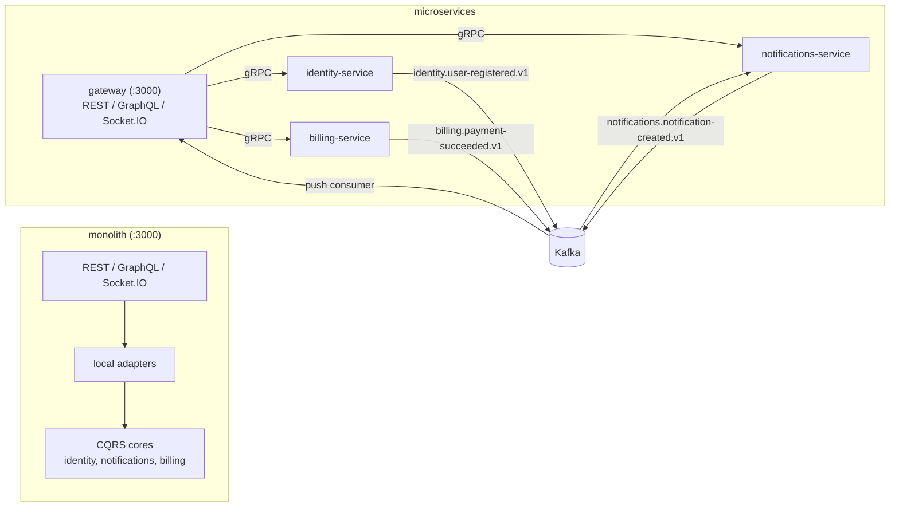
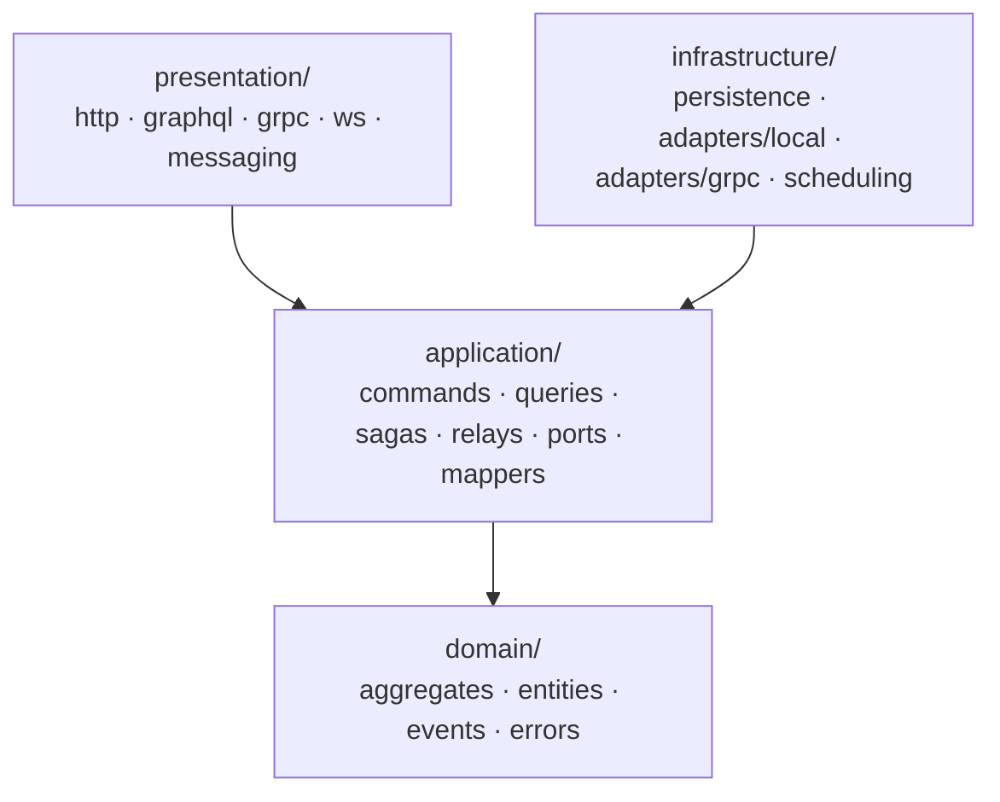
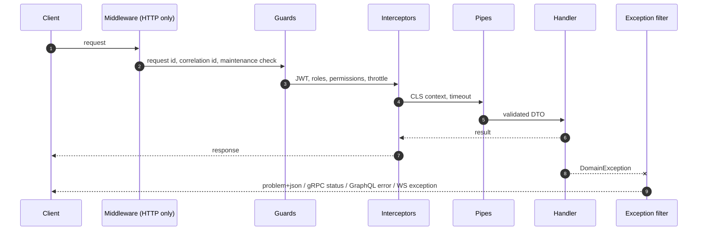
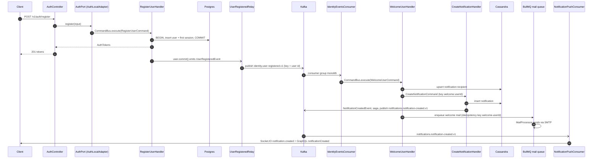
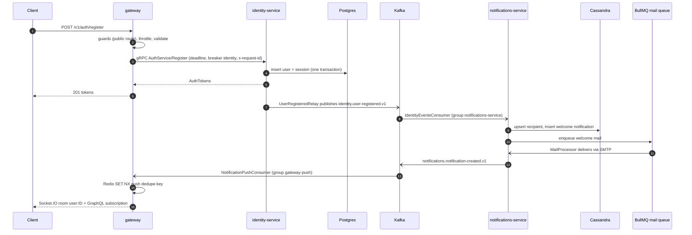
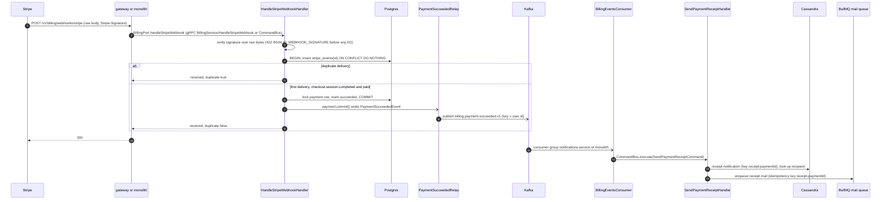
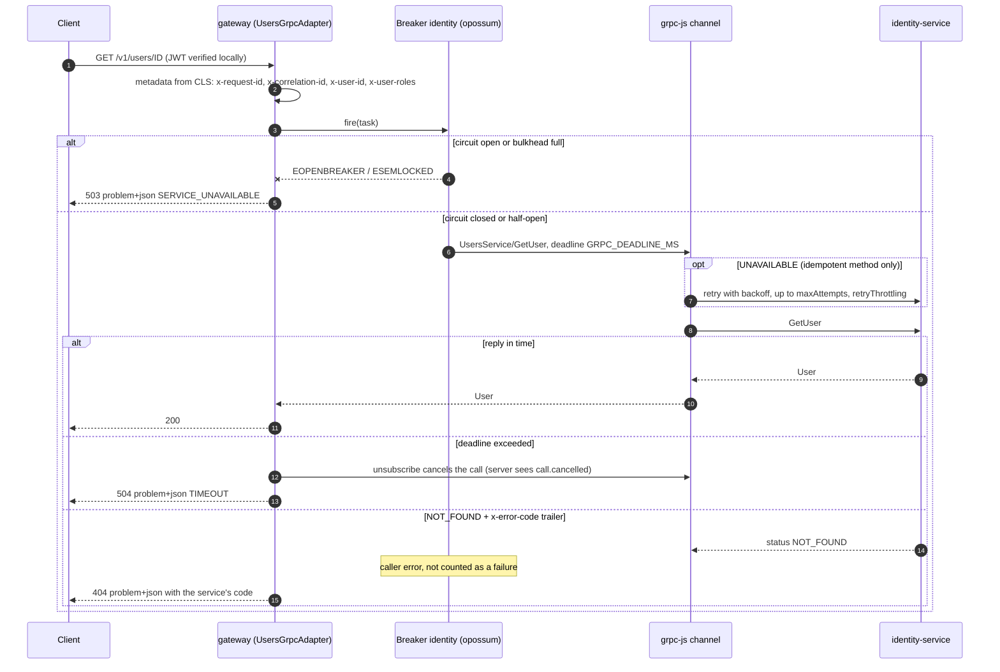

# Architecture

How the boilerplate is put together: one codebase, two deployment topologies, hexagonal + CQRS domain libraries.

## 1. Topologies

The same domain libraries and the same presentation classes (REST controllers, GraphQL resolvers, the Socket.IO gateway, Kafka consumers) run in two shapes. Only the module bindings change.

| Topology          | Processes                                                                         | Port binding                                                                                  | Async integration                           | Compose profile |
| ----------------- | --------------------------------------------------------------------------------- | --------------------------------------------------------------------------------------------- | ------------------------------------------- | --------------- |
| **Monolith**      | `apps/monolith`                                                                   | `XApiModule.forLocal()`: ports call the in-process `CommandBus` / `QueryBus`                  | Kafka (the same topics as between services) | `monolith`      |
| **Microservices** | `apps/gateway` + `identity-service` + `notifications-service` + `billing-service` | Gateway: `XApiModule.forRemote()`: ports call gRPC clients (deadline, retry, circuit breaker) | Kafka                                       | `microservices` |



Even inside the monolith, cross-context side effects (welcome notification, receipt, real-time push) travel through Kafka. A context never calls another context's handlers directly, so splitting a context into its own service changes wiring, not behaviour.

Host ports (from [`docker-compose.yml`](../docker-compose.yml)): the API (monolith or gateway) on `3000`, identity-service gRPC on `50051`, notifications-service on `50052`, billing-service on `50053` (every service listens on `50051` inside its container). Grafana is on host port `3300`. See [DOCKER.md](DOCKER.md).

## 2. Repository layout

| Path                                                                                                                              | Role                                                                                                                    |
| --------------------------------------------------------------------------------------------------------------------------------- | ----------------------------------------------------------------------------------------------------------------------- |
| `apps/monolith`                                                                                                                   | All contexts in one process: HTTP (REST + GraphQL + Socket.IO) plus a hybrid Kafka consumer                             |
| `apps/gateway`                                                                                                                    | Edge of the microservices topology: the same presentation, ports bound to gRPC clients. Owns no data                    |
| `apps/identity-service`                                                                                                           | gRPC `identity.v1.AuthService` + `identity.v1.UsersService`; Postgres, Redis; produces `identity.user-registered.v1`    |
| `apps/notifications-service`                                                                                                      | gRPC `notifications.v1.NotificationsService`; Cassandra inbox; Kafka consumers; BullMQ `mail` worker; daily digest cron |
| `apps/billing-service`                                                                                                            | gRPC `billing.v1.BillingService`; Stripe Checkout + webhooks; Postgres ledger; produces `billing.payment-succeeded.v1`  |
| `libs/identity`, `libs/notifications`, `libs/billing`                                                                             | Bounded contexts: hexagonal + CQRS (sections 3–6)                                                                       |
| `libs/files`                                                                                                                      | Edge-only context (object storage, presigned URLs). A plain application service, no CQRS, no service of its own         |
| `libs/contracts`                                                                                                                  | `.proto` files + ts-proto output, gRPC package specs, Kafka topics, envelope and payload zod schemas                    |
| `libs/transport`                                                                                                                  | gRPC clients/servers, status mapping, circuit breakers, Kafka producer/consumer plumbing, dead-lettering                |
| `libs/common`                                                                                                                     | `DomainException` hierarchy, problem+json, global pipes/filter/timeout interceptor, middlewares, utilities              |
| `libs/auth`                                                                                                                       | JWT + RBAC guards, `TokenService`, `PasswordHasher`, access-token denylist                                              |
| `libs/graphql`                                                                                                                    | Apollo on Fastify, graphql-ws, DataLoader registry, error formatting, Redis PubSub                                      |
| `libs/observability`                                                                                                              | pino logger, nestjs-cls request context, Prometheus metrics, terminus health, OpenTelemetry, `@nestjs/observe`          |
| `libs/config`                                                                                                                     | Every env var, validated per namespace (see [CONFIGURATION.md](CONFIGURATION.md))                                       |
| `libs/database`, `libs/cassandra`, `libs/redis`, `libs/mailer`, `libs/payments`, `libs/storage`, `libs/bootstrap`, `libs/testing` | Platform adapters and app bootstrap helpers. Each has its own `README.md`                                               |

## 3. Layers

Each domain library (`libs/identity`, `libs/notifications`, `libs/billing`) has four folders under `src/`. Dependencies point inward.



| Layer              | Contains                                                                                                                                                                                            | Example (identity)                                                                                                           |
| ------------------ | --------------------------------------------------------------------------------------------------------------------------------------------------------------------------------------------------- | ---------------------------------------------------------------------------------------------------------------------------- |
| **domain**         | Aggregates and entities with their invariants, domain events, `DomainException` subclasses. No Nest, no I/O                                                                                         | `domain/user.aggregate.ts`, `domain/events/user-registered.event.ts`, `domain/identity.errors.ts`                            |
| **application**    | `Command`/`Query` classes and their handlers, event handlers (relays, audit), sagas, mappers, and the abstract classes the rest of the system binds: presentation-facing ports and repository ports | `application/commands/register-user/`, `application/ports/auth.port.ts`, `application/persistence/users.repository.ts`       |
| **infrastructure** | Implementations: Drizzle / Cassandra repositories, the local and gRPC adapters of the ports, crons                                                                                                  | `infrastructure/persistence/drizzle-users.repository.ts`, `infrastructure/adapters/grpc/auth-grpc.adapter.ts`                |
| **presentation**   | REST controllers + DTOs, GraphQL resolvers + models, gRPC controllers, the Socket.IO gateway, Kafka consumers. Depends only on presentation-facing ports (and the CQRS buses, for consumers)        | `presentation/http/auth.controller.ts`, `presentation/graphql/auth.resolver.ts`, `presentation/grpc/auth-grpc.controller.ts` |

What the layering does and does not promise:

- Domain code is plain TypeScript and throws `DomainException` subclasses, never `HttpException`.
- Application handlers depend on abstract repository ports (bound in the `XCoreModule`) **and directly on platform libraries** where an abstraction would add nothing: `RegisterUserHandler` injects `PasswordHasher` (`@app/auth`), `HandleStripeWebhookHandler` injects `StripeService` (`@app/payments`), relays inject `KafkaProducer` (`@app/transport`), `WelcomeUserHandler` injects `MailService` (`@app/mailer`).
- Folder names for repository ports differ per library: `application/persistence/` (identity), `application/ports/` (notifications), `application/repositories/` (billing).
- `libs/files` is smaller: `domain/`, `application/` (`FilesService`, access policy) and `presentation/`, with storage provided by `@app/storage`.

## 4. Ports and adapters (`forLocal()` / `forRemote()`)

There are two kinds of ports. Both are **abstract classes** (usable as DI tokens without `@Inject()`).

| Kind                 | Ports                                                                                                                                                                       | Bound in                                 | Implementations                                              |
| -------------------- | --------------------------------------------------------------------------------------------------------------------------------------------------------------------------- | ---------------------------------------- | ------------------------------------------------------------ |
| Presentation-facing  | `AuthPort`, `UsersPort` (identity), `NotificationsPort`, `BillingPort`                                                                                                      | `XApiModule.forLocal()` / `.forRemote()` | `*LocalAdapter` (CQRS buses) or `*GrpcAdapter` (gRPC client) |
| Application-internal | `UsersRepository`, `SessionsRepository`, `TransactionRunner`, `NotificationsRepository`, `NotificationRecipientsRepository`, `PaymentsRepository`, `StripeEventsRepository` | `XCoreModule`                            | Drizzle (Postgres) or Cassandra repositories                 |

Presentation-facing ports speak `@app/contracts` types (generated by ts-proto from `libs/contracts/src/proto/**`), so a local adapter and a gRPC adapter return identical shapes, and both throw the same `DomainException`s: error codes survive the gRPC hop through trailers (section 9).

```ts
// libs/identity/src/identity-api.module.ts (abridged)
static forLocal(): DynamicModule {
  return {
    module: IdentityApiModule,
    imports: [IdentityCoreModule, GraphqlLoadersModule],
    controllers: CONTROLLERS,
    providers: [...PRESENTATION,
      { provide: AuthPort, useClass: AuthLocalAdapter },    // → CommandBus
      { provide: UsersPort, useClass: UsersLocalAdapter }], // → QueryBus / CommandBus
  };
}
static forRemote(options: GrpcClientsModuleOptions = {}): DynamicModule {
  return {
    module: IdentityApiModule,
    imports: [GrpcClientsModule.register(['identity'], options), GraphqlLoadersModule],
    controllers: CONTROLLERS,
    providers: [...PRESENTATION, IdentityGrpcCaller,
      { provide: AuthPort, useClass: AuthGrpcAdapter },     // → identity-service
      { provide: UsersPort, useClass: UsersGrpcAdapter }],
  };
}
```

What a `*GrpcAdapter` adds on every call (via `grpcCall()` in `@app/transport`):

| Concern         | Behaviour                                                                                                                                                                                                                                                                                                                                                                                                           |
| --------------- | ------------------------------------------------------------------------------------------------------------------------------------------------------------------------------------------------------------------------------------------------------------------------------------------------------------------------------------------------------------------------------------------------------------------- |
| Deadline        | `GRPC_DEADLINE_MS` (default `5000`): an rxjs `timeout` that cancels the call, plus the same value as the per-method `timeout` in the channel's service config                                                                                                                                                                                                                                                       |
| Retry           | Only `UNAVAILABLE`, only for idempotent methods (`GetUser`, `GetUsersByIds`, `ListUsers`, `ListNotifications`, `ListPayments`); 3 attempts by default (grpc-js caps it at 5), with `retryThrottling { maxTokens: 10, tokenRatio: 0.1 }`. `Register`, `RefreshTokens` and other writes are never retried: replaying `RefreshTokens` would trip refresh-token reuse detection                                         |
| Circuit breaker | One opossum breaker per upstream (`identity`, `notifications`, `billing`), shared by every method of that upstream. Opens at 50 % failures once ≥ 10 calls fall in a 10 s window, half-opens after 5 s, bulkhead of 1000 concurrent calls. Caller errors (`INVALID_ARGUMENT`, `NOT_FOUND`, `ALREADY_EXISTS`, `PERMISSION_DENIED`, `UNAUTHENTICATED`, `FAILED_PRECONDITION`, `OUT_OF_RANGE`, `ABORTED`) do not count |
| Metadata        | `x-request-id`, `x-correlation-id`, `x-user-id`, `x-user-roles` from nestjs-cls. The service adopts the request id, so logs line up across hops                                                                                                                                                                                                                                                                     |
| Error mapping   | Every failure becomes a `DomainException`: the original class and code when the server sent `x-error-code` / `x-error-details-bin` trailers, `OperationTimeoutException` (504) on deadline, `ServiceUnavailableException` (503) when the breaker is open or the bulkhead is full                                                                                                                                    |

The gateway verifies access tokens itself (JWT + the Redis denylist), so authentication costs no RPC. Services trust the caller identity in metadata: run them inside the service mesh only. See [SECURITY.md](SECURITY.md) for gRPC TLS (`GRPC_TLS_*`).

## 5. Module composition per app

Each domain library exports a fixed set of modules:

| Module                                                               | Contents                                                                                 | Imported by                                                                 |
| -------------------------------------------------------------------- | ---------------------------------------------------------------------------------------- | --------------------------------------------------------------------------- |
| `IdentityCoreModule`, `NotificationsCoreModule`, `BillingCoreModule` | Command/query/event handlers, sagas, relays, repository bindings, crons                  | Through `XApiModule.forLocal()` or `XGrpcModule` (never directly by an app) |
| `IdentityGrpcModule`, `NotificationsGrpcModule`, `BillingGrpcModule` | Core + the `@GrpcController()` classes                                                   | The matching service                                                        |
| `IdentityApiModule`, `NotificationsApiModule`, `BillingApiModule`    | Edge presentation; `.forLocal()` imports the core, `.forRemote()` registers gRPC clients | Monolith (`forLocal`), gateway (`forRemote`)                                |
| `NotificationsMessagingModule`                                       | Core + `IdentityEventsConsumer` and `BillingEventsConsumer` (inbound integration events) | Monolith, notifications-service                                             |
| `FilesModule`                                                        | REST `/v1/files`, GraphQL `createUploadUrl`, `FilesService`                              | Monolith, gateway                                                           |

What each `apps/*/src/app.module.ts` imports (besides `AppConfigModule.forRoot()` and `ObservabilityModule.forRoot()`, which all five import first):

| Module                                                             |                                                              monolith                                                              |                                                gateway                                                |     identity-service      |                   notifications-service                   |   billing-service   |
| ------------------------------------------------------------------ | :--------------------------------------------------------------------------------------------------------------------------------: | :---------------------------------------------------------------------------------------------------: | :-----------------------: | :-------------------------------------------------------: | :-----------------: |
| `CqrsModule.forRoot()`, `ScheduleModule.forRoot()`                 |                                                                 ✓                                                                  |                                                                                                       |             ✓             |                             ✓                             |          ✓          |
| `DatabaseModule.forRootAsync()` (Postgres / Drizzle)               |                                                                 ✓                                                                  |                                                                                                       |             ✓             |                                                           |          ✓          |
| `CassandraModule.forRootAsync()`                                   |                                                                 ✓                                                                  |                                                                                                       |                           |                             ✓                             |                     |
| `RedisModule.forRootAsync()`                                       |                                                                 ✓                                                                  |                                                   ✓                                                   |             ✓             |                             ✓                             |          ✓          |
| `AppCacheModule.forRootAsync()`                                    |                                                                 ✓                                                                  |                                                   ✓                                                   |                           |                                                           |                     |
| `AuthModule.forRootAsync()`                                        |                                                                 ✓                                                                  |                                                   ✓                                                   | ✓ (`globalGuards: false`) |                                                           |                     |
| `AppThrottlerModule.forRootAsync()`                                |                                                                 ✓                                                                  |                                                   ✓                                                   |                           |                                                           |                     |
| `AppQueueModule.forRootAsync()` + `AppMailerModule.forRootAsync()` |                                                      ✓ (worker on by default)                                                      |                                                                                                       |                           |                    ✓ (`worker: true`)                     |                     |
| `KafkaProducerModule.forRootAsync()`                               |                                                                 ✓                                                                  |                                                                                                       |             ✓             |                             ✓                             |          ✓          |
| `StripeModule.forRootAsync()`                                      |                                                                 ✓                                                                  |                                                                                                       |                           |                                                           |          ✓          |
| `StorageModule.forRootAsync()` + `FilesModule`                     |                                                                 ✓                                                                  |                                                   ✓                                                   |                           |                                                           |                     |
| `AppGraphqlModule.forRootAsync()` + `GraphqlPubSubModule`          |                                                                 ✓                                                                  |                                                   ✓                                                   |                           |                                                           |                     |
| Domain modules                                                     | `IdentityApiModule.forLocal()`, `NotificationsApiModule.forLocal()`, `NotificationsMessagingModule`, `BillingApiModule.forLocal()` | `IdentityApiModule.forRemote()`, `NotificationsApiModule.forRemote()`, `BillingApiModule.forRemote()` |   `IdentityGrpcModule`    | `NotificationsGrpcModule`, `NotificationsMessagingModule` | `BillingGrpcModule` |
| Readiness contributors (`/health/ready`)                           |                                                     Postgres, Cassandra, Redis                                                     |                                                 Redis                                                 |      Postgres, Redis      |                  Cassandra, Redis, Kafka                  |   Postgres, Redis   |

Composition rules visible in the app modules:

- **Import order matters.** `AuthModule` is imported before `AppThrottlerModule`: global guards run in registration order, and the throttler must see `req.user` to track per user.
- **Kafka is not a readiness contributor** where events are publish-after-commit (monolith, identity, billing): a broker outage must not pull every replica out of rotation. notifications-service lists it because consuming is its job.
- **The gateway owns no data**: no database, Cassandra, mailer, Stripe, CQRS or core module. An upstream outage degrades the affected routes (503 problem+json) instead of failing readiness.
- Every app installs `provideCommonEnhancersAsync()` (validation pipes, `AllExceptionsFilter`, `TimeoutInterceptor`) and applies `CorrelationIdMiddleware` to all routes. The monolith and gateway also apply `MaintenanceModeMiddleware`.

Bootstrap (`main.ts`) adds the transports:

| App                   | HTTP app                                                                                 | Microservice transports                                              | Kafka consumer group                        |
| --------------------- | ---------------------------------------------------------------------------------------- | -------------------------------------------------------------------- | ------------------------------------------- |
| monolith              | `createHttpApp(AppModule, { rawBody: true, multipart: true })` + Redis Socket.IO adapter | `connectKafkaConsumer`                                               | `monolith` (override: `KAFKA_GROUP_ID`)     |
| gateway               | same                                                                                     | `connectKafkaConsumer` (push consumer)                               | `gateway-push` (override: `KAFKA_GROUP_ID`) |
| identity-service      | `createServiceApp` (`/health/*`, `/metrics` only)                                        | `connectGrpcServer(app, ['identity'])`                               | none                                        |
| notifications-service | `createServiceApp`                                                                       | `connectGrpcServer(app, ['notifications'])` + `connectKafkaConsumer` | `notifications-service` (pinned in code)    |
| billing-service       | `createServiceApp`                                                                       | `connectGrpcServer(app, ['billing'])`                                | none                                        |

Hybrid apps connect microservices with `inheritAppConfig: true`, so the global enhancers also wrap gRPC and Kafka handlers. That is why every global enhancer branches on `context.getType()` (section 8). Per-app details: [apps/monolith/README.md](../apps/monolith/README.md), [apps/gateway/README.md](../apps/gateway/README.md), [apps/identity-service/README.md](../apps/identity-service/README.md), [apps/notifications-service/README.md](../apps/notifications-service/README.md), [apps/billing-service/README.md](../apps/billing-service/README.md).

## 6. CQRS: commands, queries, sagas, relays

`@nestjs/cqrs` (`CqrsModule.forRoot()` in every app that hosts a core). Commands and queries carry their result type, so `commandBus.execute()` is typed end to end:

```ts
export class RegisterUserCommand extends Command<AuthTokens> { … }
export class GetUserByIdQuery extends Query<User> { … }
```

| Building block  | Role                                                                                                                                                                                   | Examples                                                                                                               |
| --------------- | -------------------------------------------------------------------------------------------------------------------------------------------------------------------------------------- | ---------------------------------------------------------------------------------------------------------------------- |
| Command handler | One write use case. Loads/creates an aggregate, persists it, then `commit()`s its domain events                                                                                        | `RegisterUserHandler`, `LoginHandler`, `HandleStripeWebhookHandler`, `CreateNotificationHandler`, `WelcomeUserHandler` |
| Query handler   | Read use case, returns a `@app/contracts` shape                                                                                                                                        | `GetUserByIdHandler`, `GetUsersByIdsHandler` (feeds the GraphQL `users` DataLoader), `ListPaymentsHandler`             |
| Domain event    | Fact raised by an aggregate (`AggregateRoot.apply`), published on `commit()`                                                                                                           | `UserRegisteredEvent`, `UserRolesChangedEvent`, `PaymentSucceededEvent`, `NotificationCreatedEvent`                    |
| Event handler   | In-process reaction to a domain event                                                                                                                                                  | `UserRolesChangedAuditHandler`                                                                                         |
| **Relay**       | Event handler that turns a domain event into a Kafka integration event                                                                                                                 | `UserRegisteredRelay` → `identity.user-registered.v1`, `PaymentSucceededRelay` → `billing.payment-succeeded.v1`        |
| **Saga**        | `@Saga()` stream mapping events to commands. Pure mapping only: an error inside the operator pipeline would complete the saga stream for good, so all I/O lives in the command handler | `NotificationsSagas.notificationCreated`: `NotificationCreatedEvent` → `PublishNotificationCreatedCommand`             |
| Kafka consumer  | Presentation for inbound integration events: validates the envelope, dispatches a command                                                                                              | `IdentityEventsConsumer` → `WelcomeUserCommand`, `BillingEventsConsumer` → `SendPaymentReceiptCommand`                 |
| Cron            | `@nestjs/schedule` job guarded by a Redis lock (`@WithLock`), so one replica runs it                                                                                                   | `PurgeExpiredSessionsCron`, `PurgeStripeEventsCron`, `DailyDigestCron`                                                 |

**Commit after persistence.** Handlers wrap aggregates with `EventPublisher.mergeObjectContext()` and call `commit()` only after the write committed:

```ts
// RegisterUserHandler.execute (abridged)
const tokens = await this.transaction.run(async () => {
  await this.users.insert(user); // user + first session, one transaction
  return this.sessionTokens.open(toUserRecord(user.toSnapshot()), command.client);
});
user.commit(); // → UserRegisteredEvent → UserRegisteredRelay → Kafka
```

`HandleStripeWebhookHandler` does the same around a `@Transactional()` method, so a rolled-back delivery never announces a payment.

**Relays never throw.** Event handlers run detached from the request; a thrown error would only reach the CQRS `UnhandledExceptionBus`. Relays log the failure and move on. The record is already committed, so the gap is "committed but not published" (see [Known follow-ups](#12-known-follow-ups)).

**Idempotent consumers.** Inbound commands derive their ids from the business key, so redelivery and DLQ replays are harmless: `WelcomeUserHandler` creates the notification with idempotency key `welcome:<userId>` and enqueues mail with idempotency key `welcome-<userId>`; `SendPaymentReceiptHandler` uses `receipt:<paymentId>` / `receipt-<paymentId>`. `CreateNotificationHandler` derives the notification id from the key (`deriveNotificationId`).

## 7. Integration events and the Kafka envelope

Topics are named `<context>.<event-name>.v<major>` and declared once in `KAFKA_TOPICS` (`libs/contracts/src/events/topics.ts`). Each has a dead-letter twin `<topic>.dlq`.

| Topic                                   | Producer (relay / handler)                                     | Key     | Consumers                                                                 |
| --------------------------------------- | -------------------------------------------------------------- | ------- | ------------------------------------------------------------------------- |
| `identity.user-registered.v1`           | `UserRegisteredRelay` (identity core)                          | user id | `IdentityEventsConsumer` → welcome notification + welcome email           |
| `billing.payment-succeeded.v1`          | `PaymentSucceededRelay` (billing core)                         | user id | `BillingEventsConsumer` → receipt notification + receipt email            |
| `notifications.notification-created.v1` | `PublishNotificationCreatedHandler` (via `NotificationsSagas`) | user id | `NotificationPushConsumer` (edge) → Socket.IO room + GraphQL subscription |

Keying by user id keeps one user's events ordered on one partition.

**Envelope.** Every record value is the same JSON envelope, validated with zod by the producer (`KafkaProducer.publish`) and by the consumer (`ParseEventEnvelopePipe`):

```json
{
  "id": "0199b0a4-6c1e-7c3a-9a51-0d5f3f0f2b11",
  "type": "identity.user-registered.v1",
  "version": 1,
  "occurredAt": "2026-10-05T09:12:44.120Z",
  "source": "identity-service",
  "correlationId": "c0ffee00-…",
  "payload": {
    "userId": "0199b0a4-6c1d-7f0e-8d2b-6a1c2e3f4a5b",
    "email": "ada@example.com",
    "displayName": "Ada",
    "registeredAt": "2026-10-05T09:12:44.120Z"
  }
}
```

| Field           | Meaning                                                                                                                                                                     |
| --------------- | --------------------------------------------------------------------------------------------------------------------------------------------------------------------------- |
| `id`            | uuid v7. The relays set it to the domain event id (the notification id for `notification-created`), so a re-publish carries the same id and consumers can deduplicate on it |
| `type`          | Equals the topic for single-event topics                                                                                                                                    |
| `version`       | Major version, taken from the topic's `.v<major>` suffix                                                                                                                    |
| `occurredAt`    | ISO-8601 UTC time of the fact                                                                                                                                               |
| `source`        | Producing service (`SERVICE_NAME`)                                                                                                                                          |
| `correlationId` | From the originating request (nestjs-cls), for cross-service tracing                                                                                                        |
| `payload`       | Topic-specific, zod schema in `libs/contracts/src/events/*.events.ts`                                                                                                       |

Record headers: `x-event-type` and `x-correlation-id` (tools can route and trace without parsing JSON).

**Evolution.** Payload schemas are tolerant readers: unknown keys are stripped, not rejected, so additive changes stay on the same topic. A breaking change ships as a new topic (`.v2`) consumed side by side.

**Consumer pipeline.** `@KafkaConsumerController()` applies, at controller scope:

1. `KafkaContextInterceptor`: request and correlation ids into nestjs-cls.
2. `KafkaRetryInterceptor`: transient failures (driver, connection, timeout, 5xx-class `DomainException`) retried in-process, 4 attempts with 0.25 s / 0.5 s / 1 s backoff.
3. `KafkaDeadLetterFilter`: anything still failing (including an invalid envelope rejected by the pipe) is written to `<topic>.dlq` with headers `x-original-topic`, `x-error-message`, `x-error-type`, `x-failed-at`, then the offset commits so a poison message never blocks its partition. If the DLQ publish itself fails, the original error is rethrown and kafkajs redelivers. Throwing `KafkaRetriableException` explicitly asks kafkajs to retry.

Replay a dead-letter topic once the cause is fixed: `node --env-file=.env libs/transport/scripts/kafka-dlq-replay.mjs <topic> [--dry-run] [--group <id>]` (uses `replayDeadLetters` from `@app/transport`).

Consumers subscribe with `fromBeginning: false` and `autoCommit: true` (Nest awaits the handler before the offset is resolved). Consumer group names are pinned or defaulted per app (section 5): a renamed group has no committed offsets and would skip everything published in between.

## 8. Request lifecycle

Nest's order is always **middleware → guards → interceptors (before) → pipes → handler → interceptors (after) → exception filters**. Middleware exists only for HTTP. Because hybrid apps use `inheritAppConfig: true`, the same global guards, interceptors, pipes and filter also wrap gRPC and Kafka handlers, so each of them branches on `context.getType()`.

| Stage                    | HTTP (REST)                                                                                                         | GraphQL                                                                                                                                              | WebSocket (Socket.IO `/notifications`)                                                                                                                                                    | RPC: gRPC (services)                                                                                                                      | RPC: Kafka (consumers)                             |
| ------------------------ | ------------------------------------------------------------------------------------------------------------------- | ---------------------------------------------------------------------------------------------------------------------------------------------------- | ----------------------------------------------------------------------------------------------------------------------------------------------------------------------------------------- | ----------------------------------------------------------------------------------------------------------------------------------------- | -------------------------------------------------- |
| Middleware               | nestjs-cls `ClsMiddleware` (request id), `CorrelationIdMiddleware`, `MaintenanceModeMiddleware` (monolith, gateway) | Same, for queries/mutations over HTTP. graphql-ws subscriptions authenticate once at `connection_init` (`connectionParams.authorization` or `token`) | Handshake: a namespace middleware verifies the access token (`auth.token` or `Authorization: Bearer`) and the denylist before the connection is accepted; the socket joins room `user:ID` | none                                                                                                                                      | none                                               |
| Global guards (in order) | `JwtAuthGuard` (skipped for `@Public()`), `RolesGuard`, `PermissionsGuard`, then `AppThrottlerGuard`                | Same; `ctx.req` is the HTTP request                                                                                                                  | `JwtAuthGuard` re-checks `socket.data.user` is unexpired, then RBAC; the throttler guard skips `ws`                                                                                       | All return `true`: the service trusts the gateway's identity                                                                              | All return `true`                                  |
| Controller guards        | e.g. `LoginRequestGuard` + `LocalAuthGuard` (passport-local) on `POST /v1/auth/login`                               | as REST                                                                                                                                              | `WsSessionGuard` (denylist), `WsThrottlerGuard` (Redis-backed, per message)                                                                                                               | —                                                                                                                                         | —                                                  |
| Global interceptors      | `RequestContextInterceptor` (passes through: CLS already open), `TimeoutInterceptor` (default 30 s)                 | same                                                                                                                                                 | `RequestContextInterceptor` opens a CLS context; no timeout                                                                                                                               | `RequestContextInterceptor`; no timeout                                                                                                   | `RequestContextInterceptor`; no timeout            |
| Controller interceptors  | e.g. `StandardSchemaSerializerInterceptor` (response schema)                                                        | —                                                                                                                                                    | —                                                                                                                                                                                         | `GrpcContextInterceptor` (from `@GrpcController()`): metadata `x-request-id` / `x-correlation-id` / `x-user-id` / `x-user-roles` into CLS | `KafkaContextInterceptor`, `KafkaRetryInterceptor` |
| Pipes                    | Global: class-validator `ValidationPipe` + Standard Schema (zod) pipe for `{ schema }` params                       | same                                                                                                                                                 | `@MessageBody({ schema })` → zod                                                                                                                                                          | `ZodRpcValidationPipe(schema)` per `@Payload()`                                                                                           | `ParseEventEnvelopePipe(topic)` per `@Payload()`   |
| Handler                  | Controller → port                                                                                                   | Resolver → port (DataLoader per request for `users`)                                                                                                 | Gateway method → port; return value = ack                                                                                                                                                 | gRPC controller → `CommandBus` / `QueryBus`                                                                                               | Consumer → `CommandBus`                            |
| Exception filter         | `AllExceptionsFilter` → `application/problem+json`                                                                  | `AllExceptionsFilter` returns the error untouched; Apollo `formatError` (`formatGraphqlError`) maps it                                               | `AllExceptionsFilter`: ack `{ ok: false, error }` if the client used an ack, else emit `exception`                                                                                        | `DomainToGrpcExceptionFilter` (controller-scoped, from `@GrpcController()`)                                                               | `KafkaDeadLetterFilter` (controller-scoped)        |

Notes:

- **Why controller-scoped RPC filters.** A global filter in a hybrid app would also catch HTTP errors (`app.useGlobalFilters()` with `inheritAppConfig`), and `ms.useGlobalFilters()` after `connectMicroservice()` is ignored. `@GrpcController()` and `@KafkaConsumerController()` are composites that attach the right filter and interceptors to each RPC controller. `AllExceptionsFilter` rethrows for `rpc`.
- **Kafka handlers must not throw past the filter.** An escaping error makes kafkajs restart the consumer on the same offset forever.
- **Request context.** `ClsMiddleware` (HTTP) or `RequestContextInterceptor` (everything else) puts the request id in nestjs-cls; the pino logger, the Kafka producer (`correlationId`) and the gRPC adapters (outgoing metadata) read it from there. No REQUEST-scoped providers are used.
- **WebSocket session lifetime.** A socket is disconnected (after an `exception` with `TOKEN_EXPIRED`) when its access token expires, and every 30 s each replica disconnects sockets whose token was revoked (`TOKEN_REVOKED`).



## 9. Error model

Domain and application code throw `DomainException` subclasses from `@app/common`, never `HttpException`. Each carries a stable machine `code`, an `httpStatus` and optional client-safe `details`. Contexts subclass them with their own codes, for example:

```ts
class EmailAlreadyTakenException extends DomainConflictException {
  override readonly code = 'EMAIL_TAKEN';
}
```

| Base class                       | HTTP | gRPC status           | Default `code`            |
| -------------------------------- | ---- | --------------------- | ------------------------- |
| `DomainValidationException`      | 422  | `INVALID_ARGUMENT`    | `VALIDATION_FAILED`       |
| `BusinessRuleViolationException` | 422  | `FAILED_PRECONDITION` | `BUSINESS_RULE_VIOLATION` |
| `UnauthenticatedException`       | 401  | `UNAUTHENTICATED`     | `UNAUTHENTICATED`         |
| `PermissionDeniedException`      | 403  | `PERMISSION_DENIED`   | `FORBIDDEN`               |
| `EntityNotFoundException`        | 404  | `NOT_FOUND`           | `NOT_FOUND`               |
| `DomainConflictException`        | 409  | `ALREADY_EXISTS`      | `CONFLICT`                |
| `ExternalServiceException`       | 502  | `INTERNAL`            | `EXTERNAL_SERVICE_ERROR`  |
| `ServiceUnavailableException`    | 503  | `UNAVAILABLE`         | `SERVICE_UNAVAILABLE`     |
| `OperationTimeoutException`      | 504  | `DEADLINE_EXCEEDED`   | `TIMEOUT`                 |

502 maps to `INTERNAL`, not `UNAVAILABLE`, on purpose: clients retry `UNAVAILABLE` automatically, and a failed upstream side effect must not be replayed.

One exception, four renderings:

| Transport | Rendered by                                                  | Shape                                                                                                                                                   |
| --------- | ------------------------------------------------------------ | ------------------------------------------------------------------------------------------------------------------------------------------------------- |
| HTTP      | `AllExceptionsFilter`                                        | RFC 9457 `application/problem+json`: `type`, `title`, `status`, `detail`, `instance`, `code`, `requestId`, `errors` (validation issues)                 |
| GraphQL   | Apollo `formatError` = `formatGraphqlError` (`@app/graphql`) | `errors[].extensions`: `code`, `status`, `type`, `errors?`. GraphQL-level errors (syntax, validation, `QUERY_TOO_COMPLEX`) keep Apollo's code           |
| WebSocket | `AllExceptionsFilter`                                        | The problem document, as the ack `{ ok: false, error }` or as an `exception` event. A refused handshake gets `connect_error` with the problem as `data` |
| gRPC      | `DomainToGrpcExceptionFilter`                                | Status code from the table above, plus trailers `x-error-code` (the domain code) and `x-error-details-bin` (client-safe details)                        |

Unexpected (non-domain) errors become `500 INTERNAL` with a generic message unless `exposeInternalErrors` is on; the apps set it to `!app.isProduction`.

**Across the gRPC hop.** `grpcCall()` rebuilds the original exception from the status and trailers (`grpcErrorToDomainException`), so the gateway answers exactly like the monolith: an `EMAIL_TAKEN` thrown in identity-service reaches the client as `409` problem+json with `code: "EMAIL_TAKEN"`. Server-side statuses (5xx-class and `CANCELLED`) have their `details` replaced by a generic message, so internal addresses never leak. Local failures map as: rxjs deadline → `OperationTimeoutException` (504); open breaker, full bulkhead or shut-down breaker → `ServiceUnavailableException` (503).

```http
HTTP/1.1 409 Conflict
content-type: application/problem+json

{
  "type": "https://errors.nestjs-boilerplate.dev/email-taken",
  "title": "Email Taken",
  "status": 409,
  "detail": "…",
  "instance": "/v1/auth/register",
  "code": "EMAIL_TAKEN",
  "requestId": "…"
}
```

See [API.md](API.md) for the client-facing contract of each error.

## 10. Sequence diagrams

### 10.1 Register → welcome notification + email (monolith)

`POST /v1/auth/register` (or the GraphQL `register` mutation) is `@Public()` and `@AuthThrottle()`. Everything runs in one process, but the welcome still goes through Kafka.



### 10.2 Register → welcome notification + email (microservices)

Same handlers, distributed. The gateway's `AuthPort` is `AuthGrpcAdapter`; `Register` is **not** retried on `UNAVAILABLE` (only idempotent reads are).



If identity-service answers `ALREADY_EXISTS` with trailer `x-error-code: EMAIL_TAKEN`, the gateway rebuilds `EmailAlreadyTakenException` and returns `409` problem+json, identical to the monolith.

### 10.3 Stripe webhook → receipt

`POST /v1/billing/webhooks/stripe` is `@Public()` and `@SkipThrottle()`. The app is created with `rawBody: true` because the signature covers the exact bytes. In the microservices topology, the gateway forwards the raw bytes and the `Stripe-Signature` header in `HandleStripeWebhookRequest { bytes payload; string signature }`; in the monolith, `BillingLocalAdapter` dispatches the same command in-process.



Events for unknown payments or impossible transitions are acknowledged with a warning (retrying could never succeed). Infrastructure errors throw: the transaction rolls back, the event id is forgotten, and Stripe's retry is processed again.

### 10.4 Gateway → service gRPC call with deadline and circuit breaker

Example: `GET /v1/users/:id` on the gateway → `UserReadCache` (Redis `user:{id}`; on a miss) → `UsersPort.getUser` → `UsersGrpcAdapter` → `IdentityGrpcCaller.call()` → `grpcCall()`. The diagram shows a cache miss.



The breaker counts only upstream failures (`UNAVAILABLE`, `INTERNAL`, `DEADLINE_EXCEEDED`, …) toward its 50 % threshold. When it opens, every route that depends on that upstream fails fast with 503 for 5 s, then a half-open probe decides whether to close it. State changes are logged (`Circuit "identity" OPEN: failing fast`).

## 11. Deliberate decisions and pins

Dependencies are the latest stable releases as of 2026-09, except these deliberate pins:

| Pin                                                    | Why                                                                                                                                                             |
| ------------------------------------------------------ | --------------------------------------------------------------------------------------------------------------------------------------------------------------- |
| TypeScript **6.0.3** (not 7)                           | TS 7 (the Go compiler) has no JS compiler API. typescript-eslint supports `<6.1`, the Nest CLI bundles `~6.0`, and the swagger/graphql CLI plugins need the API |
| `@types/node` **24**                                   | Matches the Node 24 LTS runtime (`engines.node: >=24.0.0 <25`)                                                                                                  |
| `protobufjs` **7** (root `overrides`)                  | `@grpc/proto-loader`'s `Timestamp` ↔ `Date` mapping patches the protobufjs instance it uses; v8 silently breaks it                                              |
| `conventional-changelog-conventionalcommits` **9.3.1** | Lerna 10 crashes on 10.x                                                                                                                                        |
| `inquirer` **12**                                      | Peer of `@commitlint/cz-commitlint`                                                                                                                             |
| `lodash-es` in code                                    | lodash is CommonJS: ESM named imports fail. Application code imports `lodash-es`                                                                                |

Other structural decisions:

- **ESM only, Node 24 runtime.** Bun 1.4.2 is the package manager only (never the runtime), with `linker = "hoisted"` in `bunfig.toml`: NestJS packages declare each other as cyclic optional peers, and the isolated linker produced duplicate `@nestjs/core` copies. Biome's `noUndeclaredDependencies` keeps every package honest about what it imports.
- **Workspace libs need no build in dev.** `exports["@app/source"]` points at `src/*.ts` (typecheck, tests, dev), `default` at `dist/*.js` (production). Builds are SWC per package, orchestrated by Lerna/Nx. See [DEVELOPMENT.md](DEVELOPMENT.md) and [RELEASING.md](RELEASING.md).
- **One codebase, two topologies** (section 1) instead of separate repos: the monolith is the default deployment; a context becomes a service by switching its `XApiModule` binding.
- **Abstract classes as ports** so DI needs no string tokens, and `@app/contracts` types on every port so both adapters are interchangeable.
- **Publish after commit** for integration events, with idempotent consumers and DLQs (sections 6–7). Simple, but at-most-once on a crash between commit and publish.
- **Edge authentication.** The gateway verifies JWTs and the denylist locally and forwards the caller in gRPC metadata.
- **`UV_THREADPOOL_SIZE` must stay ≤ the container CPU quota.** Argon2 hashing runs on the libuv threadpool. Measured: 16 threads on a 2-CPU cap took p95 from 36 ms to 304 ms. See [PERFORMANCE.md](PERFORMANCE.md) and [CONFIGURATION.md](CONFIGURATION.md).

## 12. Known follow-ups

Stated honestly, none of these are done:

| Follow-up                                                                      | Today                                                                                                                                                                                                                               |
| ------------------------------------------------------------------------------ | ----------------------------------------------------------------------------------------------------------------------------------------------------------------------------------------------------------------------------------- |
| **Transactional outbox**                                                       | Integration events are published after commit. A crash or broker outage between commit and publish loses the event (the record stays). An outbox row written in the same transaction plus a relay would make delivery at-least-once |
| **Per-domain `@app/<x>/api` subpath exports**                                  | The gateway imports `@app/identity`, `@app/notifications`, `@app/billing` whole, so its image carries core code it never runs. Subpath exports for the API surface would slim it                                                    |
| **Separate metrics listener**                                                  | `/metrics` is served on the application HTTP port                                                                                                                                                                                   |
| **Real-database integration specs for billing and notifications repositories** | Identity has a Postgres `*.int-spec.ts` (`users.repository.int-spec.ts`); the billing (Drizzle) and notifications (Cassandra) repositories are covered by unit specs only                                                           |

## See also

- [README.md](../README.md): overview and quick start
- [DEVELOPMENT.md](DEVELOPMENT.md): local setup, scripts, adding a context
- [API.md](API.md): REST, GraphQL, Socket.IO and gRPC surface
- [CONFIGURATION.md](CONFIGURATION.md): every environment variable
- [TESTING.md](TESTING.md): unit, e2e and integration specs
- [OBSERVABILITY.md](OBSERVABILITY.md): logs, metrics, traces, health
- [PERFORMANCE.md](PERFORMANCE.md): load tests and tuning
- [SECURITY.md](SECURITY.md): auth, RBAC, gRPC TLS, webhooks
- [DOCKER.md](DOCKER.md): images and compose profiles
- [RELEASING.md](RELEASING.md): versioning and changelogs
- Package docs: [libs/transport](../libs/transport/README.md), [libs/contracts](../libs/contracts/README.md), [libs/common](../libs/common/README.md), [libs/identity](../libs/identity/README.md), [libs/notifications](../libs/notifications/README.md), [libs/billing](../libs/billing/README.md)
