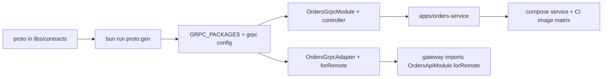

# Development

This is the day-to-day guide for working on this monorepo. It covers setup, the dev loop, generators, step-by-step recipes and troubleshooting.

Related docs: [README](../README.md), [Architecture](ARCHITECTURE.md), [Configuration](CONFIGURATION.md), [API](API.md), [Testing](TESTING.md), [Docker](DOCKER.md), [Observability](OBSERVABILITY.md), [Performance](PERFORMANCE.md), [Security](SECURITY.md), [Releasing](RELEASING.md).

## Prerequisites

| Tool                          | Version                                                 | Notes                                                                                                                                                |
| ----------------------------- | ------------------------------------------------------- | ---------------------------------------------------------------------------------------------------------------------------------------------------- |
| Node.js                       | **24 LTS** (`.nvmrc` = `24`, `engines.node` `>=24 <25`) | The only runtime: apps, tests, scripts and tooling all run on Node.                                                                                  |
| Bun                           | **1.4.2** (`packageManager`)                            | Used **only** as the package manager and script runner. `bunfig.toml` sets `[run] bun = false`, so `bun run` never swaps `node` for Bun.             |
| Docker + Compose              | recent Docker Desktop / Engine                          | Runs the local infra: Postgres 18, Redis, Cassandra, Kafka, Mailpit, RustFS (S3), fake-gcs, plus optional observability. See [DOCKER.md](DOCKER.md). |
| `buf` / `protoc-gen-ts_proto` | installed as dev dependencies                           | Only needed for `bun run proto:gen`. Nothing to install globally.                                                                                    |
| Stripe CLI (optional)         | any                                                     | Forwards webhooks to your machine: `stripe listen --forward-to localhost:3000/v1/billing/webhooks/stripe`.                                           |

Pinned on purpose (do not "upgrade" these without reading why). Everything else is the latest stable version as of 2026-09:

| Pin                                                    | Why                                                                                                                                                                                                                                                                                                                                                                     |
| ------------------------------------------------------ | ----------------------------------------------------------------------------------------------------------------------------------------------------------------------------------------------------------------------------------------------------------------------------------------------------------------------------------------------------------------------- |
| TypeScript **6.0.3**                                   | TS 7 (the Go port) has no JS compiler API. typescript-eslint supports `<6.1`, the Nest CLI bundles `~6.0`, and the swagger/graphql CLI plugins need the compiler API.                                                                                                                                                                                                   |
| `@types/node` **24**                                   | Matches the Node 24 LTS runtime.                                                                                                                                                                                                                                                                                                                                        |
| `protobufjs` **7** (root `overrides`)                  | `@grpc/proto-loader` + ts-proto register the `google.protobuf.Timestamp` ↔ `Date` wrapper on the protobufjs instance they share. A v8 copy silently breaks that mapping.                                                                                                                                                                                                |
| `conventional-changelog-conventionalcommits` **9.3.1** | Lerna 10 crashes with 10.x. See [RELEASING.md](RELEASING.md).                                                                                                                                                                                                                                                                                                           |
| `inquirer` **12**                                      | Peer dependency of `@commitlint/cz-commitlint`.                                                                                                                                                                                                                                                                                                                         |
| `lodash-es`, not `lodash`                              | `lodash` is CommonJS, so ESM named imports (`import { isNil } from 'lodash'`) fail. `lodash-es` is native ESM.                                                                                                                                                                                                                                                          |
| Bun `linker = "hoisted"` (`bunfig.toml`)               | NestJS packages declare each other as cyclic optional peers. The isolated linker created several copies of `@nestjs/core`, which split the "realm": `instanceof` checks broke, DI tokens were duplicated and `ClientsModule` loaded twice. Biome's `correctness/noUndeclaredDependencies` (error) keeps dependency hygiene: every package must declare what it imports. |

## First-time setup

```bash
git clone <repo> && cd nestjs-boilerplate
nvm use                     # Node 24 from .nvmrc
bun run setup               # = bun install && bun run setup:env
bun run docker:infra        # = docker compose up -d --wait (infra only, no app profile)
bun run dev                 # monolith on http://localhost:3000
```

- `bun install` runs the `prepare` script (`husky`), which installs the git hooks. See [RELEASING.md](RELEASING.md#git-hooks-husky).
- `bun run setup:env` (`scripts/setup-env.mjs`) copies the root `.env.example` and every `apps/*/.env.example` to `.env` **when it is missing**. It never overwrites an existing file.
- `bun run docker:infra` starts the infra and waits for the one-shot init jobs: Kafka topics, the Cassandra keyspace and the buckets. Postgres tables are created by the apps at boot because `DATABASE_RUN_MIGRATIONS=true` is set in `apps/*/.env`. You can also run `bun run db:migrate` yourself.
- Check that it works: `curl -s localhost:3000/health/ready`, then open `http://localhost:3000/docs` (Scalar/Swagger), `http://localhost:3000/graphql` (Apollo Sandbox) and Mailpit at `http://localhost:8025`.

## Environment files

| File                      | Holds                                                                                                                                                                         | Committed?      |
| ------------------------- | ----------------------------------------------------------------------------------------------------------------------------------------------------------------------------- | --------------- |
| `.env.example` (root)     | Every variable that `@app/config` reads, grouped by config namespace, with its default. A bottom section holds the docker-compose-only knobs (`DOCKER_*`, `*_HOST_PORT`).     | yes             |
| `apps/<app>/.env.example` | Per-app overrides only: `SERVICE_NAME`, `PORT`, `GRPC_URL`, `KAFKA_GROUP_ID`, `DATABASE_RUN_MIGRATIONS`, `CASSANDRA_RUN_MIGRATIONS`, and the gateway's upstream `*_GRPC_URL`. | yes             |
| `.env`, `apps/<app>/.env` | Your local copies, created by `bun run setup:env`.                                                                                                                            | no (gitignored) |

**Load order.** Each app's `dev`/`start` script passes `--env-file-if-exists=../../.env --env-file-if-exists=.env`. Real environment variables win, then `apps/<app>/.env`, then the root `.env`. The defaults in `libs/config` apply last, and they already target the local compose infra, so the apps can boot with no `.env` at all.

**Why the per-app files matter.** Without them every app would bind HTTP `3000` and gRPC `0.0.0.0:50051`, and the services would not apply migrations. Every root `dev*` script runs `setup:env` first. If you start an app another way, for example `bun run dev` inside `apps/<app>`, run `bun run setup:env` once.

**Adding a variable.** Add it to a namespace schema in `libs/config/src/namespaces/*.config.ts`, then document it in the root `.env.example` (as `KEY=` or `# KEY=`). `node scripts/check-env-example.mjs` reads the schema sources (no build needed) and fails when the two drift. CI runs it. All variables are listed in [CONFIGURATION.md](CONFIGURATION.md).

Compose reads the root `.env` only for `${VAR}` interpolation. Containers get their environment from `docker-compose.yml`. See [DOCKER.md](DOCKER.md).

## The dev loop

Every app has the same `dev` script (`apps/*/package.json`):

```bash
node --watch --watch-preserve-output \
  --env-file-if-exists=../../.env --env-file-if-exists=.env \
  --enable-source-maps \
  --conditions=@app/source \
  --import @swc-node/register/esm-register \
  --import ./src/instrument.ts \
  src/main.ts
```

| Piece                                      | What it does                                                                                                                                                                                                      |
| ------------------------------------------ | ----------------------------------------------------------------------------------------------------------------------------------------------------------------------------------------------------------------- |
| `node --watch`                             | Node's built-in watcher restarts the process when any imported file changes, including files under `libs/*/src`. No nodemon and no `nest start --watch`.                                                          |
| `--conditions=@app/source`                 | Every workspace package exports `{ "@app/source": "./src/index.ts", "types": "./src/index.ts", "default": "./dist/index.js" }`. With this condition Node resolves `@app/*` imports to the **TypeScript sources**. |
| `--import @swc-node/register/esm-register` | An ESM loader hook that transpiles `.ts` on the fly with SWC, including legacy decorators and `emitDecoratorMetadata`, which Nest DI needs.                                                                       |
| `--import ./src/instrument.ts`             | Starts OpenTelemetry (`@app/observability/otel`) **before** Nest, postgres.js, ioredis, kafkajs and grpc-js are loaded. It does nothing unless `OTEL_EXPORTER_OTLP_ENDPOINT` is set.                              |
| `--enable-source-maps`                     | Stack traces point at `.ts` lines.                                                                                                                                                                                |

**Why no library build is needed.** The same `@app/source` condition is honoured in three places:

1. the `exports` map of each package (Node at dev time),
2. `customConditions: ["@app/source"]` in `tsconfig.base.json` (typecheck and editor),
3. `ssr.resolve.conditions` in `vitest.config.ts`, which also drops `development|production` so tests resolve exactly what Node resolves (a single `graphql` realm).

Typecheck, tests and `dev` therefore all read `libs/*/src` directly. You only need `dist/` (`bun run build`) for production-style runs: each app's `start` script, `bun run --filter @app/database db:migrate`, `node scripts/docker/check-kafka-topics.mjs`, and Docker images.

Everyday commands:

| Command                                    | Purpose                                                                                                      |
| ------------------------------------------ | ------------------------------------------------------------------------------------------------------------ |
| `bun run typecheck`                        | One `tsc -p tsconfig.json` over every app and lib, from sources.                                             |
| `bun run test` / `bun run test:watch`      | Vitest. Each folder under `apps/` and `libs/` is a project named after it.                                   |
| `bunx vitest run --project billing`        | One project (`<app>:e2e` for an app's e2e suite).                                                            |
| `bun run lint` / `bun run lint:fix`        | Biome, then type-aware ESLint.                                                                               |
| `bun run format`                           | Biome format + Prettier (Markdown/YAML).                                                                     |
| `bun run check`                            | The full static gate CI runs: `biome ci`, `eslint --max-warnings=0`, `prettier --check`, `tsc`.              |
| `bun run build` / `bun run build:affected` | SWC build of every package (Lerna + Nx, cached and topological) or only those changed since `origin/master`. |
| `bun run graph`                            | Nx project graph.                                                                                            |

More about tests in [TESTING.md](TESTING.md).

## Running each topology locally

One codebase can run as two topologies. The REST, GraphQL and Socket.IO surface is the same in both. Only the binding of the domain ports changes: `XApiModule.forLocal()` uses the in-process CQRS buses, and `XApiModule.forRemote()` uses gRPC clients. See [ARCHITECTURE.md](ARCHITECTURE.md).

| Topology      | Command                                                                                                      | Processes (HTTP / gRPC)                                                                                                        |
| ------------- | ------------------------------------------------------------------------------------------------------------ | ------------------------------------------------------------------------------------------------------------------------------ |
| Monolith      | `bun run dev` (= `dev:monolith`)                                                                             | monolith `3000`                                                                                                                |
| Microservices | `bun run dev:microservices` (all four with `concurrently`, prefixed `gateway`/`identity`/`notify`/`billing`) | gateway `3000` · identity-service `3001` / `50051` · notifications-service `3002` / `50052` · billing-service `3003` / `50053` |
| Single app    | `bun run dev:gateway`, `dev:identity`, `dev:notifications`, `dev:billing`                                    | as above                                                                                                                       |

The services only serve `/health/live`, `/health/ready` and `/metrics` over HTTP. Their API is gRPC, and only the gateway calls it. In every app, `/metrics` shares the HTTP port. Set `METRICS_BEARER_TOKEN` to require a bearer token. A separate metrics listener is a known follow-up. Run either the monolith or the gateway, never both, because both bind port 3000.

Infra must be up first (`bun run docker:infra`). Other loops:

- **Everything in Docker**: `bun run docker:monolith` or `bun run docker:microservices`, which build images. `docker compose --profile microservices watch` rebuilds an app on change.
- **Hybrid**: services in Docker and one app on the host. The service containers publish 50051–50053 on the host, so `bun run dev:gateway` reaches them with its default `.env`.
- **Observability**: `bun run docker:observability` adds Jaeger (`16686`), Prometheus (`9090`) and Grafana on host port **`3300`**, because 3000 belongs to the API. For traces from host apps, set `OTEL_EXPORTER_OTLP_ENDPOINT=http://localhost:4318`. See [OBSERVABILITY.md](OBSERVABILITY.md).
- `bun run docker:down` stops everything, every profile included.

Profiles, ports and resource budgets are covered in [DOCKER.md](DOCKER.md).

Smoke test (either topology):

```bash
curl -s localhost:3000/health/ready
curl -s localhost:3000/graphql -H 'content-type: application/json' -d '{"query":"{ __typename }"}'
```

Endpoints and payloads are listed in [API.md](API.md).

### Running the built apps (`dist`)

After `bun run build`, start an app from its own directory. The `start` script loads `../../.env` and `.env` for you;
with an explicit env file, put `--import ./dist/instrument.js` (the OpenTelemetry preload) **before** `dist/main.js`:

```bash
cd apps/monolith
node --env-file=/path/to/monolith.env --import ./dist/instrument.js dist/main.js
```

Verified behaviour against warm compose infra:

- The monolith is ready in about 1.3 s and logs `Readiness contributors: postgres, cassandra, redis`, then
  `monolith listening on http://…:3000`. Kafka, S3, SMTP and Stripe are not readiness gates. Each microservice boots in
  about 1 s. A `0.0.0.0` bind is printed as `http://127.0.0.1:<port>` (Nest's `getUrl()`), but the server listens on
  every interface.
- **Microservices start order** used: identity-service, notifications-service, billing-service, then the gateway. The
  gateway does not need its upstreams to boot (gRPC channels connect lazily). gRPC servers bind `GRPC_URL`
  (`0.0.0.0:5005x`) and log `Nest microservice successfully started`, without the address.
- `JWT_ACCESS_SECRET` must be identical on identity-service and the gateway (the dev default works when both leave it
  unset). billing-service needs `STRIPE_WEBHOOK_SECRET`: the gateway forwards the raw webhook bytes and signature over
  gRPC.
- **Infra on remapped host ports** (for example when 5432 or 6379 are taken): set `DATABASE_URL`, `REDIS_URL`,
  `CASSANDRA_CONTACT_POINTS` + `CASSANDRA_PORT` + `CASSANDRA_LOCAL_DC=datacenter1`, `KAFKA_BROKERS` (the EXTERNAL
  listener, which must advertise the same `host:port` the app dials), `SMTP_HOST`/`SMTP_PORT`, `S3_ENDPOINT` **and**
  `S3_PUBLIC_ENDPOINT` (presigned URLs are built from the public one), `GCS_API_ENDPOINT`. `LOG_PRETTY=false` gives
  JSON logs in development.
- **SIGTERM** shuts down gracefully in 1-3.5 s: `SIGTERM received; forcing exit in 10000 ms if still running` →
  `Cassandra client closed` / `Postgres pool closed` → `Shutdown complete (SIGTERM)`, with Kafka offsets committed
  (consumer lag 0 afterwards).
- Consumers subscribe with `fromBeginning: false`: a brand-new group starts at the latest offset, while a group with
  committed offsets resumes where it stopped (events published while it was down are processed on restart).
  Redelivery is safe: inbox ids are deterministic (`welcome:<userId>`), so processing an event twice is idempotent.

## Generating code

Each **app** has a `g` script: `sh -c 'nest g "$@" && eslint --fix src' nest-g`. It runs the Nest CLI schematic, then ESLint `--fix` on `src`, which converts imports to the repo's `import type` style. Run it from the app folder:

```bash
cd apps/monolith
bun run g module reports           # src/reports/reports.module.ts
bun run g controller reports       # + reports.controller.spec.ts (generateOptions.spec: true)
bun run g service reports --dry-run
```

`apps/*/nest-cli.json` sets `sourceRoot: src`, `generateOptions: { spec: true, flat: false }` and the SWC builder (`typeCheck: false`; type checking is the root `tsc`).

What to expect:

- The generated code is a starting point. Check the relative imports (they must end in `.js`) and that every class Nest injects is imported as a value. See [DI pitfalls](#conventions-and-di-pitfalls).
- **Libraries have no `g` script** and there is no root `nest-cli.json`, because `libs/*` are plain workspace packages and not Nest CLI "libraries". Domain code lives in libs, so write it by hand following the layout of an existing lib (next section). Use `nest g` inside an app only for code that belongs to that app.
- Generated gRPC types come from `bun run proto:gen` and Drizzle migrations from `bun run db:generate`. Never edit either output by hand.

## Guide: add a new domain module

Example: an `orders` bounded context that starts inside the monolith. Use `libs/billing` as the template. It is the smallest domain lib that has every layer.

**1. Create the package** `libs/orders/`:

```text
libs/orders/
├── package.json        # copy libs/billing/package.json and rename
├── tsconfig.json       # copy libs/billing/tsconfig.json as is
├── README.md
└── src/
    ├── index.ts                    # the public API (barrel)
    ├── orders.constants.ts         # error codes, tokens
    ├── orders-core.module.ts       # handlers, relays, repositories
    ├── orders-api.module.ts        # forLocal() / forRemote()
    ├── domain/                     # aggregates, domain events, errors (DomainException subclasses)
    ├── application/                # commands/, queries/ (+ handlers), ports/ (abstract classes), repositories/ (abstract)
    ├── infrastructure/             # persistence/ (*.schema.ts, Drizzle repositories), adapters/local|grpc, scheduling/
    └── presentation/               # http/ (controllers + DTOs), graphql/ (resolvers, models), grpc/, kafka consumers
```

In `package.json`, keep the `exports` block exactly as in billing (the `@app/source` → `src`, `default` → `dist` pair) and the same `build`/`typecheck`/`test`/`clean` scripts. Change only the Vitest project name: `--project orders`. **Declare every import**: `@app/*` packages as `workspace:*`, third-party packages as `catalog:` (the versions live once, in the root `catalog`). Biome's `noUndeclaredDependencies` rule fails otherwise.

**2. Link it.** Add `"@app/orders": "workspace:*"` to the consuming app's `dependencies` (`apps/monolith/package.json`), then run `bun install`. Nothing else needs registering:

- Vitest discovers every folder that has a `package.json`.
- The root `tsconfig.json` includes `libs/*/src`.
- Lerna/Nx find the package through the workspaces.
- commitlint accepts `orders` as a scope automatically.

**3. Write the layers** in dependency order: domain → application → infrastructure → presentation.

- Commands and queries extend `Command<T>` / `Query<T>` from `@nestjs/cqrs`. Handlers live next to them.
- Presentation depends **only on ports** (`abstract class OrdersPort`). Ports return `@app/contracts` types, so a local adapter and a later gRPC adapter return identical shapes.
- Errors are subclasses of the concrete `DomainException`s in `@app/common` (see `libs/billing/src/domain/billing.errors.ts`).
- Integration events are published after the transaction commits, from a relay (see `libs/billing/src/application/relays/payment-succeeded.relay.ts`). There is no transactional outbox yet (a known follow-up).

**4. Persistence (Postgres).** Put the tables in `src/infrastructure/persistence/orders.schema.ts` and export an `ordersSchema` object, then:

- add `'../orders/src/**/*.schema.ts'` to `SCHEMA_GLOBS` in `libs/database/drizzle.config.ts` (one migration history for every context),
- merge the schema into the app's Drizzle schema: `const DATABASE_SCHEMA = { ...identitySchema, ...billingSchema, ...ordersSchema }` in `apps/monolith/src/app.module.ts`,
- run `bun run db:generate` and commit the new SQL plus `meta/` snapshot (see [migrations](#database-migrations-postgres--drizzle)).

**5. Modules.** Copy the billing pattern:

```ts
// orders-core.module.ts: what the owning process runs
@Module({
  providers: [
    CreateOrderHandler,
    ListOrdersHandler,
    { provide: OrdersRepository, useClass: DrizzleOrdersRepository },
  ],
})
export class OrdersCoreModule {}

// orders-api.module.ts: the edge (REST + GraphQL); only the port binding differs
@Module({})
export class OrdersApiModule {
  static forLocal(): DynamicModule {
    return {
      module: OrdersApiModule,
      imports: [OrdersCoreModule],
      controllers: [OrdersController],
      providers: [OrdersResolver, { provide: OrdersPort, useClass: OrdersLocalAdapter }],
      exports: [OrdersPort],
    };
  }
}
```

**6. Wire the app.** Import `OrdersApiModule.forLocal()` in `apps/monolith/src/app.module.ts`, after `AuthModule`, `AppThrottlerModule` and `AppGraphqlModule` (the import-order comment there explains why). Never import the Core module a second time.

**7. Configuration.** If the context needs settings, add a namespace `libs/config/src/namespaces/orders.config.ts` with `defineConfigNamespace('orders', schema)`. Register it in `CONFIG_NAMESPACES` (`libs/config/src/all-config.ts`) and export it from `libs/config/src/index.ts`. Document the variables in `.env.example`. Consume it with `ConfigModule.forFeature(ordersConfig)` + `@Inject(ordersConfig.KEY)`.

**8. Tests.** Write unit specs next to the code (`*.spec.ts`) and an e2e spec in `apps/monolith/test/*.e2e-spec.ts`, using fakes at the network edges. See [TESTING.md](TESTING.md). Then run `bun run check && bun run test`.

## Guide: extract a module into a new microservice

This continues the `orders` example: the context moves into its own `orders-service`, and the gateway calls it over gRPC. The monolith keeps `OrdersApiModule.forLocal()`, so both topologies keep working. Copy `billing` and `billing-service` at each step.



**1. Contract.** Write `libs/contracts/src/proto/orders/v1/orders.proto` (`package orders.v1; service OrdersService { … }`). Timestamps use `google.protobuf.Timestamp`, and int64 fields arrive as decimal strings. Then:

```bash
bun run --filter @app/contracts proto:lint   # buf lint (STANDARD minus two response-naming rules)
bun run proto:gen                            # buf generate + scripts/proto-esm-fix.mjs (needs `node` on PATH)
```

Commit `libs/contracts/src/generated/**`. CI regenerates it and fails on any diff. Re-export it from `libs/contracts/src/index.ts` in both forms, flat and as a namespace (in case a later `v2` reuses message names):

```ts
export * from './generated/orders/v1/orders.pb.js';
export * as ordersV1 from './generated/orders/v1/orders.pb.js';
```

**2. Register the package** in `GRPC_PACKAGES` (`libs/contracts/src/grpc/grpc-packages.ts`). Take the service name from the generated constant so it cannot drift from the proto:

```ts
orders: {
  package: 'orders.v1',
  protoPath: ['orders/v1/orders.proto'],
  services: [ORDERS_SERVICE_NAME],
  clientToken: 'ORDERS_GRPC_CLIENT',
  // Only methods that are safe to run twice: these are retried on UNAVAILABLE.
  idempotentMethods: { [ORDERS_SERVICE_NAME]: ['GetOrder', 'ListOrders'] },
},
```

**3. Client target.** In `libs/config/src/namespaces/grpc.config.ts`, add `ORDERS_GRPC_URL: zStr('localhost:50054')` to the schema and `orders: env.ORDERS_GRPC_URL` to the `clients` map. `createGrpcClientOptions` reads `cfg.clients[name]`. Document it in the root `.env.example` and in `apps/gateway/.env.example`.

**4. Server side, in the lib.** Add `OrdersGrpcController` under `presentation/grpc/` and `OrdersGrpcModule` (imports `OrdersCoreModule` and declares the controller):

```ts
@GrpcController() // Controller + DomainException → gRPC status filter + per-call CLS context
@OrdersServiceControllerMethods() // generated by ts-proto
export class OrdersGrpcController implements OrdersServiceController {
  constructor(private readonly queryBus: QueryBus) {}
  getOrder(
    @Payload(new ZodRpcValidationPipe(getOrderRpcSchema)) req: GetOrderRequest,
  ): Promise<Order> {
    return this.queryBus.execute(new GetOrderQuery(req.id)); // Timestamp fields MUST be Date objects
  }
}
```

**5. Client side, in the lib.** Add `OrdersGrpcAdapter implements OrdersPort` under `infrastructure/adapters/grpc/`. Base it on `BillingGrpcAdapter`: inject `GRPC_PACKAGES.orders.clientToken`, `grpcConfig.KEY` and `GrpcCircuitBreakers`, and wrap every call in `grpcCall(…, { timeoutMs, operation, breaker })`. proto-loader decodes absent message fields as `null`, so normalise them the way `normalizePayment` does. Then add the remote binding:

```ts
static forRemote(): DynamicModule {
  return { module: OrdersApiModule, imports: [GrpcClientsModule.register(['orders'])],
    controllers: [OrdersController], providers: [OrdersResolver, { provide: OrdersPort, useClass: OrdersGrpcAdapter }], exports: [OrdersPort] };
}
```

**6. The service app.** Copy `apps/billing-service` to `apps/orders-service` and change:

- `package.json`: `"name": "@app/orders-service"`, the Vitest project names in `test`/`test:e2e`, and the dependencies (`@app/orders`, …).
- `.env.example`: `SERVICE_NAME=orders-service`, `PORT=3004`, `GRPC_URL=0.0.0.0:50054`, `KAFKA_GROUP_ID=orders-service`, `DATABASE_RUN_MIGRATIONS=true`.
- `src/instrument.ts`: `startTracing({ serviceName: 'orders-service' })`.
- `src/app.module.ts`: the global modules the core needs (`AppConfigModule.forRoot()`, `ConfigModule.forFeature(grpcConfig)`, `ObservabilityModule.forRoot({ healthContributors })`, `CqrsModule.forRoot()`, `DatabaseModule.forRootAsync({ schema: ordersSchema })`, `RedisModule.forRootAsync()`, `KafkaProducerModule.forRootAsync()`), then `OrdersGrpcModule` and `provideCommonEnhancersAsync(…)`.
- `src/main.ts`: `connectGrpcServer(app, ['orders'])` after `createServiceApp(AppModule)` and before `app.startAllMicroservices()` and `listen(app)`.

Add root scripts by copying `dev:billing` (`"dev:orders": "bun run setup:env && bun run --filter @app/orders-service dev"`), and append the service to `dev:microservices`.

**7. Gateway.** Replace or add `OrdersApiModule.forRemote()` in `apps/gateway/src/app.module.ts`, and add `@app/orders` to the gateway's dependencies.

**8. Docker and CI.** The `Dockerfile` needs no change (`docker build --build-arg APP=orders-service .`). Add an `orders-service` service with `profiles: [microservices]` to `docker-compose.yml` (copy `billing-service`), set `ORDERS_GRPC_URL: orders-service:50051` on the gateway (inside the network every service binds `GRPC_URL: 0.0.0.0:50051`; only the published host port differs, for example `127.0.0.1:${ORDERS_GRPC_HOST_PORT:-50054}:50051`), and add `orders-service` to the `image` job matrix in `.github/workflows/ci.yml`.

Known limits that apply to extracted services:

- **Image size.** Today the gateway imports whole domain packages, and the Dockerfile builds every lib (`bun run --filter "./libs/*" …`). Per-domain `@app/<x>/api` subpath exports, which would let the gateway image drop the core and persistence code, are a known follow-up.
- **Events.** Integration events are publish-after-commit. A crash between commit and publish loses the event. A transactional outbox is a known follow-up.

## Conventions and DI pitfalls

**ESM rules.** Every package is `"type": "module"` with `module: NodeNext`.

- Relative imports end in `.js`, even from `.ts` files: `import { X } from './x.js'`.
- Use `import.meta.dirname`, never `__dirname`.
- JSON imports need `with { type: 'json' }`.

**`import type`: two opposite rules.** `verbatimModuleSyntax: true` keeps every value import as a real ESM link, and Nest DI reads constructor types at runtime through `emitDecoratorMetadata`. That gives two rules:

| Symbol                                                                                                                            | Import as                               | What breaks otherwise                                                                                                                                     |
| --------------------------------------------------------------------------------------------------------------------------------- | --------------------------------------- | --------------------------------------------------------------------------------------------------------------------------------------------------------- |
| A class injected by constructor type (`private readonly bus: CommandBus`), a DTO in a handler signature, or a GraphQL model/input | **value** (`import { CommandBus }`)     | The metadata becomes `Object`. You get `Nest can't resolve dependencies of X (?)`, ValidationPipe silently skips the DTO, and GraphQL cannot infer types. |
| An interface or type alias used in a decorated signature (`GrpcConfig`, `FastifyReply`, `ClientGrpc`)                             | **type** (`import type { GrpcConfig }`) | `TS1484`, or a runtime `SyntaxError: … does not provide an export named …`.                                                                               |

Biome's `useImportType` is **off** because it cannot see decorators. ESLint's `@typescript-eslint/consistent-type-imports` (`fixStyle: separate-type-imports`) is decorator-aware and enforces the rule. `bun run g` runs it with `--fix`. For injected values that are interfaces, use `@Inject(token)` with an `import type` (for example `@Inject(grpcConfig.KEY) private readonly config: GrpcConfig`).

**`reflect-metadata` first.** `import 'reflect-metadata'` is the first line of every `main.ts`. Vitest preloads it with `setupFiles`. The generated `<Svc>ControllerMethods()` decorators need it too.

**Circular imports.** ESM evaluates modules in order, so a class taking part in an import cycle can still be in its temporal dead zone when the decorator metadata references it (`ReferenceError: Cannot access 'X' before initialization`). Break the cycle. If you can't, wrap the type:

```ts
import { forwardRef, Inject } from '@nestjs/common';
import type { WrapperType } from '@app/common'; // libs/common/src/types/utility.types.ts
constructor(@Inject(forwardRef(() => UsersService)) private readonly users: WrapperType<UsersService>) {}
```

**Context-aware enhancers.** Hybrid apps attach gRPC and Kafka servers with `inheritAppConfig: true`, so every global `APP_GUARD`/`APP_INTERCEPTOR`/`APP_PIPE`/`APP_FILTER` also wraps RPC handlers. Every enhancer must branch on the transport with `getContextType(ctx)`, which returns `'http' | 'graphql' | 'ws' | 'rpc'` (`libs/common/src/context/execution-context.util.ts`). It is a typed `getType()` that knows `'graphql'` without importing `@nestjs/graphql`. Use `getRequest(ctx)` to get the platform request. It returns `undefined` for `rpc`, so never assume `switchToHttp()`. The `provideCommonEnhancers*()` helpers (`libs/common/src/providers/common-enhancers.ts`) already do this. Transport-specific error mapping is controller-scoped:

- `@GrpcController()` for gRPC,
- `@KafkaConsumerController()` for Kafka. It includes `KafkaDeadLetterFilter`. A Kafka handler must not let an error escape that filter: it would be redelivered forever.

**Errors.** Domain and application code throw `DomainException` subclasses (`libs/common/src/errors/domain.exception.ts`), never `HttpException`. Each transport maps them:

- HTTP: RFC 9457 `application/problem+json`
- gRPC: status + `x-error-code` trailer
- GraphQL: `extensions.code`
- WebSocket: `exception` event

```ts
export class EmailAlreadyTakenException extends DomainConflictException {
  override readonly code = 'EMAIL_TAKEN';
}
```

**Configuration.** Read settings only through `@app/config` namespaces: `ConfigModule.forFeature(stripeConfig)` + `@Inject(stripeConfig.KEY) cfg: StripeConfig`. Each namespace is a zod schema (`defineConfigNamespace`), validated at boot. `process.env` is not used outside `libs/config`, with documented exceptions: `drizzle.config.ts`, OTel bootstrap and test setup.

**Other rules.**

| Rule                                                                                                       | Why                                                                |
| ---------------------------------------------------------------------------------------------------------- | ------------------------------------------------------------------ |
| `lodash-es` named imports (`import { isNil, mapValues } from 'lodash-es'`), never `lodash`                 | `lodash` is CJS. Named ESM imports fail at runtime.                |
| No `console.*`. Use Nest `Logger` (pino-backed).                                                           | Structured JSON logs, redaction, correlation ids.                  |
| No `any`, no floating promises (`no-floating-promises`, `no-misused-promises`)                             | Type-aware ESLint enforces both.                                   |
| Ids are uuid v7 via `generateId()` (`@app/common`)                                                         | Time-ordered primary keys.                                         |
| No REQUEST-scoped providers on hot paths. Use `nestjs-cls` for request context and per-request DataLoaders | Request scope re-instantiates the provider graph on every request. |
| Keyset (cursor) pagination, prepared statements                                                            | Stable latency under load. See [PERFORMANCE.md](PERFORMANCE.md).   |

## Database migrations (Postgres / Drizzle)

All Postgres-backed contexts (identity and billing today) share **one migration history** in `libs/database/src/migrations` (`NNNN_name.sql` + `meta/`). `libs/database/drizzle.config.ts` diffs every file matched by `SCHEMA_GLOBS` (`../identity/src/**/*.schema.ts`, `../billing/src/**/*.schema.ts`) with `casing: 'snake_case'`, the same casing the runtime `drizzle()` uses.

| Command                                     | What it does                                                                                                                                              |
| ------------------------------------------- | --------------------------------------------------------------------------------------------------------------------------------------------------------- |
| `bun run db:generate`                       | `drizzle-kit generate`: writes a new SQL migration from the schema diff. Review the SQL, then commit the SQL and the `meta/` snapshot.                    |
| `bun run db:migrate`                        | Runs `libs/database` `db:migrate:dev`, which applies pending migrations from **sources** (swc-node, `@app/source`) with the root `.env`'s `DATABASE_URL`. |
| `bun run --filter @app/database db:migrate` | The same from `dist/migrate.js` (needs `bun run build`). This is the production release job. See [DOCKER.md](DOCKER.md).                                  |
| `bun run db:studio`                         | Drizzle Studio against `DATABASE_URL`.                                                                                                                    |

Notes:

- `DATABASE_RUN_MIGRATIONS=true` (set in the per-app `.env` of the monolith, identity-service and billing-service) applies migrations at boot under a Postgres **advisory lock**, so replicas that boot together apply them once. In production, set it to `false` and run the migrate job.
- Migrations are forward-only. Write expand/contract changes (add a nullable column → backfill → enforce) so the old and new versions of the code can run side by side during a rollout.
- Hand-written SQL (extensions, `pg_trgm` indexes, …) goes in a generated file. Use `drizzle-kit generate --custom` from `libs/database` to get an empty one that is registered in the journal.
- CI runs `bun run db:generate` and fails if it produces a diff or a new untracked file. A `*.schema.ts` change without its migration cannot merge.

## Cassandra CQL migrations

The notifications inbox lives in Cassandra. Its schema is versioned as CQL files that ship with the lib (SWC `copyFiles` copies `.cql` into `dist`):

```text
libs/notifications/src/infrastructure/persistence/migrations/
├── 001_create_notifications.cql
└── 002_create_notification_recipients.cql
```

- The file name is `NNN_name.cql`. A file can hold several statements, and **each one must be idempotent** (`CREATE TABLE IF NOT EXISTS …`). `{keyspace}` is substituted if you want fully qualified names.
- The lib registers its folder (`notificationsCassandraMigrations = { dir: … }`), and the app passes it to `CassandraModule.forRootAsync({ migrations: [notificationsCassandraMigrations] })`.
- Migrations run **at boot only** when `CASSANDRA_RUN_MIGRATIONS=true` (the default). There is no standalone CLI. In order, boot:
  1. creates the keyspace if it is missing (it never alters an existing one),
  2. reads `<keyspace>.schema_migrations`,
  3. claims each pending version with an LWT `INSERT … IF NOT EXISTS`, so only one replica applies it.
- They are forward-only. Editing an applied file only logs a warning. Add a new numbered file instead.
- A crashed instance can leave a claim stuck in `applying`. Boot then times out after 2 minutes and prints the `DELETE` that releases the claim.

Details: [`libs/cassandra/README.md`](../libs/cassandra/README.md).

## Kafka topics

Integration events use topics named `<context>.<event>.v<major>`, plus a `.dlq` topic for each one. Today there are three:

- `identity.user-registered.v1`
- `billing.payment-succeeded.v1`
- `notifications.notification-created.v1`

Broker auto-creation is **off**, locally as in production. Adding a topic touches the contracts and the provisioning file:

| Where                                           | What                                                                                                                                                         |
| ----------------------------------------------- | ------------------------------------------------------------------------------------------------------------------------------------------------------------ |
| `libs/contracts/src/events/topics.ts`           | Add the name to `KAFKA_TOPICS`. The `.dlq` names are derived automatically.                                                                                  |
| `libs/contracts/src/events/<context>.events.ts` | The zod payload schema (a tolerant reader: unknown keys are stripped).                                                                                       |
| `libs/contracts/src/events/event-registry.ts`   | Register the schema in `EVENT_PAYLOAD_SCHEMAS` **and** `EVENT_ENVELOPE_SCHEMAS`.                                                                             |
| `docker/kafka/topics.txt`                       | `name:partitions:replication-factor[:config=value]` for the topic **and** its `.dlq`. The one-shot `kafka-init` service creates them on `docker compose up`. |

Check the provisioning file against the contracts with `bun run build && node scripts/docker/check-kafka-topics.mjs`. The script imports the built `@app/contracts`, and CI runs it. After editing `topics.txt`, re-run `bun run docker:infra` so `kafka-init` creates the new topic idempotently.

Producing and consuming:

- Producers call `KafkaProducer.publish(topic, payload, { key })`. Key by user id so each user's events stay in order.
- Consumers are `@KafkaConsumerController()` classes with `@KafkaEventPattern(topic)` and `ParseEventEnvelopePipe(topic)`.
- The consumer group comes from `KAFKA_GROUP_ID` in the app's `.env`. Use a distinct group per consuming service, and the same group for every replica of that service.
- A breaking payload change ships as a new `.v2` topic, consumed side by side with `.v1`. Additive changes stay on the same topic.
- Dead letters can be replayed with `node --env-file=.env libs/transport/scripts/kafka-dlq-replay.mjs <topic> [--dry-run]` (after `bun run build`).

## Troubleshooting

| Symptom                                                                                  | Cause and fix                                                                                                                                                                                                                            |
| ---------------------------------------------------------------------------------------- | ---------------------------------------------------------------------------------------------------------------------------------------------------------------------------------------------------------------------------------------- |
| `EADDRINUSE :::3000`, or every service binds 3000/50051                                  | Either `apps/<app>/.env` is missing (run `bun run setup:env`), or the monolith and the gateway are both running. Both bind 3000.                                                                                                         |
| `Nest can't resolve dependencies of X (?)`, or a DTO is not validated                    | An injected class or a DTO was imported with `import type`. Import it as a value. See [DI pitfalls](#conventions-and-di-pitfalls).                                                                                                       |
| `TS1484: 'X' is a type and must be imported using a type-only import`                    | The opposite case: an interface or type alias imported as a value under `verbatimModuleSyntax`. `bun run lint:fix` repairs it.                                                                                                           |
| `ReferenceError: Cannot access 'X' before initialization`                                | An ESM import cycle reached by decorator metadata. Break the cycle, or use `forwardRef(() => X)` + `WrapperType<X>`.                                                                                                                     |
| `Cannot find module …/dist/index.js` when starting an app                                | The process ran without `--conditions=@app/source`, for example the `start` script or a bare `node`, and libs are not built. Use `bun run dev`, or run `bun run build` first.                                                            |
| gRPC Timestamps arrive as `{ seconds, nanos }`                                           | The process imported only _types_ from `@app/contracts`, or a second `protobufjs` copy exists. Import any value from `@app/contracts` (gRPC options do), and keep the single `protobufjs@7` from the root `overrides`.                   |
| gRPC server error `object expected` on a Timestamp field                                 | The handler returned an ISO string. Return a `Date`.                                                                                                                                                                                     |
| `instanceof` fails across packages, or `ClientsModule` is registered twice               | Two copies of a `@nestjs/*` package. Keep `linker = "hoisted"` in `bunfig.toml` and do not add per-package `node_modules`.                                                                                                               |
| A Kafka consumer fails at boot with an unknown topic, or "coordinator is loading" errors | The topic is missing from `docker/kafka/topics.txt`, or infra was started without the init job. Run `bun run docker:infra`. A few "coordinator is loading" warnings on a fresh broker are normal.                                        |
| A Kafka message is redelivered forever                                                   | An error escaped the handler. Consumers must use `@KafkaConsumerController()`, which dead-letters the failure to `<topic>.dlq` and commits the offset.                                                                                   |
| Cassandra: `NoHostAvailableError`, or every query fails                                  | `CASSANDRA_LOCAL_DC` must equal the node's data center (`datacenter1` in compose). Otherwise the driver ignores the node. Cassandra also needs about a minute on first start.                                                            |
| Boot hangs about 2 min, then fails on a CQL migration                                    | A crashed instance left a claim in `applying`. Run the `DELETE` printed in the log, then restart.                                                                                                                                        |
| `bun run proto:gen` fails with `env: node: No such file or directory`                    | `protoc-gen-ts_proto` is a `#!/usr/bin/env node` script. Put Node 24 on `PATH` (`nvm use`).                                                                                                                                              |
| CI "Generated artefacts drift" fails                                                     | A `.proto` or `*.schema.ts` changed without a regenerated output. Run `bun run proto:gen` / `bun run db:generate` and commit `libs/contracts/src/generated` / `libs/database/src/migrations`.                                            |
| CI "Config drift" fails                                                                  | A config schema reads a variable that the root `.env.example` does not list, or `topics.txt` and the contracts disagree. Run `node scripts/check-env-example.mjs` (and the topics check after a build).                                  |
| Latency rises sharply under load in a container (Argon2 login, uploads)                  | `UV_THREADPOOL_SIZE` is above the container's CPU quota. Measured: 16 threads on a 2-CPU cap raised p95 from 36 ms to 304 ms. Keep it ≤ the CPUs the process gets (default 4). See [PERFORMANCE.md](PERFORMANCE.md).                     |
| Stripe checkout or webhook returns errors locally                                        | `STRIPE_SECRET_KEY`/`STRIPE_WEBHOOK_SECRET` are placeholders. Set test keys, then forward webhooks with `stripe listen --forward-to localhost:3000/v1/billing/webhooks/stripe`.                                                          |
| Presigned upload/download URLs point to an unreachable host or port                      | They are signed for `S3_PUBLIC_ENDPOINT`. On the host, set it next to `S3_ENDPOINT`; for containers on a remapped S3 port, pass `S3_HOST_PORT` to the compose command too (`S3_PUBLIC_ENDPOINT=http://localhost:${S3_HOST_PORT:-9000}`). |
| A non-JSON `<claude-code-hint … />` line on stderr (billing-service, monolith)           | stripe-node 22 prints it at import when `CLAUDECODE` / `CLAUDE_CODE_CHILD_SESSION` are set (apps launched from Claude Code). Not app output: start the app with `env -u CLAUDECODE -u CLAUDE_CODE_CHILD_SESSION …`.                      |
| `docker build -t img/$app:local` produces a lowercase or odd tag in zsh                  | zsh expands `$app:l`. Quote it: `"img/${app}:local"`.                                                                                                                                                                                    |

Still stuck? Set `LOG_LEVEL=debug` (with `LOG_PRETTY=true` for readable output), check `/health/ready` (it lists each contributor), and see the gotchas in [DOCKER.md](DOCKER.md).
