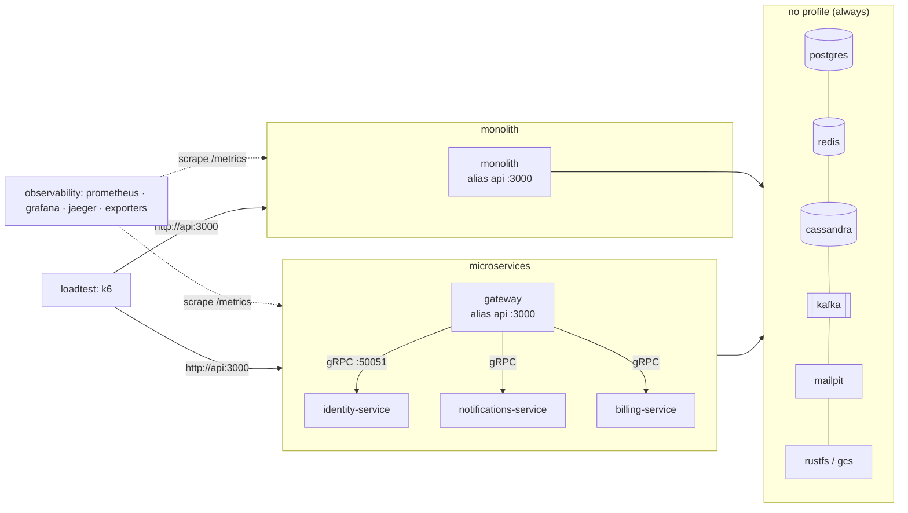

# Docker, local infrastructure & CI

Everything you need to run the stack locally, build production images, observe the apps and load-test them.
Files: [`Dockerfile`](../Dockerfile), [`.dockerignore`](../.dockerignore), [`docker-compose.yml`](../docker-compose.yml),
[`docker/`](../docker) (service configs), [`scripts/docker/`](../scripts/docker), [`.github/workflows/ci.yml`](../.github/workflows/ci.yml).

Related: [README](../README.md) · [Architecture](ARCHITECTURE.md) · [Development](DEVELOPMENT.md) ·
[Configuration](CONFIGURATION.md) · [API](API.md) · [Observability](OBSERVABILITY.md) · [Performance](PERFORMANCE.md) ·
[Testing](TESTING.md) · [Releasing](RELEASING.md) · [Security](SECURITY.md).

## TL;DR

```bash
docker compose up -d --wait                                  # infra only (Postgres, Redis, Cassandra, Kafka, Mailpit, RustFS, fake-gcs)
bun run dev                                                  # monolith on the HOST against that infra (creates missing .env files first)

docker compose --profile monolith up -d --build --wait       # or: the monolith in a container       -> http://localhost:3000
docker compose --profile microservices up -d --build --wait  # or: gateway + identity/notifications/billing -> http://localhost:3000
docker compose --profile observability up -d --wait          # Grafana http://localhost:3300 · Prometheus :9090 · Jaeger :16686
docker compose --profile loadtest run --rm k6                # k6 against http://api:3000 (whichever topology runs)
docker compose --profile '*' down -v                         # stop everything, wipe volumes
```

The root `package.json` wraps the common ones: `bun run docker:infra | docker:monolith | docker:microservices |
docker:observability | docker:down | loadtest`. `bun run docker:down` is `docker compose --profile '*' down`
**without** `-v`: it keeps the named volumes (data survives); add `-v` yourself to wipe them.

Requirements: Docker Desktop / Engine with Compose **v2.24+** (tested with Compose v5.5.1, Engine 29.8) and BuildKit.
Budget: the stack is sized for **4 CPUs / 4 GB** of Docker Desktop memory (see [Resource budget](#resource-budget-4-gb)).

## Stack map

| Service                 | Image                                           | Host port (127.0.0.1)        | Profile             | Purpose                                            |
| ----------------------- | ----------------------------------------------- | ---------------------------- | ------------------- | -------------------------------------------------- |
| `postgres`              | `postgres:18.6-alpine3.24`                      | 5432                         | —                   | identity + billing (Drizzle), db/user/pw `app`     |
| `redis`                 | `redis:8.10.2-alpine3.23`                       | 6379                         | —                   | cache, locks, throttling, BullMQ, pub/sub          |
| `cassandra`             | `cassandra:5.0.9`                               | 9042                         | —                   | notifications inbox (DC `datacenter1`)             |
| `cassandra-init`        | `cassandra:5.0.9` (cqlsh)                       | —                            | —                   | one-shot: keyspace `$CASSANDRA_KEYSPACE`           |
| `kafka`                 | `apache/kafka:4.3.1` (KRaft, single node)       | 9094 (EXTERNAL listener)     | —                   | integration events                                 |
| `kafka-init`            | `apache/kafka:4.3.1` (CLI)                      | —                            | —                   | one-shot: topics from `docker/kafka/topics.txt`    |
| `mailpit`               | `axllent/mailpit:v1.31.3`                       | 1025 (SMTP), 8025 (UI)       | —                   | catches every mail                                 |
| `rustfs`                | `rustfs/rustfs:1.0.0`                           | 9000 (S3), 9001 (console)    | —                   | S3-compatible storage, `rustfsadmin`/`rustfsadmin` |
| `gcs`                   | `fsouza/fake-gcs-server:1.56.1`                 | 4443                         | —                   | GCS emulator (`STORAGE_DRIVER=gcs`)                |
| `storage-init`          | `rustfs/rustfs:1.0.0` (curl)                    | —                            | —                   | one-shot: bucket `uploads` in both                 |
| `infra-ready`           | `redis:8.10.2-alpine3.23` (idle `sleep`)        | —                            | —                   | sentinel for `up --wait` (see below)               |
| `monolith`              | built (`APP=monolith`)                          | 3000                         | monolith            | everything in one process, alias `api`             |
| `gateway`               | built (`APP=gateway`)                           | 3000                         | microservices       | edge (REST/GraphQL/WS), alias `api`                |
| `identity-service`      | built (`APP=identity-service`)                  | 50051 (gRPC)                 | microservices       | AuthService + UsersService                         |
| `notifications-service` | built (`APP=notifications-service`)             | 50052 (gRPC)                 | microservices       | NotificationsService + Kafka consumers + mail      |
| `billing-service`       | built (`APP=billing-service`)                   | 50053 (gRPC)                 | microservices       | BillingService (Stripe)                            |
| `prometheus`            | `prom/prometheus:v3.15.0`                       | 9090                         | observability       | scrapes every app's `/metrics` + exporters         |
| `grafana`               | `grafana/grafana:13.2.2`                        | **3300**                     | observability, logs | dashboards (admin/admin, anonymous viewer)         |
| `jaeger`                | `jaegertracing/jaeger:2.20.0`                   | 16686 (UI), 4317/4318 (OTLP) | observability       | traces (in-memory)                                 |
| `postgres-exporter`     | `prometheuscommunity/postgres-exporter:v0.20.1` | —                            | observability       | Postgres metrics                                   |
| `redis-exporter`        | `oliver006/redis_exporter:v1.92.1-alpine`       | —                            | observability       | Redis metrics                                      |
| `loki` / `alloy`        | `grafana/loki:3.7.8` / `grafana/alloy:v1.20.0`  | 3100 / 12345                 | logs                | container logs → Loki (Grafana → Explore)          |
| `kafka-ui`              | `kafbat/kafka-ui:v1.5.0`                        | 8080                         | tools               | topics, consumer groups, lag                       |
| `k6`                    | `grafana/k6:2.3.0`                              | 5665 (live dashboard)        | loadtest            | load test, HTML report in `docker/k6/reports/`     |

Every host port binds **127.0.0.1 only** and can be moved with a `*_HOST_PORT` variable (shell or root `.env`; also
listed at the bottom of [`.env.example`](../.env.example)), e.g. `POSTGRES_HOST_PORT=15432 docker compose up -d` when
5432 is taken:

| Variable                                                                              | Default               | Service                         |
| ------------------------------------------------------------------------------------- | --------------------- | ------------------------------- |
| `API_HOST_PORT`                                                                       | 3000                  | `monolith` or `gateway` (`api`) |
| `POSTGRES_HOST_PORT` · `REDIS_HOST_PORT` · `CASSANDRA_HOST_PORT`                      | 5432 · 6379 · 9042    | postgres · redis · cassandra    |
| `KAFKA_HOST_PORT`                                                                     | 9094                  | kafka EXTERNAL listener         |
| `MAILPIT_SMTP_HOST_PORT` · `MAILPIT_UI_HOST_PORT`                                     | 1025 · 8025           | mailpit                         |
| `S3_HOST_PORT` · `S3_CONSOLE_HOST_PORT` · `GCS_HOST_PORT`                             | 9000 · 9001 · 4443    | rustfs (S3, console) · gcs      |
| `IDENTITY_GRPC_HOST_PORT` · `NOTIFICATIONS_GRPC_HOST_PORT` · `BILLING_GRPC_HOST_PORT` | 50051 · 50052 · 50053 | the three services' gRPC        |
| `PROMETHEUS_HOST_PORT` · `GRAFANA_HOST_PORT`                                          | 9090 · **3300**       | prometheus · grafana            |
| `JAEGER_UI_HOST_PORT` · `OTLP_GRPC_HOST_PORT` · `OTLP_HTTP_HOST_PORT`                 | 16686 · 4317 · 4318   | jaeger                          |
| `LOKI_HOST_PORT` · `ALLOY_HOST_PORT`                                                  | 3100 · 12345          | loki · alloy                    |
| `KAFKA_UI_HOST_PORT` · `K6_DASHBOARD_HOST_PORT`                                       | 8080 · 5665           | kafka-ui · k6 live dashboard    |

`S3_HOST_PORT` also feeds the apps' `S3_PUBLIC_ENDPOINT` and `KAFKA_HOST_PORT` the advertised EXTERNAL listener, so
moving them keeps presigned URLs and host-side Kafka clients working. `GCS_HOST_PORT` likewise feeds fake-gcs's
`-public-host`.
Inside the `backend` network containers use service names (`postgres:5432`, `kafka:9092`, `identity-service:50051`…);
every app container listens on HTTP **3000** (API or health + metrics) and gRPC **50051**.

## Topologies & profiles

- **No profile**: infrastructure only. The init jobs (`kafka-init`, `cassandra-init`, `storage-init`) run once per
  `up`, idempotently, and exit 0.
- **`monolith`** or **`microservices`**: never both. Each topology's edge app carries the network alias **`api`** and
  publishes host port 3000, so k6, docs and your browser don't care which one runs.
- **`observability`**, **`logs`**, **`tools`**, **`loadtest`** stack on top of either.
- `COMPOSE_PROFILES=microservices,observability` (in the shell or the root `.env`) replaces the `--profile` flags.
- `grafana` belongs to both `observability` and `logs`; `logs` alone gives Loki + Alloy + Grafana (Explore) without
  Prometheus/Jaeger.
- `docker compose --profile '*' …` addresses every profile (used by `down`); never `up` with it, since that would start
  both topologies.



## Dev loops

Day-to-day workflow, scripts and debugging are in [DEVELOPMENT.md](DEVELOPMENT.md); the Docker side:

1. **Apps on the host, infra in Docker (fastest).** `docker compose up -d --wait`, then `bun run dev` (monolith) or
   `bun run dev:microservices`. Every root `dev*` script first runs `bun run setup:env`, which copies each missing
   `.env` from its `.env.example` (never overwrites). The shared `@app/config` defaults target the published ports
   (Kafka: `localhost:9094`, the EXTERNAL listener), but the per-app values that must differ live **only** in
   `apps/*/.env` (`SERVICE_NAME`, `PORT` 3000/3001/3002/3003, `GRPC_URL` 0.0.0.0:50051/50052/50053,
   `DATABASE_RUN_MIGRATIONS=true`). Without those files every app would bind HTTP 3000 and gRPC 50051, and the
   monolith would boot against an empty schema. Starting an app another way (e.g. `bun run dev` inside `apps/<app>`)
   needs `bun run setup:env` once.
2. **Apps in Docker.** `docker compose --profile microservices watch` rebuilds and recreates an app when its folder,
   `libs/`, `package.json` or `bun.lock` changes. Dependency layers stay cached, so a source change costs ~30 s.
   `APP_TARGET=dev` swaps in the `dev` target (TS sources, no compile step, see below).
3. **Hybrid.** Services in Docker, one app on the host: the services publish their gRPC ports on the host-dev
   defaults (50051/50052/50053 = the `IDENTITY/NOTIFICATIONS/BILLING_GRPC_URL` defaults `localhost:5005x`), so
   `bun run dev:gateway` reaches them with the `.env` it creates. Start only the services you need
   (`docker compose --profile microservices up -d --build --wait identity-service notifications-service billing-service`)
   so the containerised gateway does not also claim host port 3000.

Root `.env` vs. containers: Compose reads the root `.env` **only for `${VAR}` interpolation**. Containers get their
environment from `docker-compose.yml` (plus an optional, gitignored **`.env.docker`**). Compose-only knobs are
therefore prefixed `DOCKER_` or suffixed `_HOST_PORT`, so host-dev values (e.g. `NODE_ENV=development`) can never
leak into containers. Deliberate pass-throughs: `STRIPE_SECRET_KEY`, `STRIPE_WEBHOOK_SECRET`, `CASSANDRA_KEYSPACE`,
the Postgres/RustFS credentials.

## Configuration of the app containers

Env names are exactly those of `@app/config` (all documented, with defaults, in [`.env.example`](../.env.example) and
[CONFIGURATION.md](CONFIGURATION.md); `node scripts/check-env-example.mjs` fails on drift). Extra app env for the
containers only goes in an optional `.env.docker` at the repo root (gitignored by the `.env.*` rule). Notable compose
choices:

| Setting                                    | Value                                   | Why                                                                                                                  |
| ------------------------------------------ | --------------------------------------- | -------------------------------------------------------------------------------------------------------------------- |
| `NODE_ENV`                                 | `production` (`DOCKER_NODE_ENV`)        | same code paths as prod (docs stay on via `DOCKER_DOCS_ENABLED=true`)                                                |
| `JWT_ACCESS_SECRET` / `JWT_REFRESH_SECRET` | `compose-local-…` (`DOCKER_JWT_*`)      | production mode rejects the dev-default secrets; these are NOT secret                                                |
| `OTEL_SDK_DISABLED`                        | `true` (`DOCKER_OTEL_SDK_DISABLED`)     | set `false` **and** start `observability` to send traces to `http://jaeger:4318`                                     |
| `DATABASE_RUN_MIGRATIONS`                  | `true`                                  | advisory-locked; see [Migrations](#bootstrap-jobs--migrations)                                                       |
| `KAFKA_GROUP_ID`                           | `monolith`, `gateway-push`, `<service>` | explicit consumer groups                                                                                             |
| `S3_PUBLIC_ENDPOINT`                       | `http://localhost:${S3_HOST_PORT}`      | presigned URLs must be reachable from the host, not `rustfs:9000`                                                    |
| `IDENTITY/NOTIFICATIONS/BILLING_GRPC_URL`  | `<service>:50051`                       | grpc-js resolves every A record of a scaled service (round robin)                                                    |
| `CLUSTER_WORKERS`                          | `1`                                     | scale with replicas (`--scale`), not `node:cluster`, in containers                                                   |
| `NODE_OPTIONS`                             | `--max-old-space-size=…`                | ≈ 70–75 % of the container memory limit; the rest is off-heap (see budget below)                                     |
| `SHUTDOWN_TIMEOUT_MS`                      | `15000`                                 | below `stop_grace_period: 20s`, so graceful shutdown finishes before SIGKILL                                         |
| `GRPC_ALLOW_INSECURE` / `GRPC_REFLECTION`  | `true` / `true`                         | production mode refuses plaintext gRPC; local opt-out (see [below](#what-is-local-only-dont-ship-this-compose-file)) |
| `TRUST_PROXY` (edge apps)                  | `uniquelocal` (`DOCKER_TRUST_PROXY`)    | k6 sends `X-Forwarded-For` from the private network; local only                                                      |
| `DOCS_ENABLED` (edge apps)                 | `true` (`DOCKER_DOCS_ENABLED`)          | `/docs` + `/openapi.json` + `/openapi.yaml` despite `NODE_ENV=production`                                            |
| `STORAGE_DRIVER`                           | `s3` (`DOCKER_STORAGE_DRIVER`)          | `gcs` switches to fake-gcs (`GCS_API_ENDPOINT=http://gcs:4443`)                                                      |
| `LOG_LEVEL` / `LOG_PRETTY`                 | `info` (`DOCKER_LOG_LEVEL`) / `false`   | JSON logs, so Alloy/Loki can parse them                                                                              |

### Compose-only variables

Read by Compose for `${VAR}` interpolation (shell or root `.env`). They are compose-only, never read by the apps on the host, **except** the rows marked _pass-through_ (`CASSANDRA_KEYSPACE`, `STRIPE_SECRET_KEY`, `STRIPE_WEBHOOK_SECRET`), which are also app variables:

| Variable                                                 | Default                                                                               | Effect                                                                                                                                                             |
| -------------------------------------------------------- | ------------------------------------------------------------------------------------- | ------------------------------------------------------------------------------------------------------------------------------------------------------------------ |
| `COMPOSE_PROFILES`                                       | —                                                                                     | profiles to start without `--profile`                                                                                                                              |
| `APP_TARGET`                                             | `runtime`                                                                             | app build target: `runtime` (distroless), `runtime-alpine`, `dev`                                                                                                  |
| `TAG`                                                    | `local`                                                                               | app image tag (`boilerplate/<app>:${TAG}`)                                                                                                                         |
| `DOCKER_NODE_ENV` / `DOCKER_LOG_LEVEL`                   | `production` / `info`                                                                 | app `NODE_ENV` / `LOG_LEVEL`                                                                                                                                       |
| `DOCKER_OTEL_SDK_DISABLED` / `DOCKER_OTEL_SAMPLER_RATIO` | `true` / `1.0`                                                                        | tracing on/off, head-sampling ratio                                                                                                                                |
| `DOCKER_DOCS_ENABLED` / `DOCKER_STORAGE_DRIVER`          | `true` / `s3`                                                                         | see table above                                                                                                                                                    |
| `DOCKER_JWT_ACCESS_SECRET` / `DOCKER_JWT_REFRESH_SECRET` | `compose-local-…`                                                                     | local JWT secrets (≥ 32 chars, not secret)                                                                                                                         |
| `DOCKER_TRUST_PROXY`                                     | `uniquelocal`                                                                         | edge apps' `TRUST_PROXY`                                                                                                                                           |
| `DOCKER_S3_CORS_ORIGINS`                                 | `http://localhost:3000,http://localhost:5173`                                         | RustFS `RUSTFS_CORS_ALLOWED_ORIGINS` (browser presigned PUT/GET)                                                                                                   |
| `POSTGRES_USER` / `POSTGRES_PASSWORD` / `POSTGRES_DB`    | `app` / `app` / `app`                                                                 | Postgres + the containers' `DATABASE_URL` + postgres-exporter                                                                                                      |
| `RUSTFS_ACCESS_KEY` / `RUSTFS_SECRET_KEY`                | `rustfsadmin` / `rustfsadmin`                                                         | RustFS + the containers' `S3_ACCESS_KEY_ID`/`S3_SECRET_ACCESS_KEY`                                                                                                 |
| `CASSANDRA_DC` / `CASSANDRA_HEAP` / `CASSANDRA_KEYSPACE` | `datacenter1` / `512M` / `app`                                                        | node DC (= apps' `CASSANDRA_LOCAL_DC`), `MAX_HEAP_SIZE`, keyspace (_pass-through_)                                                                                 |
| `KAFKA_CLUSTER_ID`                                       | `5L6g3nShT-eMCtK--X86sw`                                                              | KRaft cluster id                                                                                                                                                   |
| `GRAFANA_ADMIN_USER` / `GRAFANA_ADMIN_PASSWORD`          | `admin` / `admin`                                                                     | Grafana admin login                                                                                                                                                |
| `STRIPE_SECRET_KEY` / `STRIPE_WEBHOOK_SECRET`            | `sk_test_compose_local_not_for_production` / `whsec_compose_local_not_for_production` | _pass-through_ to monolith/billing (put a real **test** key in `.env`); the fallbacks are compose-local because `NODE_ENV=production` rejects the dev placeholders |
| `K6_*`, `K6_UID` / `K6_GID`                              | see [Load testing](#load-testing-k6)                                                  | k6 parameters and container user                                                                                                                                   |
| `*_HOST_PORT`                                            | see [Stack map](#stack-map)                                                           | host port bindings                                                                                                                                                 |

Tracing end to end:
`DOCKER_OTEL_SDK_DISABLED=false docker compose --profile monolith --profile observability up -d --wait`, then open
Jaeger (http://localhost:16686) or Grafana → Explore → Jaeger. Host apps: set `OTEL_EXPORTER_OTLP_ENDPOINT=http://localhost:4318`.
Signals, metric names and dashboards: [OBSERVABILITY.md](OBSERVABILITY.md).

## Bootstrap jobs & migrations

- **Kafka topics** ([`docker/kafka/topics.txt`](../docker/kafka/topics.txt)) = `@app/contracts` `KAFKA_TOPIC_VALUES` +
  `DEAD_LETTER_TOPIC_VALUES` (3 topics × 6 partitions + 3 `.dlq` × 1). Broker auto-creation is **off**, as in
  production: a missing topic fails loudly at consumer start instead of being created by a typo.
  `node scripts/docker/check-kafka-topics.mjs` (after `bun run build`) fails when the file drifts from the contracts.
- **Cassandra**: `cassandra-init` creates `CREATE KEYSPACE IF NOT EXISTS <CASSANDRA_KEYSPACE>` with
  `NetworkTopologyStrategy {'<CASSANDRA_DC>': 1}` (default `datacenter1`) and asserts the node's DC equals the apps'
  `CASSANDRA_LOCAL_DC`. Tables
  come from the services' own CQL migrations (`@app/cassandra`, LWT-locked) at boot.
- **Buckets**: `uploads` in RustFS (SigV4-signed `PUT` via curl) and in fake-gcs, verified with a HEAD/GET. RustFS
  answers browser CORS for the origins in `RUSTFS_CORS_ALLOWED_ORIGINS` (`DOCKER_S3_CORS_ORIGINS`, default
  `http://localhost:3000,http://localhost:5173` like the apps' `CORS_ORIGINS`), so a frontend can `PUT` to a
  presigned URL directly; `scripts/docker/check-infra.sh` asserts the preflight.
- **Postgres**: `docker/postgres/init/01-extensions.sql` (first start only) adds `pg_stat_statements` and `pg_trgm`.
  Tables come from the Drizzle migrations (`libs/database/src/migrations`), applied at boot under an advisory lock
  (`DATABASE_RUN_MIGRATIONS=true`). In production, run them as a release job with the same image:
  `docker compose run --rm --no-deps -w /app/libs/database identity-service dist/migrate.js` (Kubernetes: a Job
  with `workingDir: /app/libs/database`, `args: [dist/migrate.js]`) and set `DATABASE_RUN_MIGRATIONS=false`. The
  image's entrypoint is `node`, so the args replace only the default `CMD`. Release flow: [RELEASING.md](RELEASING.md).
- **`infra-ready`**: `docker compose up --wait` only accepts a one-shot container that _exited_ when an enabled service
  depends on it with `service_completed_successfully`. Without an app profile nothing would, and `--wait` would fail
  with `kafka-init exited (0)`. This idle 1 MB container depends on the three init jobs, and so means "infra bootstrapped".

`scripts/docker/check-infra.sh` boots the infra in an isolated project (`bp-infra-check`), asserts all of the above
(topics + partitions + auto-create off, keyspace + DC, extensions + `uuidv7()`, password-less Redis from another
container + `noeviction`, both buckets, every host port), prints `docker compose stats` and removes the project.
CI runs it on every pipeline (push to master, pull requests).

## Images (Dockerfile)

One image per app, selected with `--build-arg APP=<folder under apps/>`:

```text
oven/bun ─┐ (binary only)
node:24-trixie-slim ── toolchain ── manifests (package.json × N, bun.lock, bunfig.toml, patches/)
                                      ├─ deps ──────── bun install --frozen-lockfile --ignore-scripts
                                      │   ├─ dev ───── COPY . . → `bun run dev` (node --watch + swc-node, TS sources)
                                      │   └─ build ─── COPY . . → bun run --filter './libs/*' --filter ./apps/$APP build (swc)
                                      └─ prod-deps ─── bun install --production --filter ./apps/$APP (the app's closure only)
                                           └─ assemble ── scripts/docker/assemble-image.mjs (prune, copy dist, verify)
                                                ├─ runtime-alpine ── node:24-alpine + tini, user node
                                                └─ runtime (default) ── gcr.io/distroless/nodejs24-debian13:nonroot
```

```bash
docker build --build-arg APP=identity-service -t boilerplate/identity-service .                           # distroless
docker build --build-arg APP=identity-service --target runtime-alpine -t boilerplate/identity-service:debug .
docker build --build-arg APP=identity-service --build-arg VCS_REF=$(git rev-parse HEAD) -t … .           # OCI revision label
docker build --build-arg APP=gateway --target dev -t boilerplate/gateway:dev .                            # TS sources, no build
```

Build args: `APP` (required; the build fails fast without it), `NODE_VERSION` (24.21.0), `BUN_VERSION` (1.4.2),
`ALPINE_VERSION` (3.24), `DISTROLESS_IMAGE`, `UV_THREADPOOL_SIZE` (4), `PRUNE_NODE_MODULES` (true), `VCS_REF`.
Compose builds the same targets (`APP_TARGET`, tag `boilerplate/<app>:${TAG:-local}`).

- **Bun installs, Node runs.** The toolchain is `node:24-trixie-slim` with the Bun binary copied in, so swc runs on
  real Node 24. The runtime has no Bun at all. Installs use `--frozen-lockfile --ignore-scripts --backend=copyfile`
  with a BuildKit cache mount; `patches/` (the kafkajs patch) is copied before install, as bun requires.
- **Hoisted linker.** `bunfig.toml` uses `linker = "hoisted"` (the isolated linker produced duplicate `@nestjs/core`
  copies through NestJS's cyclic optional peers): one copy of each package in the **root**
  `node_modules`, workspace packages symlinked as `node_modules/@app/<name>` (relative links, preserved by `COPY`).
  The image copies that root tree; there are no per-package `node_modules`.
- **Only the app's closure ships.** The filtered production install contains only the dependencies of the app and
  of its workspace libs. `assemble-image.mjs` then deletes every other `apps/*` / `libs/*` folder, copies the compiled
  `dist/` of the closure and **fails the build** when
  - a non-TS asset under a package's `src/` (`.proto`, `.hbs`, `.cql`, `.sql`, drizzle `meta/*.json`) is missing
    from its `dist/` (swc `copyFiles`),
  - a declared runtime dependency of any closure package is not installed, or a workspace symlink dangles,
  - `dist/main.js` or `dist/instrument.js` is missing.

  It also removes install-only files (`bun.lock`, `bunfig.toml`, `patches/`) from the runtime tree.

- **Pruned `node_modules`** (`PRUNE_NODE_MODULES=true`, default): `*.d.ts`, `*.map`, TS sources (Node refuses to
  strip types under `node_modules`), Markdown (license/notice files kept) and the `typescript` package (an optional
  peer of `@nestjs/graphql`/`@nestjs/swagger`, used only by their CLI plugins). It is removed only if no installed
  package hard-depends on it. This takes the monolith from 465 MB to 294 MB. Build with
  `--build-arg PRUNE_NODE_MODULES=false` to keep them (e.g. for `--enable-source-maps` debugging).
- **Runtime**: `NODE_ENV=production`, `HOST=0.0.0.0`, `PORT=3000`, numeric non-root user (65532 distroless /
  1000 = `node` on alpine, which runs under `tini`), `EXPOSE 3000 50051`,
  `WORKDIR /app/apps/$APP`, `CMD ["--import", "./dist/instrument.js", "dist/main.js"]` (OpenTelemetry hooks load
  before any instrumented module). `HEALTHCHECK` = Node `fetch` of `/health/live` (no shell in distroless;
  `--start-interval=2s` makes containers healthy within seconds). Kubernetes ignores it: use `httpGet` probes on
  `/health/live` (liveness) and `/health/ready` (readiness).
- **`UV_THREADPOOL_SIZE`** (build arg / env, default 4): the libuv pool runs Argon2id, zlib, fs and `dns.lookup`.
  **Keep it ≤ the CPUs available to the container.** Measured with the monolith capped at 2 CPUs under k6
  (5 sign-ups/s + 20 reads/s): 4 threads gave p95 **36 ms** (cached read p95 9.6 ms, 0 dropped iterations); 16 threads
  gave p95 **304 ms … 7.2 s** with dropped iterations. Busy threads beyond the CFS quota get the whole cgroup throttled,
  event loop included. Raise it together with the CPU limit. More measurements: [PERFORMANCE.md](PERFORMANCE.md).
- No `--enable-source-maps` by default: it makes every `Error.stack` access pay a source-map lookup.
- **`dev` target**: the full dev `node_modules` + sources, runs `bun run dev` from TS (no build step). It is large
  (the entire toolchain) and slow to export on Docker Desktop; prefer dev loop 1 unless you need Linux-only behaviour.

Measured (Apple silicon, Docker Desktop 4 CPU / 4 GB, other containers running):

| Image                   | Size (distroless, pruned) | Workspace packages | Assets verified | Runtime deps checked |
| ----------------------- | ------------------------- | ------------------ | --------------- | -------------------- |
| `monolith`              | 294 MB (294,437,864 B)    | 19                 | 18              | 326                  |
| `gateway`               | 294 MB                    | 19                 | 14              | —                    |
| `notifications-service` | 280 MB                    | 13                 | —               | —                    |
| `billing-service`       | 245 MB                    | 14                 | —               | —                    |
| `identity-service`      | 242 MB (alpine: 247 MB)   | 12                 | 6               | 231                  |

The monolith row was re-measured on a cold build (the other rows are from the original measurement). The assemble step reported 19 workspace packages, 18 assets
verified and 326 runtime dependencies resolved, then pruned 27,817 files plus `typescript` (162.8 MiB) from
`node_modules`. Inside the image `/app/node_modules` is about 124 MiB, `apps/` holds only `monolith`, `libs/` its 18
closure libs, and `bun.lock`, `bunfig.toml`, `patches/` and `typescript` are gone. `swagger-ui-dist` stays (a hard
dependency of `@nestjs/swagger`) although `/docs` uses Scalar.

Build time: ~5–5.5 min cold (about 2 min of it is the distroless base pull on a fresh machine; the full and the
filtered install share a locked cache, so they serialize; swc compiles all libs + the app in ~1.5 s), **~30 s** for
a source-only change (dependency layers cached), ~40 s for another app once the full install is cached.
The gateway ships as much as the monolith because the domain-lib barrels import their infrastructure
(`@app/notifications` → cassandra/mailer…). Per-domain `@app/<x>/api` subpath exports would slim it; that is a known
follow-up, not done yet (see [Known follow-ups](#known-follow-ups)).

### Running a prebuilt image, and what a healthy container looks like

Compose services use `image: boilerplate/<app>:${TAG:-local}` plus a `build:` section. To run an image you built
separately, tag it and skip the build:

```bash
docker tag <image> boilerplate/monolith:mytag
TAG=mytag docker compose --profile monolith up -d --no-deps --no-build --pull never monolith
docker compose --profile monolith rm -sf monolith    # stop and remove only that container
```

When infra host ports are remapped, pass `S3_HOST_PORT` to that command as well: the container's
`S3_PUBLIC_ENDPOINT` is `http://localhost:${S3_HOST_PORT:-9000}` and presigned URLs embed it. `STRIPE_SECRET_KEY` and
`STRIPE_WEBHOOK_SECRET` pass through from the invoking environment or the root `.env` (default: the compose-local
`*_compose_local_not_for_production` values); sign test events with whichever webhook secret the container got.

Verified with the monolith image (24/24 smoke checks through the container):

- Healthy about 6 s after start (about 4 s of cold module import, then ~170 ms to listening), 0 restarts. It runs as
  uid 65532 under `init: true` (tini is PID 1, so the app is pid 7), `NODE_ENV=production`, Node 24.21.0,
  `NODE_OPTIONS=--max-old-space-size=512`, limit 768 MB / 2 CPUs; about 255 MiB used after the smoke run.
- The log says `monolith listening on http://127.0.0.1:3000 (pid 7, production)` although it binds `0.0.0.0`: Nest's
  `getUrl()` rewrites the wildcard address; the published port works.
- `DOCS_ENABLED=true` (via `DOCKER_DOCS_ENABLED`), so `/docs` and `/openapi.json` are served even in production mode.
  GraphQL errors carry no `extensions.stacktrace` (production).
- Logs are 100 % single-line pino JSON (no duplicate keys); expected 4xx are `warn`, never `error`.
- `docker compose stop` → `SIGTERM received; forcing exit in 15000 ms if still running` (compose sets
  `SHUTDOWN_TIMEOUT_MS=15000`, below `stop_grace_period: 20s`) → Cassandra and Postgres closed →
  `Shutdown complete (SIGTERM)` after about 2.4 s, exit code 0, Kafka consumer lag 0.

Full teardown of a stack, volumes and network included: `docker compose --profile '*' down -v --remove-orphans` (add
`-p <project>` if you started it under another project name).

## Observability

- **Prometheus** ([`docker/prometheus/prometheus.yml`](../docker/prometheus/prometheus.yml)) discovers apps with DNS
  SD on the compose service names (port 3000): one target per replica, nothing for profiles that aren't running.
  It sets the `service` label itself. Job `host-apps` scrapes apps started on the host (`host.docker.internal:3000-3003`,
  `service="host:<port>"`). When the API runs in compose, `host:3000` is that same container through its published port.
  The remote-write receiver is on for k6.
- **Grafana** (http://localhost:3300, **3300** because 3000–3003 are the API/services host-dev ports): provisioned
  datasources (Prometheus, Jaeger, Loki, fixed UIDs) and the home dashboard **NestJS services overview**
  ([`docker/grafana/dashboards/nestjs-overview.json`](../docker/grafana/dashboards/nestjs-overview.json)):
  throughput, p50/p95/p99 latency and 4xx/5xx ratio per service from
  `http_request_duration_seconds{method,route,status_code}`, top routes by rate and by p95, status-code mix, event-loop
  lag p99, CPU, RSS/heap, GC time, libuv handles, and a k6 row. `GF_PLUGINS_PREINSTALL_DISABLED=true` is required:
  Grafana 13 otherwise "updates" its bundled Prometheus plugin from grafana.com at startup, and the datasource stays
  broken until (or, offline, forever after) the download ends.
- **Jaeger 2.20.0**, pinned: 2.21 removed the `/api/services` + `/api/traces` endpoints that Grafana 13's Jaeger
  datasource still calls. It is also an OTLP collector (4317 gRPC / 4318 HTTP), so no separate collector is needed.
- **Loki + Alloy** (`logs`): Alloy tails this project's containers through the Docker socket, lifts pino's `level` to
  a label and keeps `trace_id`/`span_id` as structured metadata (log → trace links). Alloy needs
  `/var/run/docker.sock` (check permissions on rootless Docker).

## Load testing (k6)

[`docker/k6/script.js`](../docker/k6/script.js), open model (`constant-arrival-rate`, no coordinated omission):

- **`journey`** (`RATE`/s): `POST /v1/auth/register` (unique email) → `POST /v1/auth/login` → `GET /v1/auth/me` →
  `GET /v1/users/:id` (cache hit) → `POST /graphql { me }`. Each iteration sends its own `X-Forwarded-For`, so the
  per-IP auth throttle models many clients. That works because compose sets `TRUST_PROXY=uniquelocal`
  (`DOCKER_TRUST_PROXY`, local only: private-network peers are trusted proxies); the app default is
  `false`, and production must list only the load balancer's IPs/CIDRs (`true` is rejected).
- **`browse`** (`READ_RATE`/s, off by default): the three authenticated reads by a pool of users registered in
  `setup()`, sized to stay under the per-user `THROTTLE_LIMIT`.
- **Thresholds**: error rate < `MAX_ERROR_RATE` (1 %), p95 < `P95_MS` (250 ms), cached-read p95 < `P95_MS/2`, checks
  > 99 %, dropped iterations ≤ `MAX_DROPPED_RATIO` (1 %) of the planned ones. `setup()` traffic is excluded.

Compose maps `K6_BASE_URL`, `K6_RATE`, `K6_READ_RATE`, `K6_DURATION`, `K6_P95_MS` and `K6_MAX_ERROR_RATE` (shell or
root `.env`) to the script's `BASE_URL`/`RATE`/… variables. The script's other knobs (`MAX_DROPPED_RATIO`,
`THROTTLE_LIMIT`, `PASSWORD`, `RUN_ID`) are not mapped: pass them with `-e`, e.g.
`docker compose --profile loadtest run --rm -e MAX_DROPPED_RATIO=0.05 k6`. Methodology and results:
[PERFORMANCE.md](PERFORMANCE.md).

```bash
docker compose --profile microservices --profile observability up -d --build --wait
K6_RATE=5 K6_READ_RATE=20 K6_DURATION=2m docker compose --profile loadtest run --rm k6
K6_OUT= docker compose --profile loadtest run --rm k6        # without the observability profile (no remote write)
open docker/k6/reports/k6-report.html                        # HTML report of the last run; live: http://localhost:5665
```

k6 runs as `${K6_UID:-1000}:${K6_GID:-1000}` so it can write the report into the bind-mounted `docker/k6/reports/`
(committed with a `.gitkeep`, contents gitignored). On a Linux host whose user is not uid 1000, pass yours:
`K6_UID=$(id -u) K6_GID=$(id -g) bun run loadtest`. Docker Desktop (macOS/Windows) maps ownership and needs nothing.

Measured (same laptop, k6 in the same 4-CPU VM): monolith, `RATE=5 READ_RATE=20` for 40 s: **p95 36 ms**, cached
read p95 9.6 ms, 0 errors. Gateway + services, defaults (`RATE=5`, 1 min): **p95 91 ms**, cached read p95 12 ms,
0 errors. With `READ_RATE=20` added, the shared 4-core VM saturates (p95 ~0.8 s). Run k6 on another machine
(`K6_BASE_URL`) for serious numbers.

## Resource budget (4 GB)

Memory limits are caps (sum > 4 GB on purpose); measured RSS once idle:

| Container                                    | Limit                    | RSS                      | Notes                                                               |
| -------------------------------------------- | ------------------------ | ------------------------ | ------------------------------------------------------------------- |
| cassandra                                    | 1.5 GB                   | 1.05 GB                  | `MAX_HEAP_SIZE=512M` (`CASSANDRA_HEAP`), `MaxDirectMemorySize=256M` |
| kafka                                        | 768 MB                   | 300–420 MB               | `-Xmx384m`; CLI tools (healthcheck/init) run with a 96–128 MB heap  |
| postgres                                     | 512 MB                   | 40 MB                    | `shared_buffers=128MB`, `jit=off`, `pg_stat_statements`             |
| rustfs / redis / mailpit / gcs               | 256 / 256 / 128 / 128 MB | 55–90 / 15 / 17 / 12 MB  | Redis `maxmemory 192mb noeviction` (BullMQ)                         |
| monolith                                     | 768 MB                   | 230 MB                   | heap cap 512 MB                                                     |
| gateway · identity · notifications · billing | 512 · 448 · 448 · 448 MB | 180 · 130 · 160 · 120 MB | heap caps 384/320 MB                                                |
| jaeger · prometheus · grafana · exporters    | 512 · 384 · 256 · 64 MB  | —                        | `observability`; Jaeger keeps traces in memory                      |
| loki · alloy · kafka-ui · k6                 | 384 · 192 · 448 · 512 MB | —                        | `logs` / `tools` / `loadtest`                                       |

Off-heap headroom (limit − heap cap: 256 MB monolith, 128 MB gateway) also holds the Buffers of streamed uploads
(`POST /v1/files`): up to ~15 MiB each (S3 multipart, 3 × 5 MiB parts), at most `STORAGE_MAX_CONCURRENT_UPLOADS` (4)
per process, i.e. ~60 MiB; extra uploads get 503 + `Retry-After`. Raising that cap means raising the memory limit
(or lowering the heap cap) by ~15 MiB per upload; presigned uploads cost the API nothing.

Infra ≈ 1.6 GB, + one topology ≈ 0.25 (monolith) / 0.6 GB (microservices), + observability ≈ 0.4 GB. Running
**everything at once** (both extra profiles + `logs` + `tools`) exceeds 4 GB and the VM starts reclaiming memory:
start what you need, or raise Docker Desktop's memory.

## CI ([`.github/workflows/ci.yml`](../.github/workflows/ci.yml))

Runs on pushes to `master` and on pull requests. Test layout and the integration projects: [TESTING.md](TESTING.md).

- **verify**: Node 24 (`.nvmrc`) + Bun 1.4.2, `bun install --frozen-lockfile`, `bun run check` (Biome, ESLint,
  Prettier, tsc), `bun run test`, `bun run build`, generated-artefact drift (`proto:gen` + `buf lint` + `db:generate`,
  then a clean `git diff`/`git status` of `libs/contracts/src/generated` and `libs/database/src/migrations`),
  commitlint over the PR's commits (pull requests only), then the config drift checks (`.env.example`, Kafka topics).
- **integration**: `bun run test:int` (`INTEGRATION=1`, every `<package>:int` project): Postgres from testcontainers,
  Redis from a job service container (`REDIS_URL=redis://localhost:6379`).
- **image** (matrix of the 5 apps): `docker buildx` of the `runtime` target, not pushed, GitHub Actions cache per app.
- **compose**: `scripts/docker/validate-compose.sh` (`docker compose config` for every profile combination + one `api`
  per topology) and `scripts/docker/check-infra.sh` (boots and asserts the infra, including the S3 CORS preflight,
  then tears it down).

## Gotchas (all hit or verified while building this)

1. **PG18 volume path**: mount `/var/lib/postgresql` (PGDATA is `/var/lib/postgresql/18/docker`). The old
   `/var/lib/postgresql/data` silently lands in an anonymous volume.
2. `pg_isready` over the unix socket reports ready during initdb; the healthcheck uses `-h 127.0.0.1`.
3. `redis-cli ping` exits 0 on error replies: the healthcheck greps `PONG`. **BullMQ needs `noeviction`.**
4. Cassandra 5 = G1: set `MAX_HEAP_SIZE` only (`HEAP_NEWSIZE` is CMS-only). The DC name (`CASSANDRA_DC`) must equal
   the apps' `CASSANDRA_LOCAL_DC` or the driver ignores the node. cassandra-driver 4.10 speaks protocol v4.
5. Single-node Kafka needs RF=1 on **every** internal topic (else "group coordinator not available"). The CLI inherits
   `KAFKA_HEAP_OPTS` (shrink it for probes), and `apache/kafka-native` has no CLI. A few "coordinator is loading" errors
   from kafkajs on first start are normal. kafkajs is patched (`patches/kafkajs@2.2.4.patch`) for the Node 24
   1 ms idle-timer loop.
6. `docker compose up --wait` needs the `infra-ready` sentinel (above). `healthcheck.start_interval` requires
   `start_period` (a runtime error, not caught by `docker compose config`).
7. Mailpit: never set `MP_ENABLE_PROMETHEUS=0` (parsed as a listen address → crash loop).
8. MinIO images are gone and LocalStack needs an auth token: hence RustFS. Presigned URLs embed the signing host:
   `S3_PUBLIC_ENDPOINT` must be reachable by the client.
9. fake-gcs: always pass `GCS_API_ENDPOINT` (a bare `STORAGE_EMULATOR_HOST` without `/storage/v1` breaks the SDK).
10. Jaeger ≥ 2.21 breaks Grafana's Jaeger datasource; Grafana 13 needs `GF_PLUGINS_PREINSTALL_DISABLED=true`;
    literal `$` in Grafana provisioning files is `$$`.
11. `UV_THREADPOOL_SIZE` above the container's CPU quota throttles the event loop (measured above).
12. zsh users: `docker build -t img/$app:local` expands `$app:l` (lowercase modifier) → quote as `"img/${app}:local"`.
13. k6 threshold selectors cannot contain `:` or `,` in tag values (hence the `GET /v1/users/<id>` tag).
14. Distroless has no shell: debug with `--target runtime-alpine`, `docker compose logs`, or
    `docker run --rm --network <project>_backend redis:8.10.2-alpine3.23 wget -qO- http://gateway:3000/metrics`.

## What is local-only (don't ship this compose file)

The production hardening checklist lives in [SECURITY.md](SECURITY.md); the compose-specific shortcuts are:

No Redis password or TLS, default RustFS/Grafana/Postgres credentials, known JWT secrets, Kafka PLAINTEXT with RF=1,
Cassandra RF=1, in-memory Jaeger, anonymous Grafana viewer and migrations at boot. Production: managed/secured
services, secrets from a secret store, `DATABASE_RUN_MIGRATIONS=false` plus a migration job, and replicas
behind a load balancer whose idle timeout is below `HTTP_KEEP_ALIVE_TIMEOUT_MS` (72 s), with `TRUST_PROXY` set to that
load balancer's IPs/CIDRs (compose's `uniquelocal` and `true` are not for production).

**Internal gRPC is plaintext and unauthenticated here** (`GRPC_ALLOW_INSECURE=true`, `GRPC_REFLECTION=true`). The services trust every
caller: anyone who reaches port 50051 can call `UpdateUserRoles` with any `actorId`, list users or payments, and (with
reflection on) discover every method. `NODE_ENV=production` refuses to start without TLS unless that opt-out is set.
Production: mutual TLS (`GRPC_TLS_CA_PATH`/`GRPC_TLS_CERT_PATH`/`GRPC_TLS_KEY_PATH`; server certificates must name the
`*_GRPC_URL` hosts) or a service mesh doing mTLS, plus a NetworkPolicy that only lets the gateway reach the services'
gRPC ports. Reflection defaults to off in production; compose turns it back on for local grpcurl/Postman.

**Never expose the ops routes through the public ingress.** `/metrics` (route-level traffic, error rates, queue and
heap internals) and `/docs` + `/openapi.*` are served on the API port: route only `/v1`, `/graphql` and
`/notifications` (Socket.IO) publicly, keep `DOCS_ENABLED` off, and let Prometheus scrape the pods directly. Set
`METRICS_BEARER_TOKEN` (Prometheus `authorization: { credentials: … }`) so `/metrics` answers 404 to anyone else.
A separate metrics listener (its own port) is not implemented yet, so this routing rule is the control today.

## Known follow-ups

Stated honestly: none of these are done yet.

| Follow-up                                                              | Docker impact                                                                                                |
| ---------------------------------------------------------------------- | ------------------------------------------------------------------------------------------------------------ |
| Per-domain `@app/<x>/api` subpath exports                              | the gateway image would stop shipping the domain libs' infrastructure (it is as large as the monolith today) |
| Separate metrics listener                                              | `/metrics` could leave the API port; until then keep it off the public ingress + `METRICS_BEARER_TOKEN`      |
| Transactional outbox                                                   | events are published after commit today; a crash between commit and publish can lose the event               |
| Real-database integration specs for billing/notifications repositories | the CI `integration` job covers Postgres + Redis only through the existing `*:int` projects                  |
