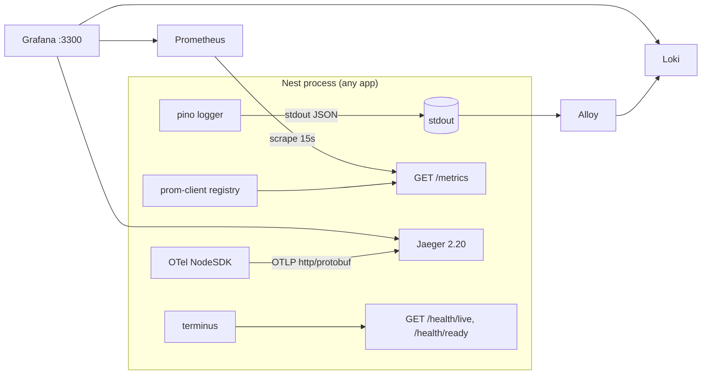

# Observability

How the boilerplate emits logs, metrics, traces and health signals, and how to read them.
Everything here is wired by one global module, `ObservabilityModule.forRoot()` from
[`@app/observability`](../libs/observability/README.md), which every app imports right after
`AppConfigModule.forRoot()`. For the local stack (Prometheus, Grafana, Jaeger, Loki) see
[DOCKER.md](DOCKER.md). For the env var catalogue see [CONFIGURATION.md](CONFIGURATION.md).

## Overview

| Signal           | Produced by                                                  | Where it goes                                              | Local UI                                    |
| ---------------- | ------------------------------------------------------------ | ---------------------------------------------------------- | ------------------------------------------- |
| Logs             | pino (nestjs-pino), JSON on stdout                           | container stdout → Grafana Alloy → Loki (`logs` profile)   | Grafana Explore, `http://localhost:3300`    |
| Metrics          | prom-client (`@willsoto/nestjs-prometheus`), `GET /metrics`  | scraped by Prometheus every 15 s (`observability` profile) | Grafana dashboard, `http://localhost:3300`  |
| Traces           | OpenTelemetry Node SDK, preloaded by `src/instrument.ts`     | OTLP/HTTP → Jaeger 2.20 (`observability` profile)          | Jaeger `http://localhost:16686`, or Grafana |
| Health           | `@nestjs/terminus`, `GET /health/live` + `GET /health/ready` | orchestrator probes, Docker `HEALTHCHECK`, k6 `setup()`    | curl                                        |
| Observe (opt-in) | `@nestjs/observe`, only when its credentials are set         | the Observe backend                                        | Observe                                     |



One id ties the signals together: the **request id** is in every log line (`requestId`), in the
`x-request-id` response header, in GraphQL error `extensions.requestId`, in problem+json error
bodies, and it is the Observe trace id. When tracing is on, every log line also carries
`trace_id`/`span_id`, and Grafana links a Loki line to its Jaeger trace.

## Logs (pino)

Every app logs **one JSON object per line on stdout** through nestjs-pino. Use Nest's `Logger`
(`new Logger(MyService.name)`); `console.*` is banned by lint. The parameters come from
`buildLoggerParams()` in
[`libs/observability/src/logging/logger-params.ts`](../libs/observability/src/logging/logger-params.ts).

### Fields

| Field                                 | Value                                                                                                                                                             |
| ------------------------------------- | ----------------------------------------------------------------------------------------------------------------------------------------------------------------- |
| `level`                               | A label (`info`, `warn`, …), not pino's number. Alloy lifts it into a Loki stream label.                                                                          |
| `time`                                | Epoch milliseconds (pino default).                                                                                                                                |
| `service`, `pid`, `hostname`          | `SERVICE_NAME`, the process id and the host name, on every line.                                                                                                  |
| `requestId`                           | The request id of the HTTP request, gRPC call, Kafka message or WebSocket message being handled (see below).                                                      |
| `context`                             | The Nest `Logger` context (class name).                                                                                                                           |
| `trace_id`, `span_id`, `trace_flags`  | The active OpenTelemetry span, only when one is active (tracing on).                                                                                              |
| `req` / `res` (request-complete line) | Trimmed on purpose: `req { id, method, url, remoteAddress }` (no headers, no query string, which may carry tokens) and `res { statusCode }`, plus `responseTime`. |
| `err`                                 | A serialized error with stack, for server-side failures only.                                                                                                     |
| `error`                               | `{ type, message, code }` without a stack, for gRPC/Kafka handlers that failed because of the caller (see levels).                                                |

Loggers called inside a request bind only `requestId` (`quietReqLogger`), not the whole request,
so in-handler lines stay small.

### Request and correlation ids across transports

Two ids exist. The **request id** identifies one hop (one HTTP request, one gRPC call, one Kafka
message). The **correlation id** identifies the whole call chain and survives hops. Both must
match `[A-Za-z0-9._:-]{1,128}`. An invalid incoming value is replaced with a fresh UUIDv7, never
echoed back, which prevents log and header injection.

| Transport            | Request id                                                                                                                                | Correlation id                                                                      | Propagated outward as                                                                        |
| -------------------- | ----------------------------------------------------------------------------------------------------------------------------------------- | ----------------------------------------------------------------------------------- | -------------------------------------------------------------------------------------------- |
| HTTP (REST, GraphQL) | Valid incoming `x-request-id`, else a UUIDv7. Fastify `request.id`, the log `requestId` and `cls.getId()` all hold the same value.        | Valid incoming `x-correlation-id`, else the request id.                             | Both are response headers (exposed to browsers via CORS); `requestId` in problem+json bodies |
| gRPC (server side)   | Metadata `x-request-id`, else `x-correlation-id`, else a UUIDv7; stable per call.                                                         | Metadata `x-correlation-id`.                                                        | Outgoing gRPC metadata (`createOutgoingMetadata`), with `x-user-id` / `x-user-roles`         |
| Kafka consumer       | Log `requestId`: the record header `x-correlation-id` (records carry no `x-request-id`), else a UUIDv7. `cls.getId()`: the envelope `id`. | Header `x-correlation-id`, else the envelope `correlationId`, else the envelope id. | Envelope `correlationId` + `x-correlation-id` header on every event the handler publishes    |
| WebSocket            | A fresh id per message (a socket lives for hours; one id per socket would merge unrelated messages).                                      | —                                                                                   | —                                                                                            |

Because the gateway forwards its request id as gRPC metadata and the service adopts it, **one
`requestId` covers the gateway line and the gRPC service lines of the same request**. Kafka
consumers log under the event's correlation id (the `x-correlation-id` record header), so one
chain shares a `requestId` across events: observed live, the `event completed` lines of a
registration's `identity.user-registered.v1` and the resulting
`notifications.notification-created.v1` carry the same `requestId`. The lines do not carry a
separate `correlationId` field.

```bash
# No token → 401, logged at warn with requestId "demo-123" (probes would not be logged at all)
curl -si http://localhost:3000/v1/auth/me -H 'x-request-id: demo-123' | grep -i x-request-id
# x-request-id: demo-123
```

```logql
{service=~".+"} | json | requestId = "demo-123"
```

### Levels

`LOG_LEVEL` (default `info`; one of `fatal error warn info debug trace silent`) sets the minimum
level. On top of it, the boilerplate picks levels so that **errors mean "the service is broken"**
and a caller's mistake never pages anyone:

| What happened                                                                                                                                                                                                                                                                                     | Level                                                 |
| ------------------------------------------------------------------------------------------------------------------------------------------------------------------------------------------------------------------------------------------------------------------------------------------------- | ----------------------------------------------------- |
| HTTP request completed, 2xx/3xx                                                                                                                                                                                                                                                                   | `info`                                                |
| HTTP request completed, 4xx                                                                                                                                                                                                                                                                       | `warn`                                                |
| HTTP request completed, 5xx or with an error                                                                                                                                                                                                                                                      | `error`                                               |
| `GET /health*` and `GET /metrics`                                                                                                                                                                                                                                                                 | not auto-logged at all (probes, scrapes)              |
| `AllExceptionsFilter`, status ≥ 500                                                                                                                                                                                                                                                               | `error` with `err` (stack)                            |
| `AllExceptionsFilter`, status < 500 (the request-complete line already reports it as `warn`)                                                                                                                                                                                                      | `debug`                                               |
| gRPC/Kafka handler failed because of the caller: `DomainException`/`HttpException` < 500, zod errors, client-class gRPC codes (`INVALID_ARGUMENT`, `NOT_FOUND`, `ALREADY_EXISTS`, `PERMISSION_DENIED`, `RESOURCE_EXHAUSTED`, `FAILED_PRECONDITION`, `ABORTED`, `OUT_OF_RANGE`, `UNAUTHENTICATED`) | `warn` with `error { type, message, code }`, no stack |
| gRPC/Kafka handler failed server-side (anything else)                                                                                                                                                                                                                                             | `error` with `err`                                    |
| kafkajs' own retry and reconnect ERROR lines                                                                                                                                                                                                                                                      | `warn`                                                |
| Readiness contributor failed                                                                                                                                                                                                                                                                      | `warn`                                                |

Every line carries `requestId` exactly once: the `AllExceptionsFilter` line gets it from the
request-scoped logger and does not add its own copy (strict JSON parsers reject duplicate keys).
Keep the 5xx doubling in mind for alert rules: during an upstream outage each failed gateway
request writes **two** `error` lines (the filter line with the real exception and stack, and the
pino-http request-complete line with `res.statusCode` 503), and the circuit breaker adds a `warn`
(`Circuit "billing" OPEN: failing fast`) when it opens. Count requests from the metrics, not from
error lines.

### Redaction

These paths are replaced with `[REDACTED]` before a line is written (`LOG_REDACT_PATHS`):
`req.headers.authorization`, `req.headers.cookie`, `req.headers["x-api-key"]`,
`req.headers["stripe-signature"]`, `res.headers["set-cookie"]`, top-level `password`, `token`,
`accessToken`, `refreshToken`, and one level deep `*.password`, `*.passwordHash`, `*.token`,
`*.accessToken`, `*.refreshToken`, `*.secret`, `*.apiKey`. Headers are listed even though the
serializers already drop them, so a future serializer change cannot leak credentials. Keep the
list short: every wildcard costs time on every log line. Never log a request body wholesale. gRPC/Kafka
payloads are not logged (`includePayload: false`).

### Output and pretty printing

- Production writes through an **async** `pino.destination` (4 KiB buffer, flushed at least every
  second). On shutdown `TelemetryFlushService` flushes it, so the last lines are not lost.
- `LOG_PRETTY=true` switches to the `pino-pretty` worker transport (single-line, coloured). It
  defaults to on when `NODE_ENV=development`, costs about 5x the throughput, and needs the
  `pino-pretty` devDependency (absent from production images, where the flag falls back to JSON).
- Before Nest finishes booting, `createBootstrapLogger()` writes single-line JSON with the same
  `service` field, so boot errors are parseable too.
- Local log shipping: `docker compose --profile logs up -d` starts Loki and Grafana Alloy. Alloy
  tails this compose project's containers, keeps `trace_id`/`span_id` as structured metadata, and
  lifts `level` into a label. In Grafana, the Loki datasource turns `trace_id` into a link to Jaeger.

## Metrics (Prometheus)

### What is exported

| Metric                                                                | Type      | Labels                           | Source                                                                                                 |
| --------------------------------------------------------------------- | --------- | -------------------------------- | ------------------------------------------------------------------------------------------------------ |
| `http_request_duration_seconds` (`_bucket`, `_sum`, `_count`)         | histogram | `method`, `route`, `status_code` | Fastify `onResponse` hook (`HttpMetricsHook`); buckets 5 ms, 10, 25, 50, 100, 250, 500 ms, 1, 2.5, 5 s |
| `process_*`, `nodejs_*` (CPU, RSS, heap, GC, event-loop lag, handles) | various   | —                                | prom-client default metrics (event-loop monitoring precision 10 ms)                                    |
| `billing_checkout_paid_without_currency_total`                        | counter   | —                                | billing: paid Stripe Checkout Sessions left pending because no currency was known                      |

Label rules:

- `route` is the matched route **template** (`/v1/users/:id`), never the raw URL. Raw paths carry
  ids and would create one time series per entity until Prometheus runs out of memory. Requests
  that match no route (404s, scanners) share one `route="UNMATCHED"` series.
- There is **no `service` label from the app**. Prometheus adds it from the scrape target (see
  below); a second one would conflict.
- The hook is a Fastify hook, not a Nest interceptor, so it also counts 404s, guard rejections
  (401/403), throttling (429), body-parser errors and the final status chosen by exception filters.
- GraphQL over HTTP shows up as `POST /graphql`. WebSocket, gRPC and Kafka traffic is not HTTP and
  is **not** in this histogram. `/metrics` itself is excluded; `/health/*` probes are counted.

There are no app-level gRPC, Kafka, Redis or database metrics yet. Postgres and Redis are covered
by `postgres-exporter` and `redis-exporter` in the `observability` profile.

Add your own with the re-exported helpers:

```ts
import { InjectMetric, makeCounterProvider } from '@app/observability';
import type { Counter } from 'prom-client';

// module providers
makeCounterProvider({ name: 'orders_placed_total', help: 'Orders placed', labelNames: ['plan'] });

// service
constructor(@InjectMetric('orders_placed_total') private readonly placed: Counter<'plan'>) {}
```

Keep label values bounded (enums, route templates), never ids or emails.

### `GET /metrics` and its protection

`/metrics` is served on the **same port as the API** (VERSION_NEUTRAL, so no `/v1` prefix;
`@Public()`, so auth guards skip it; the throttler and maintenance mode skip it too).

| Setting                                    | Effect                                                                                                                                                                                           |
| ------------------------------------------ | ------------------------------------------------------------------------------------------------------------------------------------------------------------------------------------------------ |
| `METRICS_ENABLED=false`                    | `/metrics` answers 404 and default metrics are not collected.                                                                                                                                    |
| `METRICS_BEARER_TOKEN=<at least 16 chars>` | Scrapes must send `Authorization: Bearer <token>` (compared in constant time). A missing or wrong token gets **404**, the same as a disabled endpoint, so the route's existence is not revealed. |
| neither                                    | Open (the local default).                                                                                                                                                                        |

```bash
curl -s http://localhost:3000/metrics | grep '^http_request_duration_seconds_count' | head
curl -s -H "Authorization: Bearer $METRICS_BEARER_TOKEN" http://localhost:3000/metrics | head
```

In production, **never route `/metrics` (or `/docs`) through the public ingress**: scrape it from
inside the cluster, and set `METRICS_BEARER_TOKEN` as defence in depth (Prometheus:
`authorization: { credentials_file: … }` on the scrape job). See [SECURITY.md](SECURITY.md).

### Cluster mode

With `CLUSTER_WORKERS` > 1 (monolith and gateway use `runClustered()`), each worker has its own
registry, and the primary load-balances connections, so a plain scrape would return one random
worker's counters. Instead, the worker that receives the scrape asks the primary over IPC, and the
primary returns the sum of every worker's registry (prom-client `AggregatorRegistry`). Same port,
no extra server. If the primary does not answer within 3 s the worker serves its own registry.

### Scrape configuration (local)

[`docker/prometheus/prometheus.yml`](../docker/prometheus/prometheus.yml) (scrape interval 15 s,
retention 7 days):

| Job                                         | Targets                                                                                                                                                                        | `service` label               |
| ------------------------------------------- | ------------------------------------------------------------------------------------------------------------------------------------------------------------------------------ | ----------------------------- |
| `nestjs-apps`                               | DNS service discovery of `monolith`, `gateway`, `identity-service`, `notifications-service`, `billing-service` on port 3000; one target per replica, so `--scale` is picked up | the compose service name      |
| `host-apps`                                 | `host.docker.internal:3000`…`3003` (apps started with `bun run dev:*`)                                                                                                         | `host:3000` … `host:3003`     |
| `postgres`, `redis`, `jaeger`, `prometheus` | exporters and the tools themselves                                                                                                                                             | `postgres`, `redis`, `jaeger` |

When the API runs in compose, host port 3000 is that container, so `service="host:3000"`
duplicates it. Deselect it in the dashboard's `service` variable.

## Grafana dashboard

```bash
bun run docker:observability             # Prometheus, Grafana, Jaeger, postgres/redis exporters
docker compose --profile logs up -d      # optional: Loki + Alloy (container logs → Grafana)
# then browse to http://localhost:3300   (Grafana: admin / admin, anonymous users are Viewers)
```

Grafana listens on host port **3300** (`GRAFANA_HOST_PORT`), not 3000–3003, which belong to the
API and the services' host-dev ports. Datasources are provisioned
([`docker/grafana/provisioning/datasources/datasources.yml`](../docker/grafana/provisioning/datasources/datasources.yml)):
Prometheus, Jaeger (with trace → logs links) and Loki (with a `trace_id` → Jaeger derived field).

The home dashboard is **NestJS overview**
([`docker/grafana/dashboards/nestjs-overview.json`](../docker/grafana/dashboards/nestjs-overview.json)),
with a multi-select `service` variable:

| Row                          | Panels                                                                                                                                                                            |
| ---------------------------- | --------------------------------------------------------------------------------------------------------------------------------------------------------------------------------- |
| Overview (selected services) | Throughput, Latency p95, 5xx error ratio, Event-loop lag p99 (worst), Targets up                                                                                                  |
| HTTP                         | Request rate by service; Latency p50/p95/p99 by service; Error ratio by service (4xx / 5xx); Responses by status code; Top 10 routes by request rate; Top 10 slowest routes (p95) |
| Node.js runtime              | Event-loop lag p99; CPU (cores); GC time per second; Memory (RSS / heap used / heap total); Active handles / requests (libuv)                                                     |
| k6 load test                 | k6 throughput; k6 `http_req_duration` p95/p99; k6 failed requests / VUs (filled by `bun run loadtest`)                                                                            |

How to read it under load is covered in [PERFORMANCE.md](PERFORMANCE.md#reading-the-grafana-dashboard).
Other local UIs: Prometheus `http://localhost:9090`, Jaeger `http://localhost:16686`.

## Tracing (OpenTelemetry)

### How it boots

OpenTelemetry has to patch modules (http, grpc-js, kafkajs, ioredis…) **before** they are first
imported. Under ESM that means a loader hook registered before the app's own imports, so every app
has a preload file, `apps/<app>/src/instrument.ts`:

```ts
import { startTracing } from '@app/observability/otel';
await startTracing({ serviceName: 'gateway' });
```

It is loaded with `--import`, in every way an app starts:

| How                                | Command                                                                                            |
| ---------------------------------- | -------------------------------------------------------------------------------------------------- |
| Dev (`bun run dev:<app>`)          | `node --watch … --import @swc-node/register/esm-register --import ./src/instrument.ts src/main.ts` |
| Built (`bun run start` in the app) | `node --env-file-if-exists=… --import ./dist/instrument.js dist/main.js`                           |
| Docker image                       | `CMD ["--import", "./dist/instrument.js", "dist/main.js"]`                                         |
| Cluster workers                    | inherit `execArgv`, so each worker preloads it too                                                 |

`@app/observability/otel` imports nothing from Nest or `@app/config` (anything it imported would
load before the hook and never be patched), so it is the one place outside `libs/config` that reads
`process.env`. The SDK is imported lazily: with tracing off, `startTracing()` returns at once and
the ~40 auto-instrumentation packages are never loaded. Spans are flushed on shutdown by
`TelemetryFlushService`.

### Turning it on

Tracing is **on only when an OTLP endpoint is set**, so a laptop without a collector never logs
connection errors. An explicit `OTEL_SDK_DISABLED` always wins.

| Where            | How                                                                                                                                                                                                                                                                                    |
| ---------------- | -------------------------------------------------------------------------------------------------------------------------------------------------------------------------------------------------------------------------------------------------------------------------------------- |
| Apps on the host | `bun run docker:observability`, then in `.env`: `OTEL_EXPORTER_OTLP_ENDPOINT=http://localhost:4318` (Jaeger's OTLP/HTTP port)                                                                                                                                                          |
| Apps in compose  | `DOCKER_OTEL_SDK_DISABLED=false bun run docker:microservices` (or `docker:monolith`) with the `observability` profile running. Compose points them at `http://jaeger:4318`, `http/protobuf`, sampler `parentbased_traceidratio` with ratio `DOCKER_OTEL_SAMPLER_RATIO` (default `1.0`) |
| Production       | Point `OTEL_EXPORTER_OTLP_ENDPOINT` at your collector; lower `OTEL_TRACES_SAMPLER_ARG`                                                                                                                                                                                                 |

| Variable                                                             | Meaning                                                                                              |
| -------------------------------------------------------------------- | ---------------------------------------------------------------------------------------------------- |
| `OTEL_EXPORTER_OTLP_ENDPOINT` / `OTEL_EXPORTER_OTLP_TRACES_ENDPOINT` | Collector URL; setting either turns tracing on                                                       |
| `OTEL_SDK_DISABLED`                                                  | `true` forces off, `false` forces on (then the SDK default endpoint is used)                         |
| `OTEL_SERVICE_NAME`                                                  | `service.name`; precedence `OTEL_SERVICE_NAME` > `SERVICE_NAME` > the name passed in `instrument.ts` |
| `OTEL_TRACES_EXPORTER`, `OTEL_EXPORTER_OTLP_PROTOCOL`                | Standard SDK settings (compose uses `http/protobuf`)                                                 |
| `OTEL_TRACES_SAMPLER`, `OTEL_TRACES_SAMPLER_ARG`                     | Standard samplers, e.g. `parentbased_traceidratio` + `0.1`                                           |
| `OTEL_RESOURCE_ATTRIBUTES`                                           | Extra resource attributes; `deployment.environment.name` is set from `NODE_ENV`                      |

Resource detectors are limited to env, host, OS, process and service instance id; the default set
would probe AWS/GCP/Azure metadata endpoints at startup.

### What is and isn't instrumented

| Instrumented automatically                                                                              | Not instrumented (or deliberately off)                                                                                                                                                                 |
| ------------------------------------------------------------------------------------------------------- | ------------------------------------------------------------------------------------------------------------------------------------------------------------------------------------------------------ |
| Incoming and outgoing HTTP (server spans named `GET /v1/users/:id` + `http.route` by `HttpMetricsHook`) | NestJS 12 internals, graphql 17 and postgres.js: no OTel instrumentation supports them yet. Add `@Span()` / `@Traceable()` (re-exported from nestjs-otel) on repositories, resolvers and CQRS handlers |
| grpc-js client and server calls (trace context travels in gRPC metadata)                                | `fs`, `dns`, `net` (noise), `runtime-node` (metrics; prom-client owns metrics)                                                                                                                         |
| kafkajs produce/consume                                                                                 | ioredis commands **without a parent span** (`requireParentSpan`), so health pings and BullMQ polling create no root spans                                                                              |
| ioredis commands inside a traced request                                                                | `/health*`, `/metrics`, `/favicon.ico` (never traced)                                                                                                                                                  |
| pino: `trace_id`/`span_id` injected into log lines                                                      | Log export over OTLP (logs ship from stdout) and OTLP metrics (`metricReaders: []`)                                                                                                                    |

```ts
import { Span } from '@app/observability';

@Span('UsersRepository.findById')
async findById(id: string): Promise<User | null> { … }
```

### Jaeger 2.20 pin

The local stack runs `jaegertracing/jaeger:2.20.0` (all-in-one, in-memory store, OTLP gRPC 4317 /
HTTP 4318, UI 16686). It is pinned **below 2.21** on purpose: 2.21 removed the `/api/services` and
`/api/traces` endpoints that Grafana's Jaeger datasource calls, so the datasource health check
returns 404 and trace search breaks. Revisit when Grafana's datasource moves to the new API.

## @nestjs/observe (opt-in)

`@nestjs/observe` (provider-level spans, request timelines) is wired **only when both
`OBSERVE_APP_KEY` and `OBSERVE_APP_SECRET` are set**. Otherwise no `ObserveModule` exists and no
provider is proxied, so it costs nothing. `@app/bootstrap` passes `observeInstrument()` to
`NestFactory.create(…, { instrument })`, and `ObservabilityModule.forRoot()` adds the module.

| Variable                                | Meaning                                                           |
| --------------------------------------- | ----------------------------------------------------------------- |
| `OBSERVE_APP_KEY`, `OBSERVE_APP_SECRET` | Credentials; both required to enable it                           |
| `OBSERVE_SERVICE_ID`                    | Service id; defaults to `SERVICE_NAME`                            |
| `OBSERVE_ENDPOINT`                      | Read by `@nestjs/observe` itself (not validated by `@app/config`) |

Deliberate defaults, and why:

- **Trace id = our request id** (`observeTraceIdGenerator`), so one id finds a request in the logs,
  in Observe and in downstream services.
- `sourceContext: false`: otherwise Observe uploads application source fragments around every
  error frame to a third party. Opt in deliberately.
- `forwardLogs: false`: logs already go to stdout → Loki; shipping them twice doubles cost and PII
  exposure.
- `attachTraceIdToLogs: false`: it patches Nest's `ConsoleLogger`, which the apps don't use.
- Logger, CLS and prom-client instances are never instrumented (a span per log line would cost
  more than the work), and `/health*` / `/metrics` are ignored.
- Tests: pass `ObservabilityModule.forRoot({ observe: false })`, because `forRoot()` reads the env
  once at definition time.

## Health endpoints

Every app serves both probes on its HTTP port, including the gRPC/Kafka services whose HTTP port
serves nothing else. Both are VERSION_NEUTRAL (`/health/…`, never `/v1/health/…`), `@Public()`,
`Cache-Control: no-store`, not auto-logged and not traced.

| Endpoint            | Checks                                                                                                                            | Status                                                                                                                         | Use it for                               |
| ------------------- | --------------------------------------------------------------------------------------------------------------------------------- | ------------------------------------------------------------------------------------------------------------------------------ | ---------------------------------------- |
| `GET /health/live`  | Nothing: the process and its event loop answer                                                                                    | Always 200 while the process runs, **including during graceful shutdown**                                                      | Liveness probe, Docker `HEALTHCHECK`     |
| `GET /health/ready` | Every contributor of the app, in parallel, each bounded by 3000 ms (`readinessTimeoutMs`); a throw, rejection or timeout = `down` | 200 when all are up; 503 when one is down, and 503 `shutting_down` while draining after SIGTERM (`shutdownDrainMs`, default 0) | Readiness probe, load balancer, k6 setup |

Liveness deliberately checks no dependency: a database outage must not make the orchestrator
restart every replica. In production (`exposeHealthDetails` defaults to `NODE_ENV !== 'production'`)
failure messages are stripped from the body, because they leak hosts and IPs; they are logged at
`warn` instead.

Readiness contributors per app:

| App                     | Contributors (`key`)             |
| ----------------------- | -------------------------------- |
| `monolith`              | `postgres`, `cassandra`, `redis` |
| `gateway`               | `redis`                          |
| `identity-service`      | `postgres`, `redis`              |
| `notifications-service` | `cassandra`, `redis`, `kafka`    |
| `billing-service`       | `postgres`, `redis`              |

Contributor details: `postgres` runs `select 1` with a 2 s timeout and cancels the query;
`kafka` runs `describeCluster` through a reused admin client with no retries and a short result
cache; `redis` sends `PING`; `cassandra` runs `SELECT release_version FROM system.local`. No app
sets `shutdownDrainMs` today (default 0). The gateway's readiness does not include its gRPC
upstreams; failing calls to them are handled by deadlines and circuit breakers (see
[PERFORMANCE.md](PERFORMANCE.md#grpc)). gRPC servers additionally expose the standard `grpc.health.v1` service
(`SERVING` only after `listen()`, `NOT_SERVING` as soon as shutdown starts).

```bash
curl -s http://localhost:3000/health/live
# {"status":"ok","info":{},"error":{},"details":{}}
curl -s http://localhost:3000/health/ready
# {"status":"ok","info":{"postgres":{"status":"up"},…},"error":{},"details":{…}}
```

To add a contributor, implement `HealthContributor` (`key` + `check()`) and list the class in
`ObservabilityModule.forRoot({ healthContributors: [...] })`. Kubernetes: use `httpGet` probes
on `/health/live` and `/health/ready` (it ignores the image `HEALTHCHECK`), and set
`shutdownDrainMs` to about 5000 behind a Service so endpoints are removed before the server closes.

## Configuration reference

All validated by the `observability` / `app` namespaces of [`@app/config`](../libs/config/src/namespaces/observability.config.ts)
except the `OTEL_*` variables that only `otel.ts` reads. Full catalogue: [CONFIGURATION.md](CONFIGURATION.md).

| Variable                                                                                                                                                 | Default                                              | Notes                                                                  |
| -------------------------------------------------------------------------------------------------------------------------------------------------------- | ---------------------------------------------------- | ---------------------------------------------------------------------- |
| `SERVICE_NAME`                                                                                                                                           | `app` (each `apps/<app>/.env.example` sets its name) | `service` log field, OTel `service.name` fallback, Observe service id  |
| `LOG_LEVEL`                                                                                                                                              | `info`                                               | `fatal` `error` `warn` `info` `debug` `trace` `silent`                 |
| `LOG_PRETTY`                                                                                                                                             | `true` only in development                           | ~5x slower; needs the `pino-pretty` devDependency                      |
| `METRICS_ENABLED`                                                                                                                                        | `true`                                               | `false` → `/metrics` 404, no default metrics                           |
| `METRICS_BEARER_TOKEN`                                                                                                                                   | unset                                                | min 16 chars; wrong/missing token → 404                                |
| `OTEL_EXPORTER_OTLP_ENDPOINT`                                                                                                                            | unset                                                | setting it turns tracing on (`http://localhost:4318` for local Jaeger) |
| `OTEL_EXPORTER_OTLP_TRACES_ENDPOINT`                                                                                                                     | unset                                                | traces-only override; also turns tracing on                            |
| `OTEL_SDK_DISABLED`                                                                                                                                      | unset                                                | explicit on/off; wins over the endpoint rule                           |
| `OTEL_SERVICE_NAME`, `OTEL_TRACES_SAMPLER`, `OTEL_TRACES_SAMPLER_ARG`, `OTEL_EXPORTER_OTLP_PROTOCOL`, `OTEL_TRACES_EXPORTER`, `OTEL_RESOURCE_ATTRIBUTES` | SDK defaults                                         | standard OpenTelemetry semantics                                       |
| `OBSERVE_APP_KEY`, `OBSERVE_APP_SECRET`                                                                                                                  | unset                                                | both set → `@nestjs/observe` on                                        |
| `OBSERVE_SERVICE_ID`                                                                                                                                     | `SERVICE_NAME`                                       |                                                                        |
| `DOCKER_OTEL_SDK_DISABLED`                                                                                                                               | `true`                                               | compose only: set `false` to trace the containers                      |
| `DOCKER_OTEL_SAMPLER_RATIO`                                                                                                                              | `1.0`                                                | compose only                                                           |
| `DOCKER_LOG_LEVEL`                                                                                                                                       | `info`                                               | compose only                                                           |
| `GRAFANA_HOST_PORT`, `PROMETHEUS_HOST_PORT`, `JAEGER_UI_HOST_PORT`, `LOKI_HOST_PORT`                                                                     | `3300`, `9090`, `16686`, `3100`                      | compose host ports (127.0.0.1 only)                                    |
| `GRAFANA_ADMIN_USER`, `GRAFANA_ADMIN_PASSWORD`                                                                                                           | `admin` / `admin`                                    | compose only                                                           |

## Known follow-ups

- **Separate metrics listener.** `/metrics` shares the API port today, so its protection relies on
  ingress routing plus `METRICS_BEARER_TOKEN`. A dedicated internal port would remove it from the
  public surface entirely.
- **No app-level gRPC, Kafka, cache or database metrics** (call rates, breaker state, consumer lag,
  pool usage). `GrpcCircuitBreakers.states()` exists and is a natural first gauge.
- **Tracing gaps** for NestJS 12, graphql 17 and postgres.js: rely on `@Span()` / `@Traceable()`
  until upstream instrumentations support them.
- **Jaeger** stays on 2.20 until Grafana's Jaeger datasource supports the 2.21+ API.

Related: [PERFORMANCE.md](PERFORMANCE.md), [DOCKER.md](DOCKER.md), [SECURITY.md](SECURITY.md),
[ARCHITECTURE.md](ARCHITECTURE.md), [README](../README.md).
