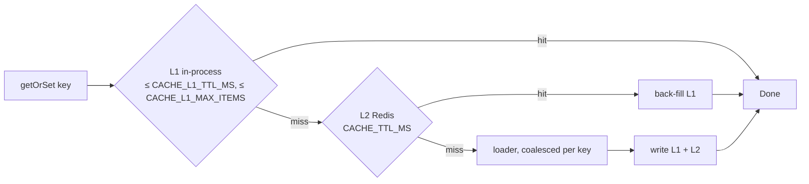
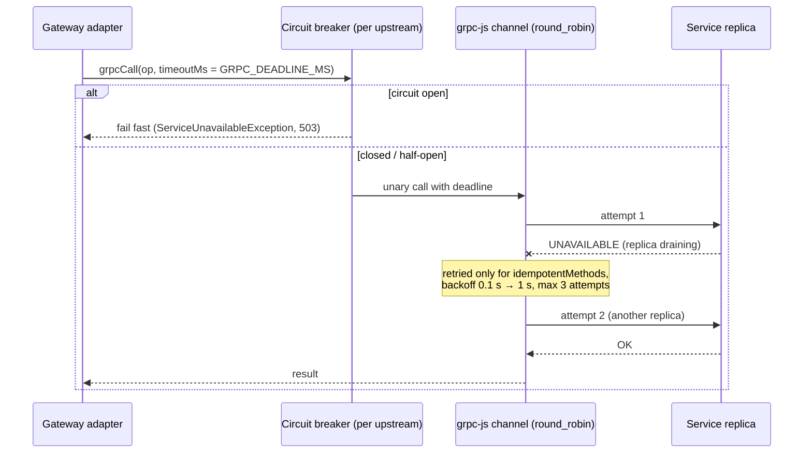
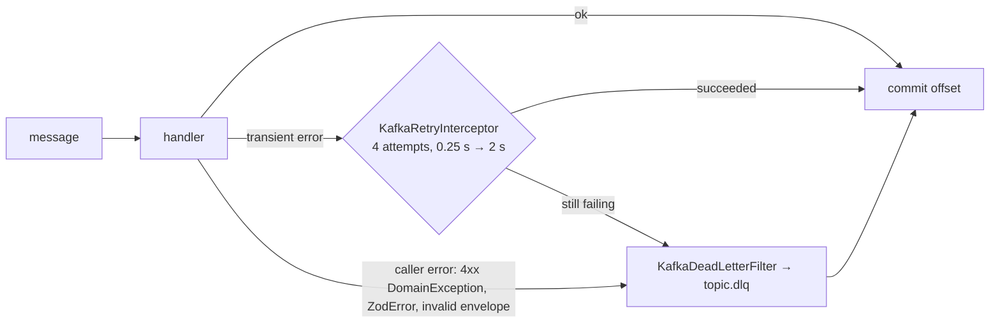

# Performance

Every optimisation in the boilerplate, why it exists, and the knob that controls it. Numbers
quoted as "measured" come from k6 runs against the compose stack on Apple silicon with Docker
Desktop at 4 CPU / 4 GB (see [DOCKER.md](DOCKER.md)). How to see these effects is covered in
[OBSERVABILITY.md](OBSERVABILITY.md); the full env catalogue is in [CONFIGURATION.md](CONFIGURATION.md).

## Summary of knobs

| Area      | Optimisation                                       | Knob (env unless noted)                                                               | Default                     | Where                                                                  |
| --------- | -------------------------------------------------- | ------------------------------------------------------------------------------------- | --------------------------- | ---------------------------------------------------------------------- |
| HTTP      | Fastify adapter, no Fastify logger, tuned timeouts | `HTTP_KEEP_ALIVE_TIMEOUT_MS`, `HTTP_REQUEST_TIMEOUT_MS`, `BODY_LIMIT_BYTES`           | 72000, 30000, 1 MiB         | `libs/bootstrap/src/http/create-http-app.ts`                           |
| HTTP      | Response compression (br quality 4, ≥ 1 KiB)       | `createHttpApp(…, { compression })` option                                            | on                          | same                                                                   |
| HTTP      | node:cluster workers                               | `CLUSTER_WORKERS` (0 = one per core)                                                  | 1                           | `libs/bootstrap/src/cluster/run-clustered.ts`                          |
| Logs      | Async pino destination, slim lines, quiet probes   | `LOG_LEVEL`, `LOG_PRETTY`                                                             | `info`, off outside dev     | `libs/observability/src/logging/logger-params.ts`                      |
| Postgres  | Pool size and lifetimes                            | `DATABASE_POOL_MAX`, `DATABASE_IDLE_TIMEOUT_SEC`, `DATABASE_MAX_LIFETIME_SEC`         | 20, 30, 1800                | `libs/database/src/drizzle/postgres-options.ts`                        |
| Postgres  | Server-side prepared statements                    | `DATABASE_PREPARE`                                                                    | `true`                      | `libs/database/src/drizzle/prepared-statements.ts`                     |
| Postgres  | Statement timeout                                  | `DATABASE_STATEMENT_TIMEOUT_MS`                                                       | 15000                       | same                                                                   |
| Postgres  | Keyset pagination on uuidv7 ids                    | page `limit`                                                                          | 20, max 100                 | `libs/database/src/pagination/keyset.ts`                               |
| Redis     | ioredis auto-pipelining                            | —                                                                                     | on (off for subscribers)    | `libs/redis/src/redis.factory.ts`                                      |
| Cache     | L1 in-process + L2 Redis, miss coalescing          | `CACHE_TTL_MS`, `CACHE_L1_TTL_MS`, `CACHE_L1_MAX_ITEMS`                               | 30000, 5000, 5000           | `libs/redis/src/cache/`                                                |
| GraphQL   | Per-operation DataLoader                           | `maxBatchSize` (code)                                                                 | 500 (users)                 | `libs/identity/src/presentation/graphql/users-loader.registrar.ts`     |
| GraphQL   | Guard once per operation, no field enhancers       | —                                                                                     | on                          | `libs/auth/src/guards/jwt-auth.guard.ts`                               |
| GraphQL   | Complexity limit                                   | `GRAPHQL_MAX_COMPLEXITY`                                                              | 250                         | `libs/graphql/src/plugins/complexity.plugin.ts`                        |
| gRPC      | Deadline on every call                             | `GRPC_DEADLINE_MS`                                                                    | 5000                        | `libs/transport/src/grpc/grpc-client.options.ts`                       |
| gRPC      | Retries for idempotent reads only, circuit breaker | `GRPC_PACKAGES[x].idempotentMethods` (code), breaker options (code)                   | 3 attempts; 50 % / 10 calls | `libs/contracts/src/grpc/grpc-packages.ts`, `grpc-circuit-breakers.ts` |
| gRPC      | Keepalive, connection age, stream cap              | `GRPC_KEEPALIVE` (code), `GRPC_MAX_MESSAGE_BYTES`                                     | 30 s ping; 5 min age; 4 MiB | `libs/transport/src/grpc/grpc.constants.ts`                            |
| Kafka     | Idempotent producer, GZIP                          | —                                                                                     | on                          | `libs/transport/src/kafka/kafka.options.ts`                            |
| Kafka     | Partitions consumed concurrently                   | `KAFKA_CONSUMER_CONCURRENCY`                                                          | 3                           | same                                                                   |
| Kafka     | In-process retry, then dead-letter                 | `DEFAULT_KAFKA_RETRY_OPTIONS` (code)                                                  | 4 attempts, 0.25 → 2 s      | `libs/transport/src/kafka/kafka-retry.interceptor.ts`                  |
| Mail      | BullMQ worker concurrency, pooled SMTP             | `MAIL_QUEUE_CONCURRENCY`, `SMTP_POOL`, `SMTP_MAX_CONNECTIONS`                         | 5, true, 5                  | `libs/mailer/src/`                                                     |
| Files     | Bounded streaming uploads                          | `STORAGE_MAX_CONCURRENT_UPLOADS`, `STORAGE_MAX_UPLOAD_BYTES`                          | 4, 25 MiB                   | `libs/files/`, `libs/storage/`                                         |
| Files     | Presigned URLs (bytes bypass the API)              | `STORAGE_SIGNED_URL_TTL_SEC`                                                          | 900                         | `libs/storage/`                                                        |
| CPU       | Argon2id cost and libuv threadpool                 | `ARGON2_MEMORY_COST`, `ARGON2_TIME_COST`, `ARGON2_PARALLELISM`, `UV_THREADPOOL_SIZE`  | 19456 KiB, 2, 1, 4          | `libs/auth/src/password/`, `Dockerfile`                                |
| Cassandra | Partition per user, TTL instead of deletes         | `CASSANDRA_CONSISTENCY`, `CASSANDRA_CORE_CONNECTIONS`, `CASSANDRA_REQUEST_TIMEOUT_MS` | `localOne`, 2, 12000        | `libs/notifications/src/infrastructure/persistence/`                   |
| Memory    | V8 heap per container                              | `NODE_OPTIONS=--max-old-space-size=…`                                                 | 512/384/320 MiB in compose  | `docker-compose.yml`                                                   |

## HTTP layer

### Fastify

Every app runs on `@nestjs/platform-fastify` (`createHttpApp()` / `createServiceApp()` in
[`@app/bootstrap`](../libs/bootstrap/README.md)). Fastify's router and schema-less JSON path are
markedly cheaper per request than Express, and its hooks let metrics see every response. The
server options (`buildFastifyOptions()`):

| Option                         | Value                               | Why                                                                                                                                 |
| ------------------------------ | ----------------------------------- | ----------------------------------------------------------------------------------------------------------------------------------- |
| `logger`                       | `false`                             | pino-http logs requests once; Fastify's own logger would log them twice.                                                            |
| `keepAliveTimeout`             | `HTTP_KEEP_ALIVE_TIMEOUT_MS` (72 s) | Longer than a typical load balancer idle timeout (60 s); otherwise the LB reuses sockets the server already closed → sporadic 502s. |
| `requestTimeout`               | `HTTP_REQUEST_TIMEOUT_MS` (30 s)    | Bounds the time to receive a request (slowloris).                                                                                   |
| `connectionTimeout`            | `0`                                 | A socket-inactivity timeout would cut socket.io and slow streams.                                                                   |
| `bodyLimit`                    | `BODY_LIMIT_BYTES` (1 MiB)          | Caps JSON bodies (uploads stream separately, see [Files](#files-and-storage)).                                                      |
| `forceCloseConnections`        | `'idle'`                            | On shutdown idle keep-alive sockets close at once while in-flight requests finish.                                                  |
| `return503OnClosing`           | `true`                              | New requests during shutdown get 503 instead of hanging.                                                                            |
| `routerOptions.maxParamLength` | `500`                               | Long path params (storage keys) still route.                                                                                        |

### Logging cost

Logging is on the hot path of every request, so it is kept cheap
(details in [OBSERVABILITY.md](OBSERVABILITY.md#logs-pino)): an **async** `pino.destination`
(4 KiB buffer, flushed every second and at shutdown) instead of a synchronous write per line;
trimmed `req`/`res` serializers (no headers, no query string); in-request loggers bind only
`requestId`; `/health*` and `/metrics` are never auto-logged; a short redaction list (every
wildcard costs on every line). `LOG_PRETTY` costs about 5x the throughput and is off outside
development. Raising `LOG_LEVEL` to `debug` in production also logs every 4xx a second time from the
exception filter.

### Compression

`@fastify/compress` is registered globally: `br`, `gzip`, `deflate`, only for bodies ≥ 1 KiB.
Brotli runs at **quality 4**, not the default 11, which costs about 10x the CPU for a few percent
smaller dynamic responses. Compression runs on the libuv threadpool, which it shares with Argon2
(see [CPU](#cpu-password-hashing-and-the-libuv-threadpool)). Disable it per app with
`createHttpApp(AppModule, { compression: false })` when a proxy in front already compresses.
WebSockets: socket.io runs websocket-only with `perMessageDeflate: false`.

### Cluster mode (`CLUSTER_WORKERS`)

The monolith and the gateway start through `runClustered()`. With `CLUSTER_WORKERS=1` (the
default, and what compose uses) it just runs the app. With N > 1 the primary forks N workers (it
never boots Nest), restarts crashed ones with capped backoff, forwards SIGTERM and aggregates
`/metrics` across workers. `0` means one worker per core (`os.availableParallelism()`).

- **Kubernetes / compose: keep 1** and scale with replicas (`docker compose up --scale`, pods).
  The orchestrator then sees each process, and CPU limits stay predictable.
- **VMs / bare metal: use 0 or the core count**, and multiply everything per process:
  `CLUSTER_WORKERS × DATABASE_POOL_MAX` connections must fit Postgres `max_connections` (200 in the
  compose Postgres), `CLUSTER_WORKERS × UV_THREADPOOL_SIZE` threads must fit the CPUs, and every
  worker holds its own L1 cache and V8 heap.

The gRPC/Kafka services (`identity-service`, `notifications-service`, `billing-service`) do not
cluster; scale them with replicas.

## Database (Postgres / Drizzle)

Postgres 18 through postgres.js + Drizzle ORM ([`@app/database`](../libs/database/README.md)).

### Keyset pagination

List endpoints never use `OFFSET`. They seek on the primary key:

```ts
const rows = await db
  .select()
  .from(users)
  .where(keysetWhere(users.id, q.cursor)) // id < $cursor
  .orderBy(keysetOrder(users.id)) // ORDER BY id DESC = newest first
  .limit(keysetFetchLimit(q.limit)); // limit + 1 look-ahead row
return keysetPage(rows, q.limit); // { items, nextCursor }
```

`OFFSET n` makes Postgres read and throw away `n` rows, so deep pages get linearly slower; a seek
is one index range scan, so page 1000 costs the same as page 1, and rows inserted meanwhile do not
shift pages. Page size is clamped to `[1, 100]` (default 20); a malformed cursor is a 422
`INVALID_CURSOR`. Composite filters get a matching composite index, e.g.
`payments_user_id_id_idx (user_id, id)` for "payments of a user, newest first". A plain ASC btree
serves `DESC` by scanning backwards; avoid Drizzle's `.desc()` in index definitions, which emits
`NULLS LAST` and no longer matches `ORDER BY … DESC`.

### uuidv7 ids

All ids come from `generateId()` (`@app/common`): UUIDv7, whose first 48 bits are a millisecond
timestamp. New rows therefore land at the right-hand edge of the primary-key btree, like a
sequence, instead of on random leaf pages as UUIDv4 would. That keeps inserts appending to hot,
cached pages, keeps the index compact (fewer page splits), and makes `ORDER BY id` mean "creation
order", which is what keyset pagination relies on. The same property orders Cassandra clustering
columns (see [Cassandra](#cassandra)) and makes request ids sortable in logs.

### Server-side prepared statements

drizzle-orm's postgres-js driver sends every query through `sql.unsafe()`, which postgres.js
never prepares by default, so each call was parsed and planned again.
`preferPreparedStatements()` switches the default to `prepare: true` on the pool client and on the
transaction and savepoint clients it hands out. postgres.js then keeps one named server-side
statement per SQL text per connection, and repeated queries skip parse and plan. Hot repository
queries are also built once with `.prepare('name')` in the repository constructor (for example
`identity_user_by_id`, `identity_user_credentials_by_email`, `billing_payments_by_user_after`).
Because statements are keyed by SQL text, keep the text bounded: the DataLoader batch query uses
`id = any($1::uuid[])`, so every batch size reuses **one** statement, where `IN ($1, …, $n)`
would create one per arity.

Verified against a live Postgres: with `log_min_duration_statement=0`, every application query
appears as `execute <name>: …` (for example `execute 8un1sm59my3: insert into "users" …`). The
server-side names are generated by postgres.js; the `.prepare('name')` labels above stay on the
Drizzle side and do not show up in the Postgres log. Only the boot-time migrator connection
(`pg_try_advisory_lock(727001)`, the `__drizzle_migrations` checks) runs `<unnamed>` statements.
To check it yourself:

```sql
ALTER SYSTEM SET log_min_duration_statement = 0; SELECT pg_reload_conf();
-- exercise the API, read `docker compose logs postgres`, then:
ALTER SYSTEM RESET log_min_duration_statement; SELECT pg_reload_conf();
```

**Set `DATABASE_PREPARE=false` behind PgBouncer in transaction mode or RDS Proxy**: named
statements belong to a server connection, and those poolers hand you a different one per
transaction.

### Pool sizing

| Variable                        | Default | Meaning                                                                                                                                                                              |
| ------------------------------- | ------- | ------------------------------------------------------------------------------------------------------------------------------------------------------------------------------------ |
| `DATABASE_POOL_MAX`             | 20      | Connections per process. Total = pool × processes (replicas × `CLUSTER_WORKERS`); keep it under Postgres `max_connections` (200 in compose) minus headroom for migrations and admin. |
| `DATABASE_IDLE_TIMEOUT_SEC`     | 30      | Close idle connections (0 = never).                                                                                                                                                  |
| `DATABASE_MAX_LIFETIME_SEC`     | 1800    | Recycle connections (0 = never), so failovers and DNS changes are picked up.                                                                                                         |
| `DATABASE_CONNECT_TIMEOUT_SEC`  | 10      | Fail fast when Postgres is unreachable.                                                                                                                                              |
| `DATABASE_STATEMENT_TIMEOUT_MS` | 15000   | Server-side cap per statement; a runaway query cannot hold a connection forever.                                                                                                     |

Every session also gets `idle_in_transaction_session_timeout=60s` (a forgotten transaction cannot
pin locks), `TimeZone=UTC` and `application_name=SERVICE_NAME` (visible in `pg_stat_activity`).
A bigger pool is rarely faster: Postgres throughput peaks at a few active connections per core, and
extra connections only queue inside the database. Raise the pool only when the pool wait shows up
in latency while Postgres CPU is low.

The compose Postgres is tuned for a 512 MB container (`shared_buffers=128MB`, `work_mem=4MB`,
`random_page_cost=1.1`, `jit=off` because JIT compile time hurts OLTP p99) and loads
`pg_stat_statements`, so slow queries can be found with:

```sql
SELECT calls, mean_exec_time, query FROM pg_stat_statements ORDER BY total_exec_time DESC LIMIT 10;
```

It also logs statements slower than 500 ms (`log_min_duration_statement`).

## Redis and caching

### ioredis auto-pipelining

The shared ioredis client is created with `enableAutoPipelining: true`: every command issued in
the same event-loop tick goes out in one write and one round trip. Under load, the throttler
script, the JWT denylist `EXISTS` and lock calls of concurrent requests share packets instead of
paying one RTT each. (The cache's L2 tier is not on this client: `@keyv/redis` uses node-redis, a
second connection pool.) Other client settings: `noDelay`, TCP keep-alive 30 s, bounded
`maxRetriesPerRequest` (`REDIS_MAX_RETRIES_PER_REQUEST`, 3) so requests fail instead of hanging
during an outage, capped-backoff reconnects. The pub/sub subscriber connection has auto-pipelining
off and unlimited retries (subscriptions must survive outages); BullMQ builds its own blocking
connections.

### Two-tier cache (L1 in-process + L2 Redis)

`AppCacheService` ([`@app/redis`](../libs/redis/README.md)) wraps cache-manager 7 with two stores:



| Mechanism              | Why                                                                                                                                                             |
| ---------------------- | --------------------------------------------------------------------------------------------------------------------------------------------------------------- |
| L1 (in-process)        | No network at all for hot keys. TTL capped at `CACHE_L1_TTL_MS` (5 s) and size at `CACHE_L1_MAX_ITEMS` (5000), so staleness and memory are bounded per process. |
| L2 (Redis)             | Shared by every replica and worker; `CACHE_TTL_MS` (30 s) default.                                                                                              |
| Miss coalescing        | Concurrent misses of one key run the loader **once per process** (no stampede on a cold key).                                                                   |
| Invalidation broadcast | `set()` / `del()` publish the key on `{prefix}:cache:invalidate`, so every other replica drops its L1 copy.                                                     |
| L2 outage = miss       | The L2 client fails commands immediately while Redis is down (no offline queue), so reads fall through to L1 + loader instead of stalling ~10 s.                |

The concrete user of it is the **user read cache** (`user:{id}`, 30 s), used by `GET /v1/users/:id`,
`GET /v1/auth/me` and the GraphQL user queries. It sits in the presentation layer on purpose: in the
microservice topology it lives in the gateway, in front of the gRPC hop, so a cached read costs no
gRPC call and no Postgres query. Writes that change a profile (role changes) call `invalidate()`.
Measured: the cached `GET /v1/users/:id` p95 was 9.6 ms while the whole k6 mix (including Argon2
sign-ups) was 36 ms. Verified live: the Redis key is `app:cache:user:<id>` (`REDIS_KEY_PREFIX` +
`cache:` + `user:<id>`), and `GET /v1/auth/me` followed by two `GET /v1/users/:id` produced exactly
one Postgres `select … from users where id`.

BullMQ keys are **not** under `REDIS_KEY_PREFIX`: they use BullMQ's own prefix (`bull:<queue>:…`), for
example `bull:mail:welcome-<userId>`; mail job ids are idempotent (`welcome-<userId>`,
`receipt-<paymentId>`).

Each process (and each cluster worker) has its own L1, which is why the TTL is short and
invalidation is broadcast. Do not put per-user authorization decisions in the cache longer than
you can tolerate them being stale for `CACHE_L1_TTL_MS`.

## GraphQL

Apollo Server 5 on Fastify, code-first ([`@app/graphql`](../libs/graphql/README.md)).

### DataLoader per operation, without REQUEST scope

Field resolvers that fetch a related entity (for example `Payment.user`) go through a DataLoader,
so a page of 50 payments costs **one** `getUsersByIds` call instead of 50 `getUser` calls (one
gRPC hop and one `WHERE id = ANY(…)` query in the microservice topology).

```ts
@ResolveField('user', () => UserModel, { nullable: true, complexity: 5 })
user(@Parent() p: PaymentModel, @Loader(USERS_LOADER) users: DataLoader<string, User | null>) {
  return users.load(p.userId);
}
```

Loaders are registered once at boot in the `DataLoaderRegistry` and created lazily **per GraphQL
operation** by the context factory, so nothing is cached across users or requests. The usual
alternative, a `Scope.REQUEST` provider, would make Nest rebuild the provider's whole dependency
chain on every request; that is banned on hot paths. The users loader caps batches at
`maxBatchSize: 500` (`IDENTITY_LIMITS.USERS_BATCH_MAX`).

### Guards run once per operation, not per field

- `fieldResolverEnhancers` is left empty, so global guards and interceptors do not run for every
  resolved field of every list item.
- Global guards still run once per **root field**. `JwtAuthGuard` remembers the requests it has
  authenticated (a `WeakMap` keyed by the request), so the second and later root fields of one
  operation reuse the first JWT verification and denylist lookup instead of repeating them.
- Subscriptions authenticate once at graphql-ws `connection_init`; the socket is closed with 4401
  when the token expires.

### Complexity limit

`ComplexityPlugin` computes the cost of each operation **before execution** and rejects anything
above `GRAPHQL_MAX_COMPLEXITY` (default 250) with HTTP 400 and `extensions.code:
"QUERY_TOO_COMPLEX"`. Cost = the `complexity` declared on the field (`@Query`, `@ResolveField`),
otherwise 1 per field. The list queries declare 5–10, related-entity fields 5. Introspection-only
operations are exempt (introspection is off in production anyway, `GRAPHQL_INTROSPECTION`).

```bash
curl -s http://localhost:3000/graphql -H 'content-type: application/json' \
  -H "authorization: Bearer $TOKEN" -d '{"query":"{ me { id email } }"}'
```

Put the cost on `@ResolveField`, not `@Field`: a `@Field` complexity is lost when a resolver
resolves the property. Give every list field a cost proportional to its fan-out.

## gRPC

In the microservice topology the gateway calls the services over gRPC
([`@app/transport`](../libs/transport/README.md)). Every setting below exists to keep a slow or
dead upstream from tying up the gateway.



| Mechanism                 | Setting                                                                                                                                                                                                             | Why                                                                                                                                                                                                      |
| ------------------------- | ------------------------------------------------------------------------------------------------------------------------------------------------------------------------------------------------------------------- | -------------------------------------------------------------------------------------------------------------------------------------------------------------------------------------------------------- |
| Deadline on every call    | `GRPC_DEADLINE_MS` (5000), in the service config **and** as an rxjs timeout whose unsubscribe cancels the call                                                                                                      | Without one a hung upstream pins sockets, memory and the client's request forever.                                                                                                                       |
| Retries                   | `UNAVAILABLE` only, `maxAttempts` 3 (grpc-js caps at 5), backoff 0.1 s → 1 s ×2, **only** for `GRPC_PACKAGES[name].idempotentMethods`: `GetUser`, `GetUsersByIds`, `ListUsers`, `ListNotifications`, `ListPayments` | A replica can commit a mutation and die before answering; a replayed `RefreshTokens` would trip reuse detection and revoke every session of the user. Add a method only if running it twice is harmless. |
| Retry throttling          | `retryThrottling { maxTokens: 10, tokenRatio: 0.1 }`                                                                                                                                                                | Stops retrying when most calls fail, so an outage is not amplified.                                                                                                                                      |
| Circuit breaker (opossum) | per upstream: opens at 50 % failures over ≥ 10 calls in a 10 s window, half-opens after 5 s; opossum's own timeout off                                                                                              | Fails fast while an upstream is down instead of queueing calls into deadlines. Caller errors (`NOT_FOUND`, `INVALID_ARGUMENT`, …) never open it.                                                         |
| Load balancing            | `round_robin` over every address the target resolves to                                                                                                                                                             | Spreads calls over replicas (`docker compose up --scale identity-service=3` works).                                                                                                                      |
| Connection age            | server `max_connection_age` 5 min + 30 s grace                                                                                                                                                                      | Clients reconnect and re-resolve DNS periodically, so new replicas receive traffic (a long-lived HTTP/2 connection would pin one).                                                                       |
| Keepalive                 | client pings every 30 s, 10 s timeout, also without calls; server accepts pings ≥ 10 s apart                                                                                                                        | Detects dead connections behind NATs and LBs. The server limit must be looser than the client interval or the server answers GOAWAY `too_many_pings`.                                                    |
| Stream cap                | server `max_concurrent_streams` 1000                                                                                                                                                                                | Bounds in-flight calls per HTTP/2 connection.                                                                                                                                                            |
| Reconnect backoff         | 1 s initial, 10 s max                                                                                                                                                                                               | Fast recovery without a reconnect storm.                                                                                                                                                                 |
| Message size              | `GRPC_MAX_MESSAGE_BYTES` (4 MiB), both directions                                                                                                                                                                   | Bounds memory per call.                                                                                                                                                                                  |

The monolith has none of this cost: `XApiModule.forLocal()` binds the same ports to in-process
CommandBus/QueryBus calls. See [ARCHITECTURE.md](ARCHITECTURE.md).

## Kafka

Integration events (`identity.user-registered.v1`, `billing.payment-succeeded.v1`,
`notifications.notification-created.v1`) go through kafkajs ([`@app/transport`](../libs/transport/README.md)).
Locally each topic has 6 partitions and its `.dlq` has 1 (`docker/kafka/topics.txt`).

### Producer

| Setting                                        | Why                                                                                                              |
| ---------------------------------------------- | ---------------------------------------------------------------------------------------------------------------- |
| `idempotent: true`, `acks: -1`                 | Producer retries cannot duplicate or reorder records; kafkajs refuses an idempotent producer without `acks: -1`. |
| `maxInFlightRequests: 5`                       | Pipelining per broker while keeping idempotent ordering guarantees.                                              |
| GZIP compression                               | The only codec built into kafkajs; JSON envelopes compress well (less network and broker disk).                  |
| `DefaultPartitioner`, key = aggregate id       | The same key always lands on the same partition, so events of one user stay ordered.                             |
| `send.timeout` 30 s, no client-level `retries` | kafkajs would otherwise merge client retries into the idempotent producer's retry and warn.                      |

Events are published **after the database commit** (`publish()` resolves once the broker acks).
There is no transactional outbox yet: a crash between commit and publish loses that event (see
[Known follow-ups](#known-follow-ups)).

### Consumer

| Setting                                                         | Default           | Why                                                                                                                                  |
| --------------------------------------------------------------- | ----------------- | ------------------------------------------------------------------------------------------------------------------------------------ |
| `KAFKA_CONSUMER_CONCURRENCY` → `partitionsConsumedConcurrently` | 3                 | Parallel across partitions, ordered within one. Useful up to the number of partitions assigned to the process (6 per topic locally). |
| `sessionTimeout` / `heartbeatInterval` / `rebalanceTimeout`     | 30 s / 3 s / 60 s | Nest does not heartbeat while a handler runs, so handlers (including retries) must finish well within 30 s.                          |
| `autoCommit`                                                    | on                | Nest 12 awaits the handler before kafkajs resolves the offset → at-least-once. Handlers dedupe on the envelope `id`.                 |
| `fromBeginning`                                                 | `false`           | A new group starts at the latest offset.                                                                                             |

### Retry, then dead-letter



A failing handler must never throw out of the consumer: a thrown error is redelivered forever and
blocks the partition. `@KafkaConsumerController()` retries transient failures **in process**
(`DEFAULT_KAFKA_RETRY_OPTIONS`: 4 attempts, jittered exponential backoff of at most 0.25 s + 0.5 s

- 1 s, far below the 30 s session timeout) and then publishes the message to `<topic>.dlq` with
  error headers and commits, so the partition keeps moving. Errors that would fail the same way again
  (4xx `DomainException`s such as an invalid envelope, zod errors) go straight to the DLQ. Throwing
  `KafkaRetriableException` is the explicit opt-out: it is rethrown so kafkajs redelivers the message.
  After fixing the cause, replay the DLQ:

```bash
bun run build
node --env-file=.env libs/transport/scripts/kafka-dlq-replay.mjs identity.user-registered.v1 --dry-run
```

Mail is delivered asynchronously too: BullMQ jobs on Redis, `MAIL_QUEUE_CONCURRENCY` (5) workers per
process, pooled SMTP (`SMTP_POOL`, `SMTP_MAX_CONNECTIONS` 5), 7 attempts with exponential backoff
from 5 s.

## Files and storage

File bytes are the easiest way to blow a Node heap, so the API avoids holding them
([`@app/files`](../libs/files/README.md), [`@app/storage`](../libs/storage/README.md)).

| Path                                                                                  | How bytes move                                                                                                                                                        | Bounds                                                                                                                                                                                 |
| ------------------------------------------------------------------------------------- | --------------------------------------------------------------------------------------------------------------------------------------------------------------------- | -------------------------------------------------------------------------------------------------------------------------------------------------------------------------------------- |
| **Presigned upload** `POST /v1/files/presigned-uploads` → client `PUT`s to the bucket | Browser → bucket directly. The API only signs a URL.                                                                                                                  | `contentLength` ≤ `STORAGE_MAX_UPLOAD_BYTES` (25 MiB, else 413); the signature covers `content-type` and `content-length`; URL valid `STORAGE_SIGNED_URL_TTL_SEC` (900 s)              |
| **Presigned download** `GET /v1/files/download-url?key=`                              | Bucket → browser directly.                                                                                                                                            | Same TTL                                                                                                                                                                               |
| **Streamed upload** `POST /v1/files` (multipart)                                      | Socket → bucket as a stream, no whole-file buffer. S3: lib-storage `Upload` in 5 MiB parts, 2 in flight (≈ 15 MiB per upload); GCS: `createWriteStream` + `pipeline`. | ≤ `STORAGE_MAX_UPLOAD_BYTES` per file (413 `FILE_TOO_LARGE`); at most `STORAGE_MAX_CONCURRENT_UPLOADS` (4) per process, beyond that **503 `UPLOAD_CAPACITY_EXCEEDED` + `Retry-After`** |

**Prefer presigned URLs** for anything large or frequent: those bytes never touch the API's CPU,
memory or bandwidth. The streamed route exists for server-side ingestion and small files. Its part
buffers live outside the V8 heap, so compose sizes the container memory with headroom:
`STORAGE_MAX_CONCURRENT_UPLOADS × ~15 MiB` on top of `--max-old-space-size` (monolith 768 MiB
limit vs 512 MiB heap). Raise the limit or the knob together. The upload route disables the
app-level interceptor timeout (`@Timeout(0)`, whose 504 would race a client still sending the
body); Fastify's `requestTimeout` (`HTTP_REQUEST_TIMEOUT_MS`, 30 s) and the storage client's
timeouts bound it instead. For large files on slow links raise `HTTP_REQUEST_TIMEOUT_MS`, or better,
use presigned uploads.

```bash
curl -s -X POST http://localhost:3000/v1/files/presigned-uploads \
  -H "authorization: Bearer $TOKEN" -H 'content-type: application/json' \
  -d '{"filename":"avatar.png","contentType":"image/png","contentLength":12345}'
# → { key, url, method: "PUT", headers, expiresAt } — then PUT the bytes to url with those headers
```

## CPU: password hashing and the libuv threadpool

Passwords are hashed with **Argon2id** (`@node-rs/argon2`, native) at the OWASP baseline:
`ARGON2_MEMORY_COST` 19456 KiB (19 MiB), `ARGON2_TIME_COST` 2, `ARGON2_PARALLELISM` 1, about 10 ms
of CPU per hash. Register and login each cost one hash; that is deliberate (it is what makes
stolen hashes expensive to crack), so these two routes dominate CPU in any realistic load test.
Login of an unknown email verifies against a dummy hash, so timing does not reveal which emails exist.

The hash runs **off the event loop, on the libuv threadpool**, which it shares with zlib
(response compression), `fs` and `dns.lookup`. The pool size is `UV_THREADPOOL_SIZE` (default 4,
set as an env var / Docker build arg; it must be set before the process starts).

**Keep `UV_THREADPOOL_SIZE` ≤ the CPUs available to the container** (its CPU quota), and raise
it only together with the CPU limit. Measured with the monolith capped at 2 CPUs under k6
(5 sign-ups/s + 20 reads/s):

| `UV_THREADPOOL_SIZE` | Overall p95        | Cached read p95 | Dropped iterations |
| -------------------- | ------------------ | --------------- | ------------------ |
| 4                    | **36 ms**          | 9.6 ms          | 0                  |
| 16                   | **304 ms … 7.2 s** | —               | yes                |

Why more threads made it slower: 16 busy Argon2 threads consume the cgroup's CFS quota within
each period, and then the kernel throttles the **whole cgroup**, the event-loop thread included,
so even cached reads that need no hashing stall until the next period. A bigger pool only helps
when there are idle CPUs to run it.

Sizing rules:

- Per process: `UV_THREADPOOL_SIZE` ≤ CPU limit. With `CLUSTER_WORKERS` > 1, the total is
  `CLUSTER_WORKERS × UV_THREADPOOL_SIZE`, so lower it per worker.
- Memory: each in-flight hash holds `ARGON2_MEMORY_COST × ARGON2_PARALLELISM` KiB (~19 MiB), so
  `UV_THREADPOOL_SIZE` concurrent hashes need that much off-heap memory.
- Login bursts: scale the identity path out (replicas) rather than up (threads). Auth routes are
  also rate-limited per client (`THROTTLE_AUTH_LIMIT` per minute per IP), which caps the hashing an
  attacker can trigger.
- Lowering the Argon2 cost to buy throughput weakens password storage; see
  [SECURITY.md](SECURITY.md) before touching it.

## Cassandra

Notifications are stored in Cassandra 5 (`libs/notifications/src/infrastructure/persistence/`),
modelled around the one query that matters, "a user's inbox, newest first":

```sql
CREATE TABLE IF NOT EXISTS notifications_by_user (
  user_id uuid, notification_id uuid, type text, title text, body text,
  data map<text, text>, read boolean, created_at timestamp,
  PRIMARY KEY ((user_id), notification_id)
) WITH CLUSTERING ORDER BY (notification_id DESC)
  AND default_time_to_live = 7776000;   -- 90 days
```

| Choice                                                                               | Why                                                                                                                                                      |
| ------------------------------------------------------------------------------------ | -------------------------------------------------------------------------------------------------------------------------------------------------------- |
| One partition per user (`(user_id)`)                                                 | The inbox read touches exactly one partition on one replica set; no scatter-gather.                                                                      |
| Clustering on `notification_id DESC`, a uuidv7                                       | Cassandra orders non-time-based uuids byte-wise, which for v7 is time order: rows are stored newest first and the inbox is a sequential slice.           |
| `default_time_to_live` 90 days instead of deletes                                    | Partitions stay bounded without tombstones (mass deletes create tombstones that slow every later read of the partition).                                 |
| `UPDATE … USING TTL ?` when marking read                                             | The table TTL also applies to UPDATEs, so the `read` cell would otherwise outlive (or underlive) the row; the bound TTL is the row's remaining lifetime. |
| `read` never written on insert                                                       | An idempotent re-insert (Kafka redelivery) cannot flip a read notification back to unread.                                                               |
| Driver paging (`fetchSize` + `pageState`)                                            | Pagination resumes from the driver's page state instead of re-reading earlier rows.                                                                      |
| Every statement a constant string with `prepare: true`, writes marked `isIdempotent` | Prepared once per connection; idempotent statements may be retried safely by the driver.                                                                 |
| `notification_recipients` projection (one row per user)                              | Receipts and digests read email and display name locally instead of a synchronous call to identity.                                                      |

Driver knobs: `CASSANDRA_CONSISTENCY` (`localOne`), `CASSANDRA_CORE_CONNECTIONS` (2 per host),
`CASSANDRA_REQUEST_TIMEOUT_MS` (12000), `CASSANDRA_LOCAL_DC` (must match the cluster's DC name, or
the driver ignores the node).

## Load testing with k6

[`docker/k6/script.js`](../docker/k6/script.js) (k6 2.3) drives the edge API at `http://api:3000`,
the network alias of whichever topology is running (monolith or gateway).

```bash
bun run docker:observability      # optional but recommended: results land in Grafana
bun run docker:monolith           # or: bun run docker:microservices
bun run loadtest                  # = docker compose --profile loadtest run --rm k6
```

### Scenarios

| Scenario  | When             | Each iteration                                                                                                                                                                                                       |
| --------- | ---------------- | -------------------------------------------------------------------------------------------------------------------------------------------------------------------------------------------------------------------- |
| `journey` | always, `RATE`/s | A **new** user: `POST /v1/auth/register` → `POST /v1/auth/login` → `GET /v1/auth/me` → `GET /v1/users/:id` (served from the user cache warmed by `/me`) → `POST /graphql { me }`. Two Argon2id hashes per iteration. |
| `browse`  | `READ_RATE` > 0  | Authenticated reads only (`/v1/auth/me`, `/v1/users/:id`, GraphQL `me`) by a pool of users registered in `setup()`. Models the read-heavy steady state.                                                              |

Both use k6's **open model** (`constant-arrival-rate`): the arrival rate stays fixed whatever the
latency. A closed loop of virtual users slows down together with the server and hides the queueing
it causes (coordinated omission), which makes percentiles look better than users experience.
`setup()` first waits up to ~2 min for `GET /health/ready` (so a cold start is never measured),
then warms the whole path with one registration. Each iteration sends a distinct
`X-Forwarded-For` (compose sets `TRUST_PROXY=uniquelocal` for the k6 container's private network),
so the per-IP auth throttle models many clients instead of one k6 box.

### Knobs

Compose maps the host variables on the left into the container; the rest are passed with `-e`.

| Host variable (compose) | In the script       | Default                      | Meaning                                                                                                  |
| ----------------------- | ------------------- | ---------------------------- | -------------------------------------------------------------------------------------------------------- |
| `K6_BASE_URL`           | `BASE_URL`          | `http://api:3000`            | Target                                                                                                   |
| `K6_RATE`               | `RATE`              | `5`                          | New-user journeys per second (5 requests, 2 Argon2id each)                                               |
| `K6_READ_RATE`          | `READ_RATE`         | `0`                          | Extra `browse` iterations per second (3 reads each)                                                      |
| `K6_DURATION`           | `DURATION`          | `1m`                         | Keep it below `JWT_ACCESS_TTL_SEC` (15 min) when `READ_RATE` > 0: pool tokens are not refreshed          |
| `K6_P95_MS`             | `P95_MS`            | `250`                        | p95 budget (ms)                                                                                          |
| `K6_MAX_ERROR_RATE`     | `MAX_ERROR_RATE`    | `0.01`                       | Allowed failed-request / failed-check ratio                                                              |
| `K6_OUT`                | `K6_OUT`            | `experimental-prometheus-rw` | Results → Prometheus remote write. Set `K6_OUT=` (empty) when the `observability` profile is not running |
| `K6_UID`, `K6_GID`      | container user      | `1000`                       | Linux: `K6_UID=$(id -u) K6_GID=$(id -g)` so the report directory is writable                             |
| —                       | `MAX_DROPPED_RATIO` | `0.01`                       | Allowed dropped iterations, as a share of the planned ones                                               |
| —                       | `THROTTLE_LIMIT`    | `100`                        | The app's per-user `THROTTLE_LIMIT`; sizes the browse pool so no user exceeds it                         |
| —                       | `RUN_ID`            | current time, base 36        | Makes emails unique per run; reusing one against the same database fails the run (409)                   |
| —                       | `PASSWORD`          | `k6-load-test-Passw0rd`      | Password of the generated users                                                                          |

```bash
# Read-heavy run: 5 sign-ups/s + 20 read iterations/s for 3 minutes, p95 budget 200 ms
K6_RATE=5 K6_READ_RATE=20 K6_DURATION=3m K6_P95_MS=200 bun run loadtest

# Script-only variables, and no Prometheus output
K6_OUT= docker compose --profile loadtest run --rm -e RUN_ID=baseline1 -e MAX_DROPPED_RATIO=0 k6
```

### Thresholds (the run fails when one is crossed)

Only traffic tagged `phase:load` counts; `setup()` traffic is excluded.

| Threshold                                               | Condition                                                                                            |
| ------------------------------------------------------- | ---------------------------------------------------------------------------------------------------- |
| `http_req_failed{phase:load}`                           | rate < `MAX_ERROR_RATE`                                                                              |
| `http_req_duration{phase:load}`                         | p(95) < `P95_MS`                                                                                     |
| `checks{phase:load}`                                    | rate > 1 − `MAX_ERROR_RATE`                                                                          |
| `http_req_duration{phase:load,name:GET /v1/users/<id>}` | p(95) < `P95_MS / 2` (cached reads must be cheap)                                                    |
| `dropped_iterations`                                    | count ≤ planned iterations × `MAX_DROPPED_RATIO` (the API or the VU pool could not sustain the rate) |

### Results

- The end-of-run summary prints `avg min med p(90) p(95) p(99) max` per metric.
- An HTML report of the last run is written to `docker/k6/reports/k6-report.html`.
- The live k6 web dashboard listens on container port 5665, published as
  `127.0.0.1:${K6_DASHBOARD_HOST_PORT:-5665}`. `docker compose run` publishes ports only with
  `--service-ports`: `docker compose --profile loadtest run --rm --service-ports k6`, then open
  `http://localhost:5665` during the run.
- With `K6_OUT=experimental-prometheus-rw` the k6 metrics (`k6_http_reqs_total`,
  `k6_http_req_duration_p95` …) appear in the **k6 load test** row of the Grafana dashboard, next
  to the server-side metrics of the same period.

Measure with realistic limits: compose caps every container's CPU and memory (monolith 2 CPU /
768 MiB), and Docker Desktop's VM size bounds the whole stack. Compare runs only on the same
machine and stack.

## Reading the Grafana dashboard

Open `http://localhost:3300` (NestJS overview, see
[OBSERVABILITY.md](OBSERVABILITY.md#grafana-dashboard)). Select the services under test in the
`service` variable (deselect `host:3000` when the API runs in compose). Panel rates use
`$__rate_interval`, and Prometheus scrapes every 15 s, so give a run at least a minute before
reading it.

| Symptom on the dashboard                                                               | Likely cause                                                                     | Knob / action                                                                                                         |
| -------------------------------------------------------------------------------------- | -------------------------------------------------------------------------------- | --------------------------------------------------------------------------------------------------------------------- |
| p95 rises together with **Event-loop lag p99**, even on cached routes                  | The event loop is blocked or the cgroup is CPU-throttled                         | Check `UV_THREADPOOL_SIZE` ≤ CPU limit; look for sync work (big JSON, sync crypto); more replicas or CPUs             |
| **CPU (cores)** flat at the container limit (e.g. 2.0 for the monolith)                | CPU-bound, usually Argon2 on register/login                                      | Scale out; compare with the `journey` vs `browse` mix; don't lower the Argon2 cost to "fix" a benchmark               |
| **Top 10 slowest routes** dominated by `POST /v1/auth/register` / `login`, others fast | Expected: one Argon2id hash each                                                 | Judge the cached-read threshold (`GET /v1/users/<id>`) separately                                                     |
| A read route slow while CPU and event-loop lag are low                                 | Waiting on I/O: Postgres pool, gRPC upstream, Redis                              | `pg_stat_statements`; `DATABASE_POOL_MAX`; gRPC deadline/breaker errors in the logs; Redis exporter panels            |
| **Error ratio** 5xx > 0 with 503s                                                      | Circuit breaker open, upload capacity, readiness drain, or a dependency down     | Logs at `error`/`warn` filtered by `service`; `GET /health/ready`                                                     |
| **Error ratio** 4xx high, mostly 429                                                   | The throttler: the load model hits `THROTTLE_LIMIT` / `THROTTLE_AUTH_LIMIT`      | Check k6's `X-Forwarded-For` / `TRUST_PROXY`, or the browse pool size (`THROTTLE_LIMIT` for the script)               |
| **GC time per second** climbing with **heap used** near `--max-old-space-size`         | Heap too small for the load, or a leak                                           | Raise `NODE_OPTIONS=--max-old-space-size` with the container limit; compare RSS with heap (off-heap: uploads, Argon2) |
| **Active handles** growing without bound                                               | Leaked sockets or timers                                                         | Heap snapshot / `--inspect` on a host run                                                                             |
| k6 **dropped iterations** > 0 while server latency looks fine                          | The k6 container ran out of VUs or CPU                                           | Lower `K6_RATE`, or give k6 more CPU                                                                                  |
| Server p95 (HTTP row) much lower than k6 p95                                           | Time spent before the app: network, Docker proxy, queueing in the accept backlog | Compare with `GET /health/live` latency; check Docker Desktop resources                                               |

The server histogram measures from Fastify receiving the request to the response being sent, so
the k6 p95 is always somewhat higher. Use both: the k6 row is what clients see, the HTTP row is
where the time went.

## Known follow-ups

Stated honestly, as of this writing:

- **Transactional outbox.** Events are published after the database commit. A crash between the
  two loses the event; an outbox table plus a relay would make it exactly-once-produced.
- **Slimmer gateway image.** The gateway imports whole domain libraries; per-domain
  `@app/<x>/api` subpath exports would let it ship only the presentation layer and gRPC adapters
  (today the gateway image is as large as the monolith's, 294 MB).
- **Separate metrics listener**, so `/metrics` (and its serialization cost) is off the API port.
- **Real-database integration specs** for the billing and notifications repositories (identity
  and Redis have them under `INTEGRATION=1`); query-plan regressions there would currently only
  show up under load.
- **No app-level gRPC / Kafka / pool metrics** yet, so pool waits, breaker trips and consumer lag
  have to be inferred from latency and logs (see [OBSERVABILITY.md](OBSERVABILITY.md#known-follow-ups)).

Related: [OBSERVABILITY.md](OBSERVABILITY.md), [DOCKER.md](DOCKER.md), [ARCHITECTURE.md](ARCHITECTURE.md),
[CONFIGURATION.md](CONFIGURATION.md), [TESTING.md](TESTING.md), [SECURITY.md](SECURITY.md),
[README](../README.md).
