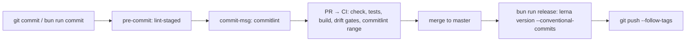

# Releasing

This page explains how a change goes from a commit to a versioned release with a changelog. Commit messages drive everything: they are validated locally and in CI, and Lerna derives each package's next version and changelog from them.



See also: [DEVELOPMENT.md](DEVELOPMENT.md), [TESTING.md](TESTING.md), [DOCKER.md](DOCKER.md).

## Conventional commits

The format is [Conventional Commits](https://www.conventionalcommits.org/), enforced by `@commitlint/config-conventional` (`commitlint.config.ts`):

```text
<type>(<scope>[,<scope>…]): <subject>

[body: wrap at 100 columns (warning)]

[footer: BREAKING CHANGE: …, Refs #123]
```

| Type                                                                          | Effect on the next version (Lerna, `conventionalcommits` preset)                                  |
| ----------------------------------------------------------------------------- | ------------------------------------------------------------------------------------------------- |
| `fix`                                                                         | patch                                                                                             |
| `feat`                                                                        | minor                                                                                             |
| `feat!` / `fix!` or a `BREAKING CHANGE:` footer                               | major (**minor** while the package is still `0.x`: Lerna downgrades major bumps below 1.0.0)      |
| `perf`, `refactor`, `docs`, `test`, `build`, `ci`, `chore`, `style`, `revert` | patch. A package whose files changed always gets at least a patch bump, whatever the commit type. |

Examples from this repo's history: `chore(repo): scaffold nestjs 12 boilerplate`, `fix(repo): apply verified review findings`.

## Commitizen

```bash
git add -p
bun run commit        # = cz, with the @commitlint/cz-commitlint adapter (package.json "config.commitizen")
```

The prompt reads its choices from `commitlint.config.ts`: types, the allowed scopes, and multiple scopes separated by `,` (`enableMultipleScopes`). A message built this way always passes the `commit-msg` hook. `inquirer` is pinned to **12** because it is the peer dependency of `@commitlint/cz-commitlint`.

You can still type messages by hand with `git commit -m`. The hook validates them the same way.

## Commitlint scopes

`scope-enum` is computed at lint time:

1. **Every workspace package**, via `@commitlint/config-workspace-scopes`, with the `@app/` prefix removed:
   - apps: `gateway`, `monolith`, `identity-service`, `notifications-service`, `billing-service`
   - libs: `auth`, `billing`, `bootstrap`, `cassandra`, `common`, `config`, `contracts`, `database`, `files`, `graphql`, `identity`, `mailer`, `notifications`, `observability`, `payments`, `redis`, `storage`, `testing`, `transport`
2. **Extra scopes** (`EXTRA_SCOPES`): `deps`, `deps-dev`, `release`, `docker`, `ci`, `config`, `repo`, `tooling`, `docs`.

Other rules:

- `scope-case` is `kebab-case` (error).
- `body-max-line-length` is 100 (warning).
- A new package becomes a valid scope automatically. Nothing needs editing.

Name the package(s) the commit changes, for example `feat(billing): …` or `fix(gateway,transport): …`. Use `repo`, `tooling`, `ci`, `docker` or `docs` for changes that belong to no package.

The scope is for humans. Lerna decides which packages a commit affects from the **files** it touches, not from the scope. So keep commits focused: a commit that touches five packages bumps all five.

## Git hooks (husky)

`bun install` runs the root `prepare` script (`husky`), which points `core.hooksPath` at `.husky/_`.

| Hook         | Runs                     | Blocks the commit when                              |
| ------------ | ------------------------ | --------------------------------------------------- |
| `pre-commit` | `lint-staged`            | Biome, ESLint or Prettier cannot fix a staged file. |
| `commit-msg` | `commitlint --edit "$1"` | The message breaks a rule above.                    |

- `HUSKY=0` disables the hooks. CI sets it.
- `git commit --no-verify` and commits made in the GitHub web editor skip the hooks. CI therefore re-runs commitlint over the whole PR range (see [CI pipeline](#ci-pipeline)).
- The hooks only touch staged files. The full gate is still `bun run check` (Biome CI + ESLint `--max-warnings=0` + Prettier check + `tsc`). Run it before pushing.

## lint-staged

`lint-staged.config.ts` splits files between three tools. The globs **do not overlap**: lint-staged runs different globs concurrently, and two tools writing the same file would race.

| Glob                                        | Commands (in order)                                                                                                                                                            |
| ------------------------------------------- | ------------------------------------------------------------------------------------------------------------------------------------------------------------------------------ |
| `*.{ts,mts,cts}`                            | 1. `biome check --write` (format, lint, import sorting) 2. `eslint --fix --max-warnings=0` (type-aware rules: floating promises, decorator-aware `consistent-type-imports`, …) |
| `*.{js,mjs,cjs,json,jsonc,graphql,gql,css}` | `biome check --write`                                                                                                                                                          |
| `*.{md,yml,yaml}`                           | `prettier --write`                                                                                                                                                             |

Why three tools:

- **Biome** is the fast formatter and linter for code.
- **ESLint** (typescript-eslint supports TypeScript <6.1, hence the 6.0.3 pin) runs only the rules that need type information or decorator awareness.
- **Prettier** covers Markdown and YAML, which Biome does not format.

The ESLint cache lives in `node_modules/.cache/eslint/`. The config file is loaded by Node's native type stripping, so it may contain only erasable TypeScript syntax.

## Versioning and changelogs (lerna)

`lerna.json` configures **independent** versioning: every app and lib has its own version (all start at `0.0.0`) and its own `CHANGELOG.md`. Nx 23 runs the tasks (`build`, `typecheck` and `test` are cached; `build` depends on `^build`).

| Setting (`command.version`)               | Value                         | Meaning                                                                                                                                |
| ----------------------------------------- | ----------------------------- | -------------------------------------------------------------------------------------------------------------------------------------- |
| `version`                                 | `independent`                 | One version and one tag per package (`@app/billing@0.2.0`).                                                                            |
| `conventionalCommits` + `changelogPreset` | `true`, `conventionalcommits` | Bump levels and changelog entries come from the commit messages. The preset is pinned to **9.3.1** because Lerna 10 crashes with 10.x. |
| `allowBranch`                             | `master`, `main`, `release/*` | Releases are refused on feature branches.                                                                                              |
| `private`                                 | `true`                        | Private packages are versioned too (every package here is `"private": true`).                                                          |
| `message`                                 | `chore(release): publish`     | The release commit. It is a valid conventional commit (`release` is an extra scope).                                                   |
| `push`, `createRelease`                   | `false`, `false`              | Nothing leaves your machine until you push. No GitHub Release is created.                                                              |
| `npmClient`                               | `bun`                         |                                                                                                                                        |

### Cutting a release

```bash
git switch master && git pull
bunx lerna changed          # preview: packages changed since their last tag
bun run release             # = lerna version --conventional-commits --yes --no-push
git push --follow-tags      # push the release commit and the per-package tags
```

`bun run release`:

1. finds the packages whose files changed since their last tag (on the first release, every package),
2. picks each package's bump from the commits that touched it,
3. writes or updates `<package>/CHANGELOG.md` and `package.json#version`,
4. creates one commit (`chore(release): publish`) and one tag per package.

The repository has no `CHANGELOG.md` files yet. The first release creates them.

**Nothing is published to a registry.** Every package is private, and the boilerplate has no `lerna publish` step. The deliverables are the Docker images, one per app: `docker build --build-arg APP=<app> .`. Tag them with the app's version from its tag (`@app/gateway@1.4.0` → image `gateway:1.4.0`) in your CD pipeline. The Dockerfile already accepts a `VCS_REF` build argument. See [DOCKER.md](DOCKER.md).

**Database releases.** Ship Drizzle migrations as a release job before rolling out the new app version (`DATABASE_RUN_MIGRATIONS=false` in production, then `dist/migrate.js` from the same image). Cassandra CQL migrations run at service boot and are LWT-claimed. See [DEVELOPMENT.md](DEVELOPMENT.md#database-migrations-postgres--drizzle).

**Contract changes.** A breaking change to a gRPC proto or a Kafka payload needs a new version (`orders.v2` package, `.v2` topic), served side by side with v1 until every consumer has moved. `libs/contracts/README.md` documents `buf breaking --against '.git#branch=master,subdir=libs/contracts'` for checking protos. The CI workflow does **not** run it yet. Run it by hand before releasing a proto change.

Related root scripts: `bun run build:affected` (`lerna run build --since origin/master`), `bun run graph` (Nx project graph) and `bun run clean` (every package's `clean`, plus the Nx cache).

## CI pipeline

[`.github/workflows/ci.yml`](../.github/workflows/ci.yml) runs on pushes to `master`, on pull requests and on manual dispatch (`workflow_dispatch`). A new push to a pull request cancels the run already in progress for it. Pushes to `master` are never cancelled.

The `verify` and `integration` jobs install with `bun install --frozen-lockfile` (Bun 1.4.2) on Node from `.nvmrc`, with `HUSKY=0` and the Nx daemon and Cloud off. The Bun download cache and the Nx/ESLint caches are kept between runs.

| Job                                       | Steps                                                                                                                                                                                                                                                                                                                                                                                                                                                                                                                                                  |
| ----------------------------------------- | ------------------------------------------------------------------------------------------------------------------------------------------------------------------------------------------------------------------------------------------------------------------------------------------------------------------------------------------------------------------------------------------------------------------------------------------------------------------------------------------------------------------------------------------------------ |
| **verify** (lint, typecheck, test, build) | 1. `bun run check` (biome ci, eslint `--max-warnings=0`, prettier `--check`, tsc) 2. `bun run test` (unit + e2e) 3. `bun run build` 4. **generated artefacts drift**: `bun run proto:gen`, `buf lint`, `bun run db:generate`, then `git diff --exit-code` plus an untracked-file check on `libs/contracts/src/generated` and `libs/database/src/migrations` 5. **commitlint** over the PR range (`--from base.sha --to head.sha`, PRs only) 6. **config drift**: `node scripts/check-env-example.mjs` and `node scripts/docker/check-kafka-topics.mjs` |
| **integration**                           | `bun run test:int` (`INTEGRATION=1`, every `<pkg>:int` Vitest project). Postgres comes from testcontainers, and Redis from a `redis:8.10.2-alpine3.23` service container.                                                                                                                                                                                                                                                                                                                                                                              |
| **image** (matrix)                        | Builds the `runtime` target for `gateway`, `monolith`, `identity-service`, `notifications-service` and `billing-service` with `APP=<app>` and `VCS_REF=<sha>`. Images are loaded and inspected, never pushed. Each app has its own GitHub Actions build cache scope.                                                                                                                                                                                                                                                                                   |
| **compose**                               | `scripts/docker/validate-compose.sh` (`docker compose config` for every profile combination), then `scripts/docker/check-infra.sh`, which boots the infra and asserts topics, keyspace, buckets, extensions and host ports, then tears it down.                                                                                                                                                                                                                                                                                                        |

Before you push, run the same gate locally:

```bash
bun run check && bun run test && bun run build
bun run proto:gen && bun run db:generate && git status --porcelain -- libs/contracts/src/generated libs/database/src/migrations
node scripts/check-env-example.mjs && node scripts/docker/check-kafka-topics.mjs
INTEGRATION=1 bun run test:int     # needs Docker (testcontainers) and REDIS_URL
```

What CI does **not** do (yet):

- No deployment, and images are not pushed to a registry.
- No `lerna version` run. Releases are cut by hand with `bun run release` (above).
- No `buf breaking` gate.

Integration specs that run the billing (Postgres) and notifications (Cassandra) repositories against real databases are a known follow-up. Today only `@app/database`, `@app/redis` and the identity users repository have `*.int-spec.ts`. The billing and notifications repositories are covered by unit specs. See [TESTING.md](TESTING.md).
